!!! abstract "Unit Overview"
    This unit explains the fundamental concepts of education, its functions, and types (formal, non-formal, informal). It details the structure of the Indian education system across various levels—from pre-primary to higher education, including professional and distance learning. Furthermore, it explores the relationship between education and the Indian Constitution, highlighting key values like Justice, Liberty, Equality, and Fraternity, fundamental rights and duties, and specific constitutional provisions and challenges related to education in India.

!!! info "Information"
    **Unit I - Education in Contemporary India and Constitutional Context**
    **Content:** Education Meaning Functions Types, Levels of Education, Indian Constitutional Values
    **Pages:** 6 - 93

## 🎯 Introduction
The first unit serves as a foundational pillar for understanding the landscape of Education in Contemporary India. It connects the philosophical interactions of "what education is" with the practical realities of "how education is delivered" and the legal framework of "guarantees for education".

**Key Learnings:**
*   Understanding the etymological and philosophical definitions of Education.
*   Differentiating between Individual, Social, and specific aims of education.
*   Recognizing the structure and objectives of the 5+ levels of the Indian Education System.
*   Analyzing the role of Open and Distance learning in democratizing education.
*   Interpreting the Indian Constitution's role in shaping educational policies, rights, and duties.

## 🔗 Connection to Other Units

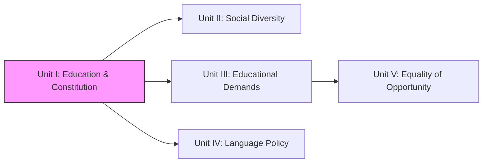

| Unit | Connection |
| :--- | :--- |
| **Unit I** | **Foundations & Legal Framework (Constitution)** |
| **Unit II** | Understanding the *Who* (Diversity in Society) based on Unit I's framework |
| **Unit III** | Demands of individuals discussed in Unit I vs Diverse communities |
| **Unit IV** | Language policies arising from Constitutional provisions in Unit I |
| **Unit V** | Implementing Equality (Constitutional Value from Unit I) in opportunity |

## 📚 Unit Overview

| Lesson | Focus Area | Key Concepts |
| :--- | :--- | :--- |
| **Lesson 1** | **Concept of Education** | Definitions, Aims (Individual/Social), Functions, Types (Formal/Informal) |
| **Lesson 2** | **Levels of Education** | Pre-primary to Higher Ed, Professional Ed, Distance & Open Learning |
| **Lesson 3** | **Constitutional Values** | Preamble, Fundamental Rights/Duties, Articles 45/21A, Minorities Rights |

### Learning Outcomes
By the end of this unit, you will be able to:
1.  **Define** education using Eastern and Western perspectives.
2.  **Explain** the functions of education towards the individual, society, and nation.
3.  **Compare** formal, non-formal, and informal types of education.
4.  **Analyze** the objectives and structures of various educational levels in India.
5.  **Evaluate** the role of the Indian Constitution in guaranteeing educational rights and promoting values like equality and justice.

## 🗺️ Topic Connection Map

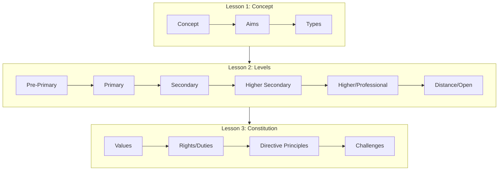

---

# LESSON - 1: Education: Meaning, Functions and Types

## 1:00 Introduction
This lesson attempts to explain briefly the concept of education, definitions of education, various aims of education, our national aims of education, functions of education and three types of education - formal, non-formal and informal education.

## 1:01 Concept of Education

Etymologically, the term **'Education'** is traced to different sources of derivation.

*   **Educare (Latin):** Means 'to bring up' or 'to nourish'. Implies child is brought up according to certain aims.
*   **Educere (Latin):** Means 'to lead out' or 'to draw out' ('e' = out, 'ducere' = to lead). Implies aiming to 'draw out' rather than 'put in'.
*   **Educatum (Latin):** Means 'the act of teaching or training'. Implies education is external and imposed.

!!! note "Key Points 📌"
    Modern educationists prefer the **'Educere'** sense, viewing education as growth from within rather than external imposition.

## 1:02 Indispensability of Education
Man is a social animal distinguished by superior intelligence. Unlike other creatures that are trained, man is educated.

*   **Helplessness at Birth:** The human child is dependent; education provides knowledge, skills, and habits to become a "complete man".
*   **Social Efficiency:** Learning norms makes one an efficient citizen.
*   **Long Childhood:** A blessing allowing time to learn vocational skills, culture, and develop potential.

!!! quote "Definition"
    **T. Raymonds:** "Education is a process to develop the potentials of man so as to differentiate him from other living beings."

!!! quote "Definition"
    **Aristotle:** "Just as living beings are superior to inanimate things, the educated is more valuable than the uneducated."

## 1:03 Definitions of Education

### Indian Thinkers
| Thinker | Definition |
| :--- | :--- |
| **Vivekananda** | "Education is the manifestation of divine perfection, already existing in man." (Man-making, character-building). |
| **Tagore** | "Education means enabling the mind to find out that ultimate truth... gives us the wealth, not of things but of inner light." |
| **Aurobindo Ghosh** | "Education is helping the growing soul to draw out that is in itself." |
| **Mahatma Gandhi** | "Education is the all-round drawing out of the best in child and man — body, mind and spirit." |

!!! tip "Exam Tip 📝"
    Indian views are essentially **Spiritual** and **Intellectual** in character.

### Western Thinkers
| Thinker | Definition |
| :--- | :--- |
| **Aristotle** | "Education is the creation of sound mind in a sound body." |
| **Pestalozzi** | "Education is natural, harmonious and progressive development of man’s innate powers." |
| **Adams** | "Education is a conscious and deliberate process... to modify the development of the other." |
| **T.P. Nunn** | Complete development of individuality to make original contributions. |
| **Redden** | "Deliberate and systematic influence... harmonious development of physical, intellectual, aesthetic, social and spiritual powers... directed towards the union of the educand with his creator." |

## 1:04 Nature / Characteristics of Education

1.  **Life-long Process:** From womb to tomb.
2.  **Systematic Process:** Transacted through institutions/regulations.
3.  **Development of Individual and Society:** Force for social development.
4.  **Modification of Behaviour:** Human behavior is improved.
5.  **Purposive:** Has definite goals.
6.  **Training:** Senses, mind, behavior, skills are trained.
7.  **Instruction and Direction:** Directs individual to fulfill desires.
8.  **Life:** Life experiences are educative.
9.  **Continuous Reconstruction of Experiences:** (John Dewey) Remodels experiences.
10. **Individual Adjustment:** Helps adjust with environment/society.
11. **Balanced Development:** Harmonious development.
12. **Dynamic Process:** Changes with situations and time.
13. **Bipolar Process:** (Adams) Interaction between two personalities (Teacher <-> Student).
14. **Three Dimensional Process:** (John Dewey) Teacher, Child, Society.
15. **Growth:** To produce continuous physical and psychological growth.

## 1:05 Aims of Education
Aims are long-term goals; Objectives are short-term.

### Classification of Aims

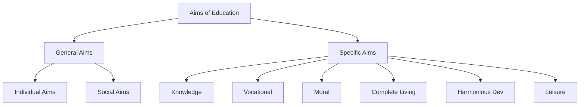

#### 1. Individual Aim
*   **Proponents:** Sir Percy Nunn.
*   **Focus:** Unfoldment of individual personality / Self-realization.
*   **Philosophy:** Progress of nations depends on individuals; education should focus on the individual, not society.

#### 2. Social Aim
*   **Proponents:** Prof. Bagley, John Dewey.
*   **Focus:** Socially efficient individuals / Citizenship.
*   **Philosophy:** Individual has no existence apart from society.
*   **Goals:** Health, vocational efficiency, cooperation, citizenship.

!!! success "Summary"
    Individual and Social aims are **Complementary**, not antagonistic. (Ross: "The circle cannot be broken.")

#### Specific Aims
3.  **Knowledge Aim:** Cognitive development; knowledge as power/happiness.
4.  **Vocational Aim:** Livelihood earning; productive hands.
5.  **Moral Aim:** (Herbart/Gandhi/Radhakrishnan) Character formation; conquest of lower impulses.
6.  **The Complete Living Aim:** (Herbert Spencer) Treat body, mind, soul; enjoy life and leisure.
7.  **Harmonious Development of Personality:** Balanced development of physical, intellectual, emotional, moral, aesthetic, social, spiritual powers.
8.  **Leisure Aim:** Using free time profitably/usefully.

### 1:05:1 National Objectives of Education in India
**Kothari Commission (1964-66)** objectives:
i) Relating education to productivity.
ii) Strengthening social and national integration.
iii) Consolidating democracy.
iv) Accelerating modernization.
v) Building character (social, moral, spiritual values).

## 1:06 Functions of Education

### Towards Individual
*   Strengthens personality.
*   Promotes ethical behavior.
*   Improves reasoning/thinking.
*   Prepares for future.

### Towards Society
*   Removes unwanted traditions.
*   Develops science and technology.
*   Promotes equality and wellness.
*   Fights prejudice; promotes friendliness.

### Towards Nation
*   Awareness of rights/duties.
*   Develops leadership.
*   Trains for democracy.
*   Promotes international understanding/globalization.

## 1:07 Nature of Education as a Separate Discipline

### 1:07:1 Definition of ‘Academic Discipline’
A branch of knowledge with its own:
*   Unique field of research.
*   Methods of research.
*   Subject contents/Theoretical structure (concepts, principles).
*   History/Origin.

### 1:07:2 Nature of Education as a Distinct Discipline
1.  **Theoretical Structure:** 'Pedagogy' (teaching) forms the core.
2.  **Process of Education:** Teaching constitutes the distinct process.
3.  **Start as a System:** Input (Students) -> Process (Teaching) -> Output (Progress).
4.  **Field of Research/Laboratory:** Schools/Classrooms are labs.
5.  **Research Method:** Unique methods (Historical, Survey, Experimental, etc.).

## 1:08 Types of Education

| Type | Characteristics | Examples |
| :--- | :--- | :--- |
| **Formal** | Fixed curriculum, teachers, premises, schedule, exams. | Schools, Colleges, Universities. |
| **Non-Formal** | Open/Flexibility in admission, curriculum, time. | Adult education, vocational training, Open Universities (in a sense). |
| **Informal** | Incidental, spontaneous, non-designed. | Family, society, play groups, conversation. |

---

# LESSON — 2: LEVELS OF EDUCATION

## 2:00 Introduction
Discussion of Pre-primary, Primary, Secondary, Higher Secondary, Higher, Professional, Distance, and Open Education.

## 2:01 Various Levels of Education
Evolution from family-based education to formal schools.
**Structure:**
*   **Pre-primary:** Age 3-5
*   **Primary:** Age 5-11
*   **Middle:** Age 11-14
*   **Secondary:** Age 14-16
*   **Senior/Higher Secondary:** Age 16-18
*   **Other:** Professional, Distance, Open.

## 2:02 Pre-primary or Nursery Level Education and its Objectives

### 2:02:1 Meaning
*   **Age:** 2½ - 5 years.
*   **Focus:** Physical health, social traits, intellectual abilities, emotional needs.
*   **Method:** Play-way, stimulating atmosphere, no formal teaching.
*   **Names:** Nursery, Kindergarten, Montessori.

### 2:02:2 Importance
a) **Physical Growth:** Space for activity/exploration.
b) **Social Development:** Compensates for nuclear families; peer interaction.
c) **Intellectual Development:** Satisfies curiosity (Pre-operative stage).
d) **Emotional Development:** Controls temper/emotions.
e) **Psychological Needs:** Satisfies ego-centrism, independence, creativity.

### 2:02:3 Objectives (Indian Education Commission 1964-66)
1.  Health habits (toilet, dressing).
2.  Social attitudes/participation.
3.  Aesthetic sense.
4.  Emotional maturity.
5.  Intellectual curiosity.
6.  opportunity to explore/experiment.
7.  Self-expression/creativity.
8.  Muscular coordination/motor skills.

### 2:02:4 Teaching Methods
Play way method, toys, conversation, songs, stories. Focus on speaking skills.

## 2:03 Primary Education and its Objectives

### 2:03:1 Primary Education Stage
*   **Start:** Age 5+.
*   **Duration:** 5 years (Class I-V).
*   **Core:** 3 R’s (Reading, Writing, Arithmetic).

### 2:03:2 Objectives
1.  Literacy, numeracy, creativity.
2.  Desire to learn.
3.  Critical thinking.
4.  Dignity of work.
5.  Social/moral values.
6.  Health/Discipline.
7.  Aesthetic values.
8.  Environment awareness.
9.  Patriotism.
10. International appreciation.

## 2:04 Secondary Education

### 2:04:1 Meaning
*   **Duration:** 5 years (after Primary) -> Classes VI-X.
*   **Structure:**
    *   **Middle/Lower Secondary:** VI, VII, VIII.
    *   **High School:** IX, X.
*   **Public Exam:** End of 10th std.

### 2:04:2 Importance
i) Continues after primary (literacy).
ii) Critical for **adolescence** (shaping character/aptitude).
iii) Source for primary teachers.
iv) Link between primary and higher education.
v) Terminal behavior (Higher Ed or Job).
vi) Strong edifice for national economic growth.

### 2:04:3 Objectives
*   **General:** Democratic citizenship, vocational efficiency, leadership, cultural appreciation (Secondary Education Commission).
*   **Specific:** 3 languages, Math, Science, Social Science, Physical Ed.

## 2:05 Higher Secondary Education

### 2:05:1 Meaning
*   **Level:** +2 (Classes XI, XII) in 10+2+3 pattern.
*   **Streams:**
    1.  **Academic:** Preparation for Higher Ed.
    2.  **Vocational:** Preparation for self-employment/jobs.

### 2:05:2 Aims (Kothari Commission)
i) Prep for university/professional ed.
ii) Strengthen vocational stream.
iii) Social/National integration.
iv) Character building.
v) Citizenship training.

## 2:06 Higher Education Stage

### 2:06:1 Meaning
University/College education after 12 years of schooling. Degrees (3 years), PG (2 years), Research (M.Phil, Ph.D).

### 2:06:2 Aims (India Education Commission 1964-66)
*   Seek/cultivate new knowledge (Truth).
*   Interpret old knowledge.
*   Provide leadership.
*   Identify gifted youth.
*   Train competent professionals.
*   Promote equality/social justice.

### 2:06:3 Problems
i) Ill-equipped/under-staffed.
ii) Isolation from socio-economic life.
iii) Low standards of research/teaching.
iv) Unemployment of graduates.

### 2:06:4 Improving Quality
i) Network of universities.
ii) Develop "Major Universities".
iii) Autonomous Status for colleges.
iv) Centres of Advanced Study.
v) Curriculum/Exam reforms.
vi) Infrastructure improvement.
vii) Teacher orientation/refresher courses.

## 2:07 Professional Education

### 2:07:1 Meaning
Training to acquire mastery in professional subjects to increase productivity (Engineering, Medicine, Law, Teaching, etc.). Focus on professional ethics.

### 2:07:2 Stages
i) Graduate.
ii) Postgraduate.
iii) Doctoral.

## 2:08 Distance Education

### 2:08:1 Meaning and Definition
*   **Definition (Helmberg 1981):** Education provided at different levels in the absence of direct and continuous supervision of teachers.
*   **Features:** "Open Education", learner freedom (speed/time).

### 2:08:2 Need
i) Manage student population explosion.
ii) Divert rush from formal universities.
iii) Education for those outside school system.
iv) Continuation of non-formal education.

### 2:08:3 Formats
*   Correspondence + Contact classes.
*   Support to school system (TV/Radio).
*   Music/Vocational lessons.
*   Radio Schools.

### 2:08:4 Salient Features
*   Teacher presence not mandatory.
*   Structured lessons/Individual study.
*   "Earning while learning".
*   Democratization of education.
*   Cost-effective.

### 2:08:5 Correspondence Courses
Dependent on printed "learning packages" and personal contact programmes (PCP).

### 2:08:6 Distance Education in India
*   **First:** Delhi University (1962).
*   **Pioneer:** IGNOU (Indira Gandhi National Open University).
*   **Tamil Nadu:** Madras, Madurai-Kamaraj, Annamalai, etc.

### 2:08:7 Advantages
*   For dropouts/discontinued.
*   Vertical mobility (promotion).
*   Self-motivated quality.
*   Reduces pressure on formal colleges.
*   Avoids traffic/congestion.

## 2:09 Open School System

### 2:09:1 Concept
*   **Entry:** No formal qualification needed; Age 16+.
*   **Focus:** Life-oriented, need-based.
*   **Method:** Modular approach, multi-sensory media.

### 2:09:2 Emergence in India
*   **1979:** Directorate of Open School Education (CBSE/NCERT).
*   **1989/1990:** **NIOS** (National Institute of Open Schooling) established.
*   **Reach:** 1500+ study centers.

### 2:09:3 Objectives
1.  Education for employed/16+.
2.  Opportunities for: Rural housewives, Drop-outs, Failed students.
3.  Relax age restrictions.

### 2:09:4 Style of Functioning
*   Levels: III, V, VIII, X, XII.
*   X/XII: 5 subjects.
*   Certificates recognized nationwide.

### 2:09:5 Advantages
*   Democratizing education.
*   Eradicating illiteracy.
*   Productivity of workforce.

---

# LESSON - 3: INDIAN CONSTITUTIONAL VALUES AND EDUCATION

## 3:00 Introduction

India achieved independence from British rule on **15th August 1947**. The Constitution of India was prepared by a council of eminent persons from different walks of life, headed by **Dr. B.R. Ambedkar** (Law Minister of the interim government). After detailed discussion and debate, it was:
*   **Adopted:** 26th November 1949
*   **Came into Force:** 26th January 1950

!!! quote "Key Point"
    The Constitution mirrors the hopes and aspirations of the people of India and introduces four foundational values: **Justice, Liberty, Equality, and Fraternity**.

### Topics Covered in This Lesson:
1. Preamble and four constitutional values
2. Fundamental Rights and Duties
3. Directive Principles of State Policy and Education
4. Education and Constitutional Values (Freedom, Justice, Equality, Fraternity)
5. Social Justice through education
6. Right to Education Act (RTE)
7. Seventh Schedule provisions
8. Transfer of Education to Concurrent List (1976)

## 3:01 Structure of Constitution of India

!!! info "Evolution of Constitution"
    **Original (1950):** Preamble + 8 Schedules + 22 Appendices + 395 Articles  
    **Current (2022):** Preamble + 12 Schedules + 25 Appendices + 448 Articles

### Key Schedules:
| Schedule | Content | Enforceability |
| :--- | :--- | :--- |
| **Fourth Schedule (Part IV)** | **Directive Principles of State Policy** | Guidelines for govt policies; **NOT enforceable by courts** |
| **Seventh Schedule** | **Three Lists** | Lists the responsibilities |

#### Three Lists in Seventh Schedule:
1.  **List I - Union List:** Responsibilities of Central Government
2.  **List II - State List:** Responsibilities of State Governments
3.  **List III - Concurrent List:** Joint responsibilities of Central and State Governments

## 3:02 Preamble of Indian Constitution

!!! abstract "The Preamble"
    **"WE, THE PEOPLE OF INDIA, having solemnly resolved to constitute India into a SOVEREIGN, SOCIALIST, SECULAR, DEMOCRATIC REPUBLIC and to secure to all its citizens:**
    
    **JUSTICE** - social, economic and political;  
    **LIBERTY** of thought, expression, belief, faith and worship;  
    **EQUALITY** of status and of opportunity; and to promote among them all;  
    **FRATERNITY** - assuring the dignity of the individual and the unity and integrity of the nation."

!!! note "Amendment Note"
    The terms **"Socialist"** and **"Secular"** were added to the Preamble through the **42nd Amendment in 1976**.

### Core Values - Detailed Explanation:

#### (i) Justice

**Definition:** Ensuring protection of individual rights while keeping in mind social needs and progress.

**Three Types of Justice:**

| Type | Meaning | Examples |
| :--- | :--- | :--- |
| **Social Justice** | No discrimination on basis of caste, religion, race, gender; Special privileges for marginalized | Reservations in education/employment for SC/ST/OBC |
| **Economic Justice** | Fair economic system with even distribution of resources; Raise standard of living | Creating a system to minimize wealth inequalities |
| **Political Justice** | Equal opportunities in politics, voting rights, free elections | Reservation of seats in Parliament for SC/ST |

#### (ii) Freedom (Liberty)

**Definition:** Freedom of thought, speech, writing, beliefs, faith, and worship practices.

**Key Aspects:**
*   Right to speak/write views without harming country/society
*   Right to criticize the government
*   Right to follow any religion and worship
*   Right to act according to conscience (within law)
*   State treats all religions equally

!!! warning "Important"
    Freedom is **not absolute**. It must be exercised without harming others or being anti-national.

#### (iii) Equality

**Definition:** All are equal before the law; Equal opportunities should be provided without discrimination.

**Two Dimensions:**

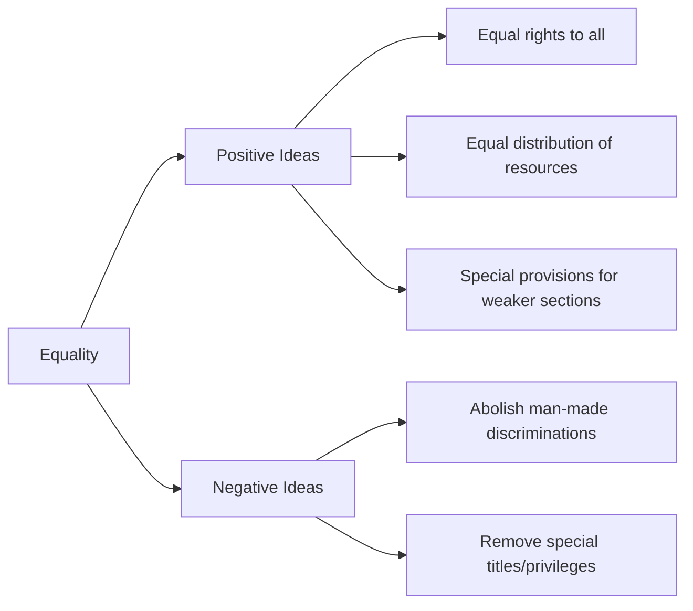

**Positive Ideas:**
*   Providing equal rights to all
*   Equal distribution of resources
*   Equal opportunities to progress
*   Special provisions for SC/ST/OBC/Women/Disabled (This is NOT violation of equality)

**Negative Ideas:**
*   Abolishing man-made discriminations
*   Removing special titles, rights enjoyed by higher classes

!!! tip "Exam Definition"
    **Equal Opportunity** does NOT mean same opportunities for all, but means providing appropriate educational opportunities according to abilities and aptitudes, ensuring everyone's potential grows to the fullest.

#### (iv) Fraternity

**Definition:** Ensuring individual's dignity and nation's unity and integrity.

**Key Elements:**
*   Considering everyone as brother/sister
*   "Unity in Diversity"
*   Living in harmony without social conflicts
*   Reinforcing democracy

## 3:03 Fundamental Rights and Duties of Indian Citizens

!!! abstract "Definition - Fundamental Rights"
    **Fundamental Rights** are basic human freedoms that every Indian citizen is entitled to enjoy for proper and harmonious personality development. They apply universally to all citizens, irrespective of race, place of birth, religion, caste, or gender, and are **enforceable by courts** (subject to certain restrictions).

### 3:03:1 Eight Fundamental Rights (Articles 12-35)

#### 1. Right to Equality (Articles 14-18)
*   **Equality before law**
*   **Prohibition of discrimination** on grounds of religion, race, caste, gender, place of birth
*   **Equality of opportunity** in employment
*   **Abolition of untouchability** (Article 17)
*   **Abolition of titles** (Article 18)

#### 2. Right to Freedom (Articles 19-22)
*   Freedom of **speech and expression**
*   Freedom of **assembly**
*   Freedom of **association/union/cooperatives**
*   Freedom of **movement and residence**
*   Right to **practice any profession/occupation**
*   **Right to life and liberty**
*   Protection against conviction and arrest

!!! note "Restrictions"
    These rights are subject to: Security of State, friendly relations with foreign countries, public order, decency, or morality.

#### 3. Right against Exploitation (Articles 23-24)
*   Prohibition of all forms of **forced labour**
*   Prohibition of **child labour**
*   Prohibition of **trafficking** of human beings

#### 4. Right to Freedom of Religion (Articles 25-28)
*   Freedom of **conscience** and free profession, practice, propagation of religion
*   Freedom to **manage religious affairs**
*   Freedom from certain taxes
*   Freedom regarding **religious instruction** in educational institutions

#### 5. Cultural and Educational Rights (Articles 29-30)
*   Right to **conserve culture, language, or script**
*   **Right of minorities** to establish and administer educational institutions

#### 6. Right to Constitutional Remedies (Article 32)
*   Right to approach courts for **enforcement of Fundamental Rights**
*   Dr. Ambedkar called this the **"Heart and Soul"** of the Constitution

#### 7. Right to Education (Article 21A)
!!! success "Latest Addition"
    Added through **86th Amendment**. It is the **Fundamental Right** of all children aged **6-14 years** to get free and compulsory education.

#### 8. Right to Information (Article 19(1))
*   Right of general public to get information from any government department
*   **Exception:** Country's security and foreign affairs

### 3:03:2 Eleven Fundamental Duties (Article 51A - Part IVA)

!!! info "Added by 42nd Amendment"
    Fundamental Duties were added to the Constitution through the **42nd Amendment**.

| No. | Fundamental Duty |
| :---: | :--- |
| **1** | Abide by Constitution; respect ideals, institutions, National Flag, National Anthem |
| **2** | Cherish and follow noble ideals of national freedom struggle |
| **3** | Uphold and protect sovereignty, unity, and integrity of India |
| **4** | Defend the country; render national service when called |
| **5** | Promote harmony and common brotherhood; renounce practices derogatory to women's dignity |
| **6** | Value and preserve rich heritage of composite culture |
| **7** | Protect natural environment (forests, lakes, rivers, wildlife); compassion for living creatures |
| **8** | Develop scientific temper, humanism, spirit of inquiry and reform |
| **9** | Safeguard public property; abjure violence |
| **10** | Strive towards excellence in all spheres |
| **11** | **Parent/Guardian to provide education opportunity to child aged 6-14 years** |

## 3:04 Directive Principles of State Policy and Education

### 3:04:1 Directive Principles of State Policy (Part IV - Articles 36-51)

!!! abstract "Definition"
    **Directive Principles** are directions given to the State to guide the establishment of economic and social democracy, as proposed by the Preamble.

**Key Characteristics:**
*   State expected to keep these in mind while framing laws and policies
*   **Cannot be enforced by any Court of Law**
*   Act as a check on the State
*   Provide yardstick to measure government performance

#### Categories of Directive Principles:
1.  Ideals that State ought to strive towards
2.  Directions for legislative and executive power
3.  Rights of citizens which State should secure

### Important Articles Related to Education:

#### Article 36: Definition of "State"
Includes Central and State governments.

#### Article 37: Non-justiciable Nature
Provisions cannot be enforced by court, but fundamental in governance; State's duty to apply these in making laws.

#### Article 38: Social Order and Welfare
*   State shall strive to promote welfare through social, economic, political justice
*   Minimize inequalities in income
*   Eliminate inequalities in status, facilities, opportunities
*   Ensure individual dignity

#### Article 39: Certain Policy Principles
*   Adequate means of livelihood
*   **Equal pay for equal work for men and women**
*   Reduction of wealth concentration
*   Distribution of resources for common good

#### Article 39A: Equal Justice and Free Legal Aid
Free legal aid to ensure opportunities for justice not denied due to economic disabilities.

#### Article 40: Village Panchayats
Organize village panchayats as units of self-government.

#### Article 41: Right to Work, Education, Public Assistance
!!! important "Key Article"
    **"The State shall... make effective provision for securing the right to work, to education and to public assistance in cases of unemployment, old age, sickness and disablement."**

#### Article 42: Maternity Relief
Just and humane conditions of work and maternity relief.

#### Article 43: Living Wage for Workers
Secure living wage, decent standard of life, leisure, cultural opportunities.

#### Article 43A: Workers' Participation in Management
Steps to secure participation of workers in management.

#### Article 44: Uniform Civil Code
State shall endeavor to secure uniform civil code for citizens of India.

#### Article 45: Free and Compulsory Education for Children
!!! success "Historic Article"
    **"The State shall endeavour to provide, within a period of ten years from the commencement of this Constitution, for free and compulsory education for all children until they complete the age of fourteen years."**

!!! note "Important Transformation"
    This Directive Principle was later elevated to a **Fundamental Right** as **Article 21A** through the **86th Amendment**.

#### Article 46: Promotion of Educational and Economic Interests of SC/ST
!!! important "Key Article for Weaker Sections"
    **"The State shall promote with special care the educational and economic interests of the weaker sections of the people, and in particular, of the Scheduled Castes and Scheduled Tribes and shall protect them from social injustice and all forms of exploitation."**

#### Article 47: Nutrition, Standard of Living, Public Health
Raise level of nutrition, standard of living, improve public health.

#### Article 48: Agriculture and Animal Husbandry
Organize agriculture on modern lines; protect cows and cattle.

#### Article 48A: Environment Protection
Protect and improve environment; safeguard forests and wildlife.

#### Article 49: Protection of Monuments
Protect monuments of national importance.

#### Article 50: Separation of Judiciary from Executive
Steps to separate judiciary from executive.

#### Article 51: International Peace and Security
*   Promote international peace
*   Maintain relations between nations
*   Foster respect for international law
*   Encourage settlement of disputes by arbitration

### 3:04:1:01 Limitations of Directive Principles

| Limitation | Explanation |
| :--- | :--- |
| **Not Time-bound** | No specific deadline for implementation |
| **Not Enforceable** | Cannot be enforced through courts |
| **Some became Articles** | Some took form of Constitutional Articles |
| **Some became Laws** | Right to Information (2005), Right to Education (2009) became laws |

### 3:04:2 Constitutional Provisions Relating to Education

#### Article 45: Provision for Free and Compulsory Education

!!! quote "Article Text"
    "The State shall endeavour to provide within a period of 10 years from the commencement of this Constitution, for free and compulsory education for all children until they complete the age of fourteen years."

**Definition of "State" (Article 12):**
*   Government and Parliament of India
*   Government and Legislature of each State
*   All local authorities within territory of India

#### Article 46: Promotion of Educational/Economic Interests of Weaker Sections

!!! quote "Article Text"
    "The state shall promote with special care the educational and economic interests of the weaker sections of the people, and in particular, of the Scheduled Castes and the Scheduled Tribes and shall protect them from social injustice and all forms of exploitation."

!!! success "Important Note"
    **Article 45** (from Directive Principles) has been included as **Article 21A** (Fundamental Right to Education) through the **86th Amendment**.

### 3:04:2:01 Provisions Safeguarding Educational Rights of Minorities

#### Article 28: Freedom Regarding Religious Instruction

**Clause (1):** No religious instruction shall be provided in any educational institution **wholly maintained out of State funds**.

**Clause (2):** Does not apply to institutions administered by State but established under endowment/trust requiring religious instruction.

**Clause (3):** No person attending State-recognized or State-aided institution shall be required to participate in religious worship/instruction unless consent is given (by guardian if minor).

#### Article 29, Clause (2): Right of Admission in Educational Institution

!!! important "Anti-Discrimination Provision"
    **"No citizen shall be denied admission into educational institution maintained by the State or receiving aid out of State funds on grounds only of religion, race, caste, language or any of them."**

#### Article 30: Right of Minorities to Establish Educational Institutions

**Clause (1) - Right to Establish and Administer:**
!!! success "Key Minority Right"
    **"All minorities, whether based on religion or language, shall have the right to establish and administer educational institutions of their choice."**

**Clause (2) - Non-Discrimination in Aid:**
!!! success "Equal Treatment"
    **"The State shall not, in granting aid to educational institutions, discriminate against any educational institution on the ground that it is under the management of a minority, whether based on religion or language."**

## 3:05 Challenges Faced in Fulfilling Constitutional Obligations

India's Constitution came into effect on **26th January 1950**. Parliament, Executive, and Judiciary are bound to function according to Constitutional provisions.

!!! info "Constitutional Facts"
    *   **Current Structure:** 25 Appendices + 448 Articles + 12 Schedules
    *   **World's Longest:** Written Constitution
    *   **Flexibility:** Amended **105 times** in 72 years (to 2022)
    *   **Nature:** Flexible to fulfill emerging needs

### 3:05:1 Challenges to Freedom

#### Article 19: Six Fundamental Freedoms
1.  Freedom of **speech and expression**
2.  Freedom to **assemble peacefully** without arms
3.  Freedom to **form associations or unions**
4.  Freedom to **move freely** throughout India
5.  Freedom to **reside and settle** anywhere in India
6.  Freedom to **practice any profession**, occupation, trade, commerce

#### Current Challenges:

| Challenge | Description |
| :--- | :--- |
| **State Interference** | Frequent interference in freedom of speech/expression |
| **Foisting Cases** | Cases against those who criticize government |
| **Media Ethics** | Publishing baseless, sensational news |
| **Misunderstanding of Rights** | People don't realize freedom is not absolute; should not harm others or be anti-national |
| **Selfishness** | Behaving selfishly under guise of freedom; suppressing the oppressed |

!!! warning "Solution"
    **Education** should make people aware of the nature and extent of their freedom.

### 3:05:2 Challenges to Justice

#### Problems in Justice Delivery:

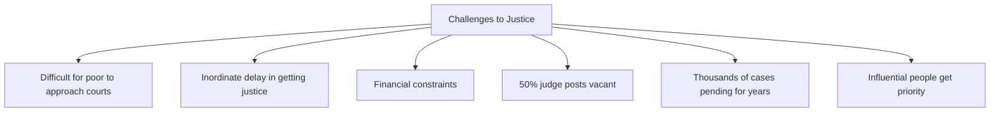

!!! danger "Critical Issue"
    **"Justice delayed is justice denied"**

**Root Causes:**
*   Government's financial condition prevents proportionate court establishment
*   Inadequate number of judges
*   ~50% judge posts vacant (retiring judges not replaced promptly)
*   Thousands of cases pending for years
*   Cases of influential people get priority

### 3:05:3 Challenges to Equality

#### Article 14: Equality Before Law
!!! quote "Constitutional Provision"
    No discrimination on basis of religion, caste, gender, or language.

#### Persistent Issues:

| Issue | Current Status |
| :--- | :--- |
| **Gender Discrimination** | Continues despite laws |
| **Infanticide** | Prevented to great extent but not eradicated |
| **Atrocities against Women** | Molestation continues despite laws |
| **Honour Killing** | Due to inter-caste marriages |
| **Employment Discrimination** | Inequality in salary, promotion |
| **Religious/Social Reforms** | Conservatives and religious leaders hamper government efforts |
| **Untouchability** | Not eradicated despite laws; emerging in new forms |

### 3:05:4 Challenges to Fraternity

#### Divisive Factors in Indian Society:

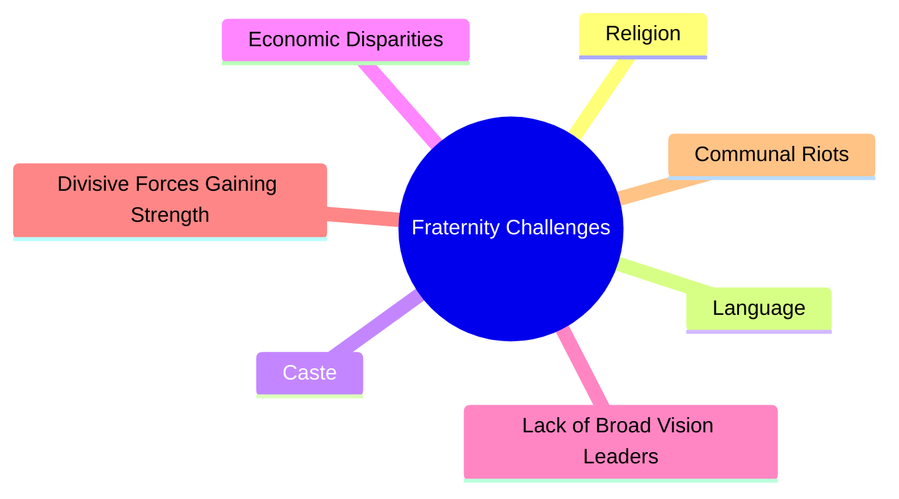

**Key Problems:**
*   Society divided by religion, language, caste, economic disparities
*   Divisive forces gaining strength
*   Scarcity of national leaders with broad vision and selflessness
*   People cannot be separated from divisive forces
*   Small violent acts colored with caste/religion/language leading to riots
*   Lack of "We" feeling among people

!!! success "Solution"
    **"All of us are Indians; if only India lives, all of us can live; if India falls, all of us will fall together."**  
    This **"We" feeling** needs to be strengthened through education and social awareness.

---

## � Conclusion

In this comprehensive lesson on Indian Constitutional Values and Education, we have covered:

1.  **Structure of the Indian Constitution** - The world's longest written constitution with 448 Articles and 12 Schedules
2.  **Preamble** - The four foundational values: Justice, Liberty, Equality, and Fraternity
3.  **Fundamental Rights** - Eight categories of rights enforceable by courts, including the crucial Right to Education (Article 21A)
4.  **Fundamental Duties** - Eleven duties of citizens, including parental duty to provide education
5.  **Directive Principles** - Non-enforceable guidelines for state policy, particularly Articles 45 and 46 related to education
6.  **Minority Rights** - Constitutional safeguards under Articles 28, 29, and 30
7.  **Challenges** - Contemporary issues in fulfilling constitutional obligations regarding freedom, justice, equality, and fraternity

!!! tip "Key Takeaway"
    Education plays a vital role in realizing constitutional values and building a just, equitable, and fraternal society. The transformation of Article 45 (Directive Principle) into Article 21A (Fundamental Right) marks a historic achievement in India's commitment to universal education.

---

---

## 3:06 Education and Freedom, Justice, Equality, Fraternity

### 3:06:1 Education and Freedom

!!! success "Role of Education in Promoting Freedom"
    Education plays a vital role in making citizens aware of their freedoms and how to exercise them responsibly.

**How Education Promotes Freedom:**

1.  **Awareness of Rights:** Education makes people aware that they have freedom of speech, expression, movement, profession, etc.
2.  **Responsible Exercise:** Education teaches that freedom is not absolute and should be exercised without harming others or the nation.
3.  **Critical Thinking:** Educated citizens can critically evaluate government policies and express constructive criticism.
4.  **Democratic Participation:** Education enables meaningful participation in democratic processes.
5.  **Freedom from Ignorance:** Education liberates individuals from the bondage of ignorance and superstition.

!!! quote "Key Principle"
    **"Freedom is not doing what you like, but having the right to do what you ought."**

### 3:06:2 Education and Justice

**Three Dimensions of Justice through Education:**

#### a) Social Justice through Education
*   Providing **reservation in educational institutions** for SC/ST/OBC
*   **Special scholarships and incentives** for marginalized communities
*   Establishing schools in tribal and backward areas
*   **Mid-day meal schemes** to attract poor children to schools
*   Free textbooks and uniforms for economically weaker sections

#### b) Economic Justice through Education
*   **Vocational education** to enable self-employment
*   Skill development programs for unemployed youth
*   Adult education to improve economic opportunities
*   **Education for entrepreneurship**
*   Empowering women through education for economic independence

#### c) Political Justice through Education
*   **Civic education** about voting rights and political processes
*   Education about constitutional rights and duties
*   Developing **leadership qualities** among youth
*   Creating awareness about reservation in Parliament/Assemblies
*   Training in **democratic values** and processes

### 3:06:3 Education and Equality

!!! important "Education as the Great Equalizer"
    Education is the most powerful tool to reduce inequality and promote social mobility.

**How Education Promotes Equality:**

| Initiative | Impact |
| :--- | :--- |
| **Free and Compulsory Education** | Ensures all children (6-14 years) get education regardless of economic status |
| **Reservation Policy** | 15% for SC, 7.5% for ST in educational institutions |
| **Scholarships for Girls** | Promotes gender equality in education |
| **Special Schools** | Navodaya Vidyalayas, Kasturba Gandhi Balika Vidyalayas |
| **Inclusive Education** | Integration of children with disabilities |
| **Bridge Courses** | For children from disadvantaged backgrounds |

**Barriers to Equality in Education:**
*   Economic poverty
*   Social discrimination (caste/religion)
*   Gender bias
*   Regional imbalances (urban-rural divide)
*   Language barriers

### 3:06:4 Education and Fraternity

!!! abstract "Definition"
    **Fraternity** means developing a sense of brotherhood and social solidarity among all citizens, celebrating "Unity in Diversity."

**How Education Promotes Fraternity:**

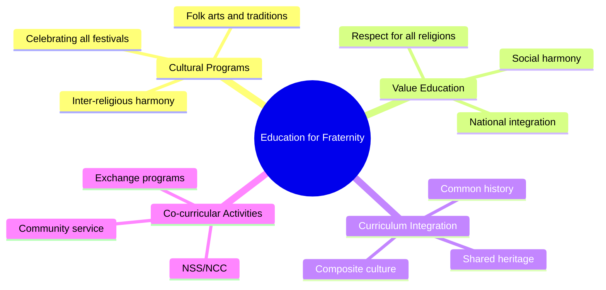

**Specific Educational Measures:**

1.  **Three-Language Formula:** Promotes linguistic harmony
2.  **Common School System:** Children from all backgrounds study together
3.  **Value Education:** Teaching moral and spiritual values
4.  **National Integration Camps:** Bringing students from different regions together
5.  **Cultural Exchange Programs:** Understanding diversity
6.  **Social Service Activities:** NSS, NCC, Scouts & Guides

!!! tip "Exam Point"
    Education cultivates **"Unity in Diversity"** by helping students appreciate India's pluralistic society while strengthening national identity.

---

## 3:07 Meaning of 'Social Justice' and Education as a Means

### 3:07:1 Meaning of Social Justice

!!! abstract "Definition - Social Justice"
    **Social Justice** refers to the fair and equitable distribution of resources, opportunities, and privileges within a society, ensuring that the rights of all individuals and groups are protected, especially those who are disadvantaged or marginalized.

**Key Elements of Social Justice:**

| Element | Meaning |
| :--- | :--- |
| **Distributive Justice** | Fair distribution of wealth, resources, and opportunities |
| **Procedural Justice** | Fair processes and procedures in institutions |
| **Retributive Justice** | Fair punishment for wrongdoing |
| **Restorative Justice** | Repairing harm and restoring relationships |

**Social Justice in Indian Context:**
*   Eradicating **caste-based discrimination**
*   Ensuring **gender equality**
*   Uplifting **economically weaker sections**
*   Protecting rights of **minorities and tribal communities**
*   **Equal opportunities** for all in education and employment

### 3:07:2 Education as a Means to Achieve Social Justice

!!! success "Education: The Ladder of Social Mobility"
    Education is the most effective instrument for achieving social justice and transforming society.

**How Education Achieves Social Justice:**

#### 1. Breaking the Cycle of Poverty
*   Education provides **skills and knowledge** for better employment
*   **Increases earning potential** and standard of living
*   Empowers individuals to claim their rights

#### 2. Eliminating Discrimination
*   Creates **awareness about equality** and human rights
*   Challenges **prejudices and stereotypes**
*   Promotes **respect for diversity**

#### 3. Empowering Marginalized Communities
*   **Reservation in educational institutions** (SC/ST/OBC)
*   Special scholarships and hostels
*   Establishment of schools in tribal/backward areas
*   **Adult education programs** for those who missed schooling

#### 4. Promoting Gender Equality
*   Girls' education programs (Beti Bachao Beti Padhao)
*   Kasturba Gandhi Balika Vidyalayas
*   Free education for girls
*   Incentives for parents to send girls to school

#### 5. Enabling Social Mobility
*   Education allows movement from lower to higher social strata
*   Merit-based opportunities
*   Breaking hereditary occupation patterns

**Constitutional Backing:**
*   **Article 46:** Promotes educational interests of SC/ST and weaker sections
*   **Article 45/21A:** Free and compulsory education for all children (6-14 years)
*   **Article 30:** Minorities' right to establish educational institutions

!!! example "Success Stories"
    Dr. B.R. Ambedkar himself is a prime example of how education can empower individuals from marginalized communities to achieve great heights and transform society.

---

## 3:08 Right to Education Act (RTE)

### 3:08:1 Background and Need for RTE Act

!!! info "Historical Evolution"
    **Article 45** (Directive Principle) → **86th Constitutional Amendment (2002)** → **Article 21A** (Fundamental Right) → **RTE Act 2009**

**Why RTE Act was Needed:**

| Problem | Solution through RTE |
| :--- | :--- |
| Millions of children out of school | Made education a legal entitlement |
| High dropout rates | Made schooling compulsory |
| Poor quality of education | Prescribed norms and standards |
| Discrimination in admission | Ensured non-discrimination |
| Financial barriers | Made education free |
| Infrastructure deficiencies | Set minimum standards for schools |

**Timeline:**

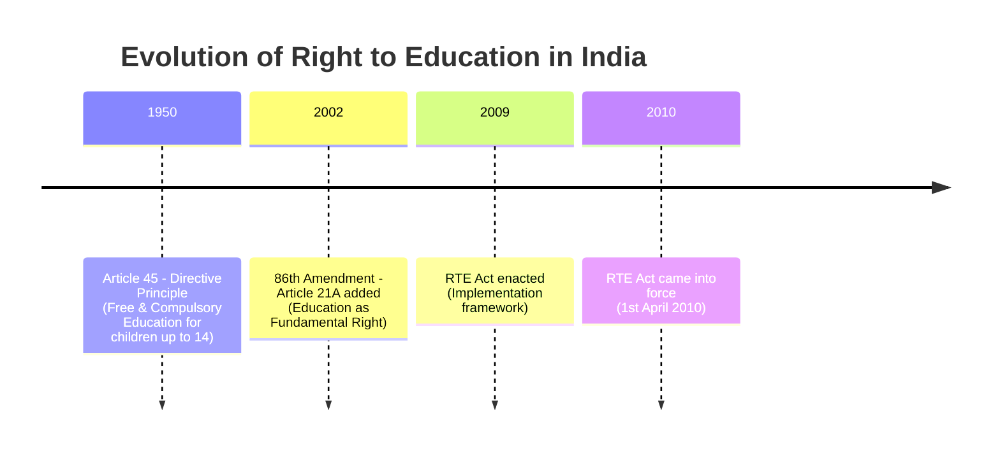

### 3:08:2 The Right of Children to Free and Compulsory Education Act, 2009

!!! abstract "Full Title"
    **"The Right of Children to Free and Compulsory Education Act, 2009"** - Also known as **RTE Act 2009**

**Date of Enactment:** 4th August 2009  
**Date of Implementation:** 1st April 2010

!!! quote "Article 21A"
    **"The State shall provide free and compulsory education to all children of the age of six to fourteen years in such manner as the State may, by law, determine."**

**Scope:**
*   Applies to children aged **6 to 14 years**
*   Covers elementary education (Classes I to VIII)
*   Makes education both **FREE** and **COMPULSORY**

### 3:08:3 Salient Features of RTE Act 2009

#### 1. Free and Compulsory Education
!!! success "Core Provision"
    *   **Free Education:** No child shall be liable to pay any fee or charges
    *   **Compulsory Education:** Duty of government to provide and ensure admission, attendance, and completion

#### 2. Non-Discrimination and Equal Opportunity
*   No child shall be denied admission on grounds of:
    *   Religion, caste, or creed
    *   Gender
    *   Place of birth
    *   Disability

#### 3. Age-Appropriate Admission
*   Child admitted to age-appropriate class
*   Special training for children directly admitted to age-appropriate class
*   Bridge courses for out-of-school children

#### 4. No Screening or Capitation Fee
!!! important "Prohibited Practices"
    *   **No screening procedures** for admission
    *   **No capitation fees** charged
    *   **No donation** for admission

#### 5. Reservation for Disadvantaged Children
*   **25% seats reserved** in private unaided schools for children from:
    *   Economically Weaker Sections (EWS)
    *   Disadvantaged groups

#### 6. Prohibition of:
*   **Physical punishment and mental harassment**
*   **Holding back** or expulsion of child till completion of elementary education
*   **Private tuition by teachers**
*   **Capitation fees**

#### 7. School Infrastructure Norms

| Requirement | Specification |
| :--- | :--- |
| **Playground** | Mandatory |
| **Drinking Water** | Safe and adequate |
| **Toilets** | Separate for boys and girls |
| **Kitchen** | For mid-day meal |
| **Boundary Wall** | For safety |
| **Library** | Adequate books and materials |
| **Classrooms** | One per teacher |

#### 8. Pupil-Teacher Ratio (PTR)
*   **Primary (I-V):** 1:30
*   **Upper Primary (VI-VIII):** 1:35

#### 9. Teacher Qualifications
*   Teachers must possess **minimum qualifications** prescribed by NCTE
*   In-service teachers given **5 years** to acquire minimum qualifications

#### 10. No Deployment of Teachers for Non-Academic Work
*   Except: Census, Elections, Disaster Relief

#### 11. Continuous and Comprehensive Evaluation (CCE)
*   No Board exams till Class VIII
*   Focus on **holistic development**
*   Regular assessment of learning outcomes

#### 12. Curriculum and Syllabus
*   Based on Constitutional values
*   **Child-centered and child-friendly**
*   All-round development of the child
*   Building knowledge, skills, and attitudes

#### 13. School Management Committee (SMC)
*   **75% parents** representation
*   **50% women** members
*   Proportionate representation from SC/ST/OBC/minorities
*   Functions: School development plan, monitoring

#### 14. Duties and Responsibilities

**Duties of Parents/Guardians:**
*   Admit child to elementary education
*   Ensure child's attendance and completion

**Duties of School Management:**
*   Provide free and compulsory education
*   Ensure quality education
*   Maintain records of children

**Duties of Government:**
*   Ensure availability of schools within 1 km (primary) and 3 km (upper primary)
*   Provide infrastructure and teachers
*   Training of teachers
*   Ensure quality standards

### 3:08:4 Significance and Impact of RTE Act

**Positive Impacts:**

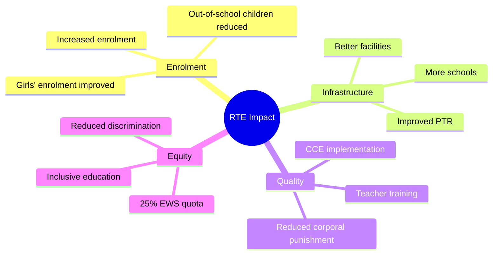

**Challenges in Implementation:**
*   Inadequate infrastructure in many schools
*   Teacher shortage and vacancies
*   Quality of education in some schools
*   Weak monitoring mechanisms
*   Financial constraints
*   Resistance from private schools to 25% quota

!!! tip "Exam Importance"
    RTE Act 2009 is one of the most significant educational reforms in India. Remember: **Free + Compulsory + 6-14 years + Article 21A + 25% EWS quota**

---

## 3:09 Education in the Seventh Schedule

### 3:09:1 The Seventh Schedule of Indian Constitution

!!! abstract "What is Seventh Schedule?"
    The **Seventh Schedule** of the Indian Constitution (Article 246) divides powers between the Central (Union) Government and State Governments through **THREE LISTS**.

### Three Lists in Seventh Schedule

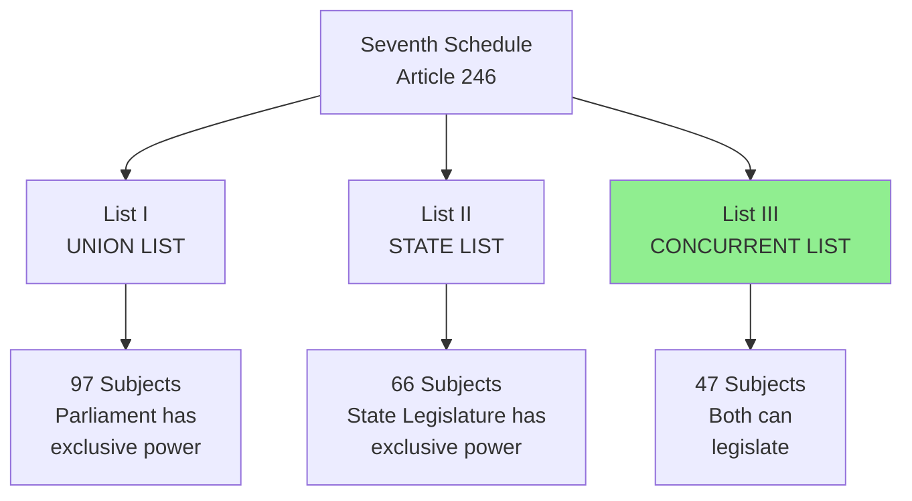

| List | Name | Authority | Number of Subjects | Examples |
| :---: | :--- | :--- | :---: | :--- |
| **I** | **Union List** | Parliament (Central Govt) | 97 | Defence, Foreign Affairs, Railways, Banking |
| **II** | **State List** | State Legislature | 66 | Police, Public Health, Agriculture, Local Govt |
| **III** | **Concurrent List** | Both Central & State | 47 | Education, Forest, Marriage, Adoption |

### 3:09:2 Education in the Lists - Original Position (1950)

**Original Constitution (1950):**

| Subject | List | Entry Number | Details |
| :--- | :---: | :---: | :--- |
| **Education** | **State List (List II)** | **Entry 11** | Education including universities (subject to Union List entries) |
| Coordination & standards | Union List (List I) | Entry 64 | Institutions for scientific/technical training |
| Coordination & standards | Union List (List I) | Entry 65 | Union agencies and institutions for professional, vocational, or technical training |
| Coordination & standards | Union List (List I) | Entry 66 | Coordination & standards in higher education/research |

!!! note "Key Point"
    Originally, **Education was primarily a STATE subject** with some Central coordination for higher education and technical training.

### 3:09:3 Transfer of Education to Concurrent List (1976)

#### Background and Need

**Before 1976:**
*   Education in **State List** → States had full control
*   Central government's role limited to coordination
*   Led to disparities in educational standards across states
*   National educational policies difficult to implement uniformly

**Reasons for Transfer:**

| Reason | Explanation |
| :--- | :--- |
| **Uniform Standards** | Need for common educational standards across India |
| **National Integration** | Education essential for building national character |
| **Planned Development** | Coordinated planning required for development |
| **Financial Resources** | Central government has better financial capacity |
| **Educational Expansion** | Need for uniform expansion of education |
| **Quality Control** | Central oversight needed for quality assurance |

#### The 42nd Amendment Act, 1976

!!! success "Historic Change"
    Through the **42nd Amendment Act, 1976**, Education was transferred from **State List (List II, Entry 11)** to **Concurrent List (List III, Entry 25)**.

**Date:** 3rd January 1977 (came into force)

**What Changed:**

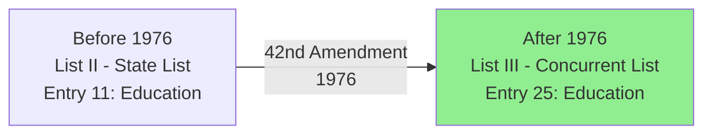

**Current Position:**
*   **Entry 25** of Concurrent List: "Education, including technical education, medical education and universities, subject to the provisions of entries 63, 64, 65 and 66 of List I; vocational and technical training of labour."

### 3:09:4 Implications of Education Being in Concurrent List

#### Positive Implications

!!! success "Benefits of Concurrent List Status"

**1. Shared Responsibility**
*   Both Central and State governments can legislate on education
*   Better coordination between Centre and States
*   Combined resources and expertise

**2. Uniform Standards**
*   National policies like NPE 1986, RTE Act 2009 applicable to all states
*   Common educational standards across India
*   Uniform curriculum framework (NCF)

**3. Financial Support**
*   Central government provides substantial funding through:
    *   **Centrally Sponsored Schemes** (Samagra Shiksha)
    *   Grants to states
    *   Special programs

**4. National Integration**
*   Common educational policies promote national unity
*   Three-language formula
*   Value education for national integration

**5. Coordinated Planning**
*   **Five Year Plans** for education
*   National level assessment (NAS)
*   Coordinated teacher training programs

**6. Quality Assurance**
*   Central bodies: NCERT, NCTE, NIOS, UGC, AICTE
*   Standard setting for schools/colleges/universities
*   Accreditation and monitoring mechanisms

#### Negative Implications/Challenges

!!! warning "Challenges"

**1. Reduced State Autonomy**
*   States have less flexibility in policy-making
*   Regional needs may be overlooked
*   Cultural diversity may not be fully addressed

**2. Central Dominance**
*   In case of conflict, **Central law prevails** over State law (Article 254)
*   States feel their authority undermined

**3. Financial Dependency**
*   States become dependent on Central grants
*   States' own initiatives may be constrained

**4. Delays in Decision Making**
*   Coordination between Centre and States takes time
*   Bureaucratic delays

**5. One-Size-Fits-All Approach**
*   National policies may not suit all states
*   Regional variations not adequately addressed
*   Local contexts and needs ignored

### 3:09:5 Arguments For and Against Concurrent List

#### Arguments IN FAVOR of Education in Concurrent List

| Argument | Explanation |
| :--- | :--- |
| **National Character** | Education shapes national character; requires uniform policy |
| **Equal Opportunities** | Ensures equal educational opportunities across India |
| **Resource Mobilization** | Central govt has better financial resources |
| **Quality Standards** | Uniform quality standards across the country |
| **Modern Needs** | National perspective needed for global competitiveness |
| **Planned Development** | Coordinated five-year plans possible |

#### Arguments AGAINST Education in Concurrent List

| Argument | Explanation |
| :--- | :--- |
| **Federal Structure** | Violates federal principle; encroaches on state autonomy |
| **Regional Diversity** | One policy cannot fit diverse cultural/linguistic regions |
| **Local Needs** | States better understand local educational needs |
| **Democratic Decentralization** | Education should be closer to people |
| **Flexibility Lost** | States cannot experiment with innovative approaches |
| **Central Bureaucracy** | Creates red tape and delays |

### 3:09:6 Current Scenario

**Concurrent List Status - Balanced Approach:**

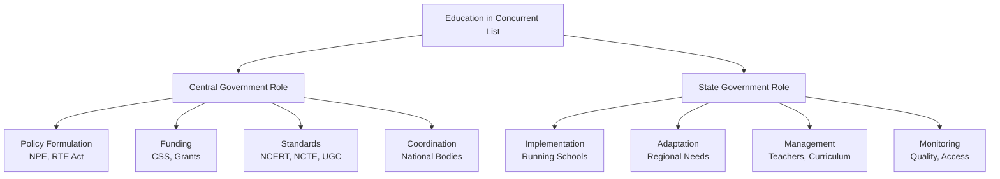

!!! tip "Exam Point"
    Remember: Education in Concurrent List means **BOTH** Central and State governments can legislate. In case of conflict, **Central law prevails**. This was done through **42nd Amendment in 1976** to ensure **uniform standards and national integration**.

---

## ✅ Conclusion - Lesson 3

This comprehensive lesson on **Indian Constitutional Values and Education** has covered:

1.  **Structure of Constitution** - World's longest written constitution with flexibility
2.  **Preamble** - Four cardinal values: Justice, Liberty, Equality, Fraternity
3.  **Fundamental Rights** - Eight categories including crucial Right to Education (Article 21A)
4.  **Fundamental Duties** - Eleven duties of citizens including parental duty to educate children
5.  **Directive Principles** - Non-enforceable guidelines, especially Articles 45 & 46 for education
6.  **Minority Rights** - Articles 28, 29, 30 safeguarding educational rights
7.  **Education and Constitutional Values** - How education promotes Freedom, Justice, Equality, Fraternity
8.  **Social Justice** - Education as the primary tool for achieving social justice
9.  **RTE Act 2009** - Historic legislation making education a fundamental right with key features
10. **Seventh Schedule** - Transfer of education from State List to Concurrent List in 1976 and its implications
11. **Contemporary Challenges** - Issues in fulfilling constitutional obligations

!!! success "Key Takeaway"
    The Indian Constitution provides a comprehensive framework for education as a tool for social transformation. The evolution from Article 45 (Directive Principle) to Article 21A (Fundamental Right) through RTE Act 2009 marks India's commitment to universal education. Education in the Concurrent List ensures both national standards and regional flexibility.

---

## ❓ Review Questions - Complete Unit I

### Review Questions - Lesson 1

#### Conceptual (C)
1.  What is the concept of Education? [1:01]
2.  Define 'Education' (Adam's or Redden's definition). [1:03]
3.  State any five characteristics of education. [1:04]
4.  What are the two general aims of education? [1:05]
5.  List the specific aims of education. [1:05]
6.  State the national objectives of education in India. [1:05:1]
7.  What are the functions of education towards individual? [1:06]
8.  Define 'Academic Discipline'. [1:07:1]
9.  Differentiate between Formal, Non-formal, and Informal education. [1:08]

#### Analytical (B)
1.  Explain the indispensability of education to man. [1:02]
2.  Discuss the nature/characteristics of education. [1:04]
3.  Explain the Individual and Social aims of education. [1:05]
4.  Discuss the functions of education towards society and nation. [1:06]
5.  Explain the nature of Education as a separate discipline. [1:07:2]

### Review Questions - Lesson 2

#### Conceptual (C)
1.  What are the various levels of education? [2:01]
2.  Define Pre-primary education. [2:02:1]
3.  State the objectives of Pre-primary education. [2:02:3]
4.  What is Primary education? [2:03:1]
5.  What do you mean by Secondary education? [2:04:1]
6.  State the aims of Higher Secondary education. [2:05:2]
7.  Define Higher education. [2:06:1]
8.  What is meant by Professional education? [2:07:1]
9.  Define 'Distance Education'. [2:08:1]
10. What is the concept of 'Open Education'? [2:09:1]

#### Analytical (B)
1.  Explain the importance and objectives of Pre-primary education. [2:02:2 + 2:02:3]
2.  Discuss the importance and objectives of Secondary education. [2:04:2 + 2:04:3]
3.  Explain the aims of Higher education and problems faced. [2:06:2 + 2:06:3]
4.  Suggest measures for improving quality of higher education. [2:06:4]
5.  Explain the need and salient features of Distance education. [2:08:2 + 2:08:4]
6.  Discuss the objectives and advantages of Open School System. [2:09:3 + 2:09:5]

### Review Questions - Lesson 3

#### Conceptual (C)
1.  What are the four values enshrined in the Preamble? [3:02]
2.  Define the three types of Justice. [3:02]
3.  What is meant by 'Equality' and 'Fraternity'? [3:02]
4.  State the eight Fundamental Rights. [3:03:1]
5.  List the eleven Fundamental Duties. [3:03:2]
6.  What is Article 21A? [3:03:1]
7.  Define 'Directive Principles of State Policy'. [3:04:1]
8.  What does Article 45 state? [3:04:2]
9.  What does Article 46 state? [3:04:2]
10. Explain Article 30 regarding minorities. [3:04:2:01]
11. Define 'Social Justice'. [3:07:1]
12. When was RTE Act enacted? [3:08:2]
13. What are the salient features of RTE Act? [3:08:3]
14. What is the Seventh Schedule? [3:09:1]
15. When was education transferred to Concurrent List? [3:09:3]

#### Analytical (B)
1.  Explain the meaning and types of Justice as enshrined in the Constitution. [3:02]
2.  Discuss the concept of Equality with its dimensions. [3:02]
3.  Explain the eight Fundamental Rights with examples. [3:03:1]
4.  Discuss the Directive Principles related to education. [3:04:1 + 3:04:2]
5.  Explain how education promotes Freedom, Justice, Equality, and Fraternity. [3:06]
6.  Discuss education as a means to achieve social justice. [3:07:2]
7.  Explain the background and salient features of RTE Act 2009. [3:08:1 + 3:08:3]
8.  Discuss the implications of education being in the Concurrent List. [3:09:4]
9.  Analyze the challenges faced in fulfilling constitutional obligations. [3:05]

#### Extended Response (A)
1.  **"The Indian Constitution is the mirror of hopes and aspirations of the people."** Discuss with reference to the Preamble and Fundamental Rights.
2.  Critically analyze the transformation of Article 45 (Directive Principle) into Article 21A (Fundamental Right). What are its implications for Indian education?
3.  **"Justice, Liberty, Equality, and Fraternity are interdependent constitutional values."** Discuss with examples and role of education.
4.  Evaluate the role of education in addressing the challenges faced in fulfilling constitutional obligations.
5.  Discuss the constitutional provisions related to education for minorities and weaker sections. Are they adequate?
6.  **"Education in Concurrent List is a blessing in disguise."** Discuss with arguments for and against.
7.  Examine the significance of RTE Act 2009 in the context of constitutional commitment to education.
8.  Compare and contrast the Individual and Social aims of education with national objectives of Indian education.

---

## 📝 Quick Revision Tables - Complete Unit I

### Table 1: Etymology and Definitions

| Source | Origin | Meaning | Perspective |
| :--- | :--- | :--- | :--- |
| **Educare** (Latin) | To bring up/nourish | External imposition | Traditional |
| **Educere** (Latin) | To lead out/draw out | Growth from within | **Modern (Preferred)** |
| **Educatum** (Latin) | Act of teaching/training | External training | Traditional |
| **Vivekananda** | Man-making education | Manifestation of perfection | **Indian/Spiritual** |
| **Gandhi** | All-round drawing out | Body, mind, spirit | **Indian/Holistic** |
| **Adams** | Bipolar process | Personality modification | Western |
| **Redden** | Most comprehensive | Harmonious development | Western |

### Table 2: Aims and Functions

| Aim | Focus | Proponent | Key Point |
| :--- | :--- | :--- | :--- |
| **Individual** | Self-realization | Percy Nunn | Freedom to develop |
| **Social** | Citizenship | Dewey/Bagley | Society's needs |
| **Knowledge** | Cognitive development | - | Power through knowledge |
| **Vocational** | Livelihood | - | Productive skills |
| **Moral** | Character | Herbart | Conquest of lower impulses |
| **Complete Living** | Holistic life | Herbert Spencer | Body, mind, soul |
| **Harmonious** | Balanced growth | - | All potentials equally |
| **Leisure** | Profitable free time | - | Productive leisure |

### Table 3: Levels of Education

| Level | Age Group | Duration | Key Features | Examination |
| :--- | :---: | :---: | :--- | :--- |
| **Pre-Primary** | 2.5-5 | 2-3 years | Play way, No formal teaching | None |
| **Primary** | 5-11 | 5 years | 3 Rs, Basic skills | Internal |
| **Middle** | 11-14 | 3 years | Lower Secondary | Internal |
| **Secondary** | 14-16 | 2 years | High School | **Public (X Std)** |
| **Higher Secondary** | 16-18 | 2 years | +2, Academic/Vocational | **Public (XII Std)** |
| **Higher/University** | 18+ | 3-5+ years | Degree, PG, Research | Semester/Annual |
| **Professional** | 18+ | 2-5 years | Engineering, Medical, Law | Degree |
| **Distance/Open** | 16+ | Flexible | Self-paced, Home-based | Flexible |

### Table 4: Constitutional Articles

| Article | Topic | Category | Enforceable | Content |
| :---: | :--- | :--- | :---: | :--- |
| **14-18** | Equality | Fundamental Right | ✅ Yes | Before law, No discrimination |
| **19-22** | Freedom | Fundamental Right | ✅ Yes | Speech, Movement, Profession, Life |
| **21A** | **Education** | **Fundamental Right** | **✅ Yes** | **Free & Compulsory (6-14)** |
| **23-24** | Anti-Exploitation | Fundamental Right | ✅ Yes | No forced/child labour |
| **25-28** | Religion | Fundamental Right | ✅ Yes | Freedom of religion |
| **29-30** | Culture/Education | Fundamental Right | ✅ Yes | Minorities' rights |
| **32** | Constitutional Remedies | Fundamental Right | ✅ Yes | Right to approach court |
| **45** | Free Education | Directive Principle | ❌ No | Became Art 21A |
| **46** | SC/ST/Weaker | Directive Principle | ❌ No | Educational interests |
| **51A** | Duties | Fundamental Duty | ⚠️ Moral | 11 duties including education |

### Table 5: Key Commissions and Acts

| Year | Commission/Act | Key Recommendation/Feature |
| :---: | :--- | :--- |
| **1952-53** | Secondary Education Commission | Democratic citizenship aim |
| **1964-66** | **Kothari Commission** | **10+2+3 pattern, National objectives** |
| **1976** | 42nd Amendment | Education → Concurrent List |
| **1986** | National Policy on Education | Common school system, Operation Blackboard |
| **2002** | 86th Amendment | Article 21A added (Fundamental Right) |
| **2009** | **RTE Act** | **Free & Compulsory Education implemented** |
| **2010** | RTE Implementation | 1st April 2010 |

### Table 6: Distance and Open Education

| Feature | Distance Education | Open School System |
| :--- | :--- | :--- |
| **Started (India)** | Delhi Univ (1962) | 1979 (NCERT) |
| **Pioneer Institution** | **IGNOU** | **NIOS** (1989) |
| **Entry Requirement** | Higher Secondary | Age 16+, Basic literacy |
| **Flexibility** | High (Time, Place) | Very High (Qualification) |
| **Age Limit** | Usually 18+ | 16+ |
| **Levels Offered** | UG, PG | III, V, VIII, X, XII |
| **Cost** | Moderate | Very Low |
| **Method** | Correspondence + Contact | Modular + Self-paced |

### Table 7: Preamble Values

| Value | Meaning | Types/Dimensions | Role of Education |
| :--- | :--- | :--- | :--- |
| **Justice** | Fair treatment | Social, Economic, Political | Awareness of rights, Empowerment |
| **Liberty** | Freedom | Thought, Expression, Belief, Worship | Critical thinking, Responsible use |
| **Equality** | Equal treatment | Status, Opportunity | Access, Merit, Social mobility |
| **Fraternity** | Brotherhood | Unity, Dignity, Integrity | Unity in diversity, Harmony |

### Table 8: RTE Act 2009 - Quick Facts

| Aspect | Detail |
| :--- | :--- |
| **Full Name** | Right of Children to Free and Compulsory Education Act, 2009 |
| **Enacted** | 4th August 2009 |
| **Implemented** | 1st April 2010 |
| **Constitutional Basis** | Article 21A (86th Amendment, 2002) |
| **Age Group** | **6 to 14 years** |
| **Level** | Elementary Education (Class I-VIII) |
| **Key Feature 1** | Free & Compulsory |
| **Key Feature 2** | 25% EWS quota in private schools |
| **Key Feature 3** | No detention till Class VIII |
| **Key Feature 4** | No capitation fee, No screening |
| **PTR** | 1:30 (Primary), 1:35 (Upper Primary) |
| **Prohibition** | Physical punishment, Private tuition by teachers |

### Table 9: Seventh Schedule

| List | Name | Number of Subjects | Legislative Authority | Education Status |
| :---: | :--- | :---: | :--- | :--- |
| **I** | Union List | 97 | Parliament | Coordination & Higher Ed Standards |
| **II** | State List | 66 | State Legislature | (Earlier: Full control till 1976) |
| **III** | **Concurrent List** | 47 | **Both Centre & State** | **Education (Entry 25) - Since 1977** |

**Key Point:** In Concurrent List, if there's conflict → **Central Law Prevails** (Article 254)

### Table 10: Types of Education

| Type | Structure | Timing | Location | Examples | Flexibility |
| :--- | :--- | :--- | :--- | :--- | :---: |
| **Formal** | Fixed curriculum, Teachers, Exams | Scheduled | School/College | Primary, Secondary, Higher Ed | ❌ Low |
| **Non-Formal** | Flexible curriculum | Flexible | Varied | Adult Ed, Vocational training | ✅ Medium |
| **Informal** | No structure, Incidental | Anytime | Anywhere | Family, Society, Conversation | ✅ High |

---

## 🧠 Memory Mnemonics and Tricks

### 1. Three Latin Origins (3 E's)
**"Every Educated person Excels"**
*   **E**ducare = External (bringing up)
*   **E**ducere = Extract (drawing out) ← **Modern preference**
*   **E**ducatum = Education (act of teaching)

### 2. Preamble Values (JLEF)
**"Just Like Every Friend"**
*   **J** = Justice
*   **L** = Liberty
*   **E** = Equality
*   **F** = Fraternity

### 3. Three Types of Justice (SEP)
**"Separate Equal Parts"**
*   **S** = Social Justice
*   **E** = Economic Justice
*   **P** = Political Justice

### 4. National Objectives (P-S-D-M-C)
**"Please Study Daily, Make Character"**
*   **P** = Productivity
*   **S** = Social/National Integration
*   **D** = Democracy
*   **M** = Modernization
*   **C** = Character building

### 5. RTE Act Key Points (6-14-25)
**"6 to 14, 25 percent free"**
*   **6-14** = Age group
*   **25%** = EWS quota in private schools
*   **FREE** = No fee
*   **COMPULSORY** = Must attend

### 6. Eight Fundamental Rights (EFRE-CR-EI)
**"Every Fair Rule Ensures Citizens' Rights, Education & Information"**
*   **E** = Equality (14-18)
*   **F** = Freedom (19-22)
*   **R** = Against Exploitation (23-24)
*   **E** = Freedom of Religion (25-28)
*   **C** = Cultural and Educational (29-30)
*   **R** = Constitutional Remedies (32)
*   **E** = Education (21A)
*   **I** = Information (19(1))

### 7. Levels of Education (PPM-S-HS-H-P-D)
**"Pre-Primary Moves Slowly, Higher Studies Help Professional Development"**
*   Pre-primary → Primary → Middle → Secondary → Higher Secondary → Higher → Professional → Distance/Open

### 8. Three Lists in Seventh Schedule (U-S-C)
**"Union, State, Combined"**
*   **U** = Union List (97) - Central
*   **S** = State List (66) - State
*   **C** = Concurrent List (47) - Both (Education here since **1976**)

### 9. Amendment Years
**"76 made concurrent, 2002 made right, 2009 made law"**
*   **1976** - 42nd Amendment (Education → Concurrent List)
*   **2002** - 86th Amendment (Article 21A added)
*   **2009** - RTE Act enacted
*   **2010** - RTE Act implemented (1st April)

### 10. Education-Related Articles (45-46-21A-28-29-30)
**"45 + 46 = Nearly 100, Add 21A = Education Now!, 28-29-30 = Minorities Protected"**
*   **45** = Free education (Directive - became 21A)
*   **46** = SC/ST/Weaker sections
*   **21A** = Fundamental Right to Education
*   **28, 29, 30** = Minorities' educational rights

---

## 📊 Comparative Charts

### Chart 1: Individual vs Social Aims

| Aspect | Individual Aim | Social Aim |
| :--- | :--- | :--- |
| **Focus** | Self-realization | Social efficiency |
| **Philosophy** | Individual is supreme | Society is supreme |
| **Proponents** | Percy Nunn, Adams | Dewey, Bagley |
| **Goal** | Personal development | Good citizenship |
| **Freedom** | Maximum freedom | Controlled freedom |
| **Reality** | Individual → Society | Society → Individual |
| **Education For** | Individual's sake | Society's sake |
| **Criticism** | Leads to selfishness | Suppresses individuality |
| **Truth** | ✅ Both are **complementary**, not antagonistic |

### Chart 2: Formal vs Non-Formal vs Informal

| Feature | Formal | Non-Formal | Informal |
| :--- | :--- | :--- | :--- |
| **Structure** | Highly structured | Flexible structure | No structure |
| **Curriculum** | Fixed, Prescribed | Flexible | None |
| **Time** | Fixed schedule | Flexible | Anytime |
| **Place** | School/Institution | Varied | Anywhere |
| **Teachers** | Qualified, Appointed | Facilitators/Trainers | Anyone |
| **Age** | Age-specific | Age-flexible | All ages |
| **Certificate** | Yes | Sometimes | No |
| **Cost** | High | Moderate | Free/Minimal |
| **Examples** | School, College | Adult Ed, ITI | Family, Friends |

### Chart 3: Directive Principles vs Fundamental Rights

| Aspect | Directive Principles (Part IV) | Fundamental Rights (Part III) |
| :--- | :--- | :--- |
| **Nature** | Positive Directions | Negative Restrictions |
| **Enforceability** | ❌ Not enforceable in court | ✅ Enforceable in court |
| **Purpose** | Guidelines for govt policy | Protect individual rights |
| **Scope** | Social/Economic welfare | Civil/Political liberties |
| **Article Range** | Articles 36-51 | Articles 12-35 |
| **Status** | Moral/Political obligation | Legal obligation |
| **Examples** | Art 45 (Education), Art 46 (SC/ST) | Art 21A (Education), Art 19 (Freedom) |
| **Relationship** | **Complementary** - Both needed for welfare state |

### Chart 4: Before and After 42nd Amendment (Education)

| Aspect | Before 1976 | After 1977 (42nd Amendment) |
| :--- | :--- | :--- |
| **List** | State List (List II) | Concurrent List (List III) |
| **Entry No.** | Entry 11 | Entry 25 |
| **Control** | State Government | Both Centre & State |
| **Policy Making** | States independent | National policies possible |
| **Uniformity** | Varied standards | Uniform standards |
| **Resources** | State resources | Combined resources |
| **Examples** | - | NPE 1986, RTE 2009 |
| **Advantage** | State autonomy | National integration |
| **Disadvantage** | Disparity | Less state flexibility |

---

## 🎯 Exam Preparation Tips

### Most Important Topics (Must Know)

1.  ⭐⭐⭐ **Etymology of Education** (Educare, Educere, Educatum)
2.  ⭐⭐⭐ **Definitions** (Vivekananda, Gandhi, Redden)
3.  ⭐⭐⭐ **Individual vs Social Aims**
4.  ⭐⭐⭐ **Types of Education** (Formal, Non-formal, Informal)
5.  ⭐⭐⭐ **Preamble Values** (Justice, Liberty, Equality, Fraternity)
6.  ⭐⭐⭐ **Eight Fundamental Rights** (Especially Article 21A)
7.  ⭐⭐⭐ **Eleven Fundamental Duties**
8.  ⭐⭐⭐ **Article 45 and Article 46** (Directive Principles)
9.  ⭐⭐⭐ **RTE Act 2009** (Features, Significance)
10. ⭐⭐⭐ **Education in Concurrent List** (42nd Amendment 1976)

### Frequently Asked Questions

| Question Pattern | Marks | Key Points to Cover |
| :--- | :---: | :--- |
| **Define Education** | 2-5 | Etymology + One Indian + One Western definition |
| **Aims of Education** | 5-10 | Individual, Social, Specific aims, National objectives |
| **Levels of Education** | 5-10 | All 8 levels with objectives |
| **Preamble Values** | 5-10 | JLEF with types and education's role |
| **Fundamental Rights** | 10-15 | All 8 rights with examples, focus on 21A |
| **RTE Act** | 10-15 | Background, Features, Significance, Challenges |
| **Constitutional Articles** | 10-15 | 45, 46, 21A, 28, 29, 30 with explanation |
| **Concurrent List** | 5-10 | Why transferred, Implications, Arguments for/against |

### Writing Strategy

**For Short Questions (2-5 marks):**
*   Direct answer first
*   1-2 sentences definition/explanation
*   Example if needed
*   Conclude in one line

**For Medium Questions (5-10 marks):**
*   Introduction (1-2 lines)
*   Main content in points (3-5 points)
*   One example per point
*   Conclusion (2 lines)

**For Long Questions (10-15 marks):**
*   Introduction (¶ 1)
*   Multiple sub-headings (3-5 sub-sections)
*   Each sub-section: Definition + Explanation + Example
*   Use tables/diagrams if possible
*   Comprehensive conclusion (¶ last)

### Common Mistakes to Avoid

❌ **Don't:**
*   Mix up Article numbers (45 vs 21A)
*   Confuse Directive Principles with Fundamental Rights
*   Forget the year of amendments (1976, 2002, 2009)
*   Miss key features of RTE Act
*   Ignore examples

✅ **Do:**
*   Remember exact Article numbers
*   Clearly distinguish enforceable vs non-enforceable
*   Memorize important years and dates
*   List all salient features of RTE
*   Always provide relevant examples

---

## 📚 Important Definitions for Exam

!!! tip "Memorize These Exact Definitions"

### 1. Education (Redden - Most Comprehensive)
> "Education is the deliberate and systematic influence exerted by the mature person upon the immature, through instruction, discipline and harmonious development of physical, intellectual, aesthetic, social and spiritual powers of human being, according to individual and social needs and directed towards the union of the educand with his creator as the final end."

### 2. Fundamental Rights
> "Fundamental Rights are basic human freedoms that every Indian citizen is entitled to enjoy for a proper and harmonious development of personality. These rights universally apply to all citizens, irrespective of race, place of birth, religion, caste or gender, and are enforceable by courts."

### 3. Directive Principles of State Policy
> "Directive Principles are directions given to the State to guide the establishment of an economic and social democracy, as proposed by the Preamble. They are not enforceable by courts but are fundamental in the governance of the country."

### 4. Social Justice
> "Social Justice refers to the fair and equitable distribution of resources, opportunities, and privileges within a society, ensuring that the rights of all individuals and groups are protected, especially those who are disadvantaged or marginalized."

### 5. Distance Education (Helmberg)
> "Distance education is the one in which education is provided at different levels in the absence of direct and continuous supervision of teachers, with students having full freedom to learn at their own speed and time."

### 6. Article 21A
> "The State shall provide free and compulsory education to all children of the age of six to fourteen years in such manner as the State may, by law, determine."

### 7. RTE Act 2009
> "The Right of Children to Free and Compulsory Education Act, 2009 makes it a fundamental right of every child aged 6-14 years to receive free and compulsory elementary education in a neighbourhood school."

---

## 🔍 Summary - Unit I

### Three Lessons Overview

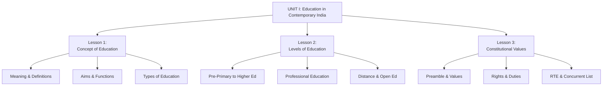

### Key Learning Outcomes

By completing Unit I, you should be able to:

✅ **Define** education from multiple perspectives (Indian & Western)  
✅ **Explain** the aims (Individual/Social) and functions of education  
✅ **Differentiate** between formal, non-formal, and informal education  
✅ **Describe** all levels of Indian education system (Pre-primary to Higher)  
✅ **Analyze** the role of distance and open education  
✅ **Interpret** the four constitutional values (JLEF)  
✅ **List** all Fundamental Rights and Duties  
✅ **Explain** Directive Principles related to education (Art 45, 46)  
✅ **Discuss** RTE Act 2009 and its significance  
✅ **Evaluate** the implications of education in Concurrent List  

---

## 🎓 Final Checklist Before Exam

### Lesson 1: Concept of Education
- [ ] Three Latin origins memorized
- [ ] Two Indian definitions (Vivekananda, Gandhi)
- [ ] Two Western definitions (Adams, Redden)
- [ ] 15 characteristics of education listed
- [ ] Individual vs Social aims differentiated
- [ ] Six specific aims understood
- [ ] Kothari Commission objectives known
- [ ] Functions towards individual/society/nation listed
- [ ] Three types of education compared

### Lesson 2: Levels of Education
- [ ] Age groups for each level memorized
- [ ] Objectives of Pre-primary education (8 points)
- [ ] Objectives of Primary education listed
- [ ] Importance of Secondary education explained
- [ ] 10+2+3 pattern understood
- [ ] Problems in Higher education identified
- [ ] Measures to improve Higher education listed
- [ ] Professional education defined
- [ ] Distance education features (10 points)
- [ ] Open school system objectives known
- [ ] IGNOU and NIOS establishment years remembered

### Lesson 3: Constitutional Values
- [ ] Preamble values (JLEF) explained
- [ ] Three types of Justice defined
- [ ] Eight Fundamental Rights listed (especially 21A)
- [ ] Eleven Fundamental Duties memorized
- [ ] Article 45, 46, 21A, 28, 29, 30 understood
- [ ] Directive Principles nature explained
- [ ] Education's role in promoting values analyzed
- [ ] Social Justice defined
- [ ] RTE Act date (2009/2010) remembered
- [ ] RTE Act salient features (14 points) listed
- [ ] Seventh Schedule structure understood
- [ ] 42nd Amendment (1976) - Education to Concurrent List
- [ ] Implications of Concurrent List explained
- [ ] Arguments for/against Concurrent List prepared

---

## 🌟 Inspirational Quote

!!! quote "Remember"
    **"Education is the most powerful weapon which you can use to change the world."**  
    — Nelson Mandela
    
    **"Education is not preparation for life; education is life itself."**  
    — John Dewey
    
    **"The highest education is that which does not merely give us information but makes our life in harmony with all existence."**  
    — Rabindranath Tagore

---

!!! success "🎉 Unit I Complete!"
    **Congratulations!** You have completed Unit I - Education in Contemporary India and Constitutional Context.
    
    You now have a comprehensive understanding of:
    - ✅ The philosophical foundations of education
    - ✅ The structure of Indian education system
    - ✅ The constitutional framework governing education
    - ✅ The legal rights and duties related to education
    - ✅ The role of education in nation-building
    
    **Next Steps:**
    1. Practice writing answers for review questions
    2. Create your own summary notes
    3. Use mnemonics to memorize key facts
    4. Attempt previous year question papers
    5. Move to **Unit II: Understanding Social Diversity**
    
    **All the Best for Your Exams! 📚🎯**
