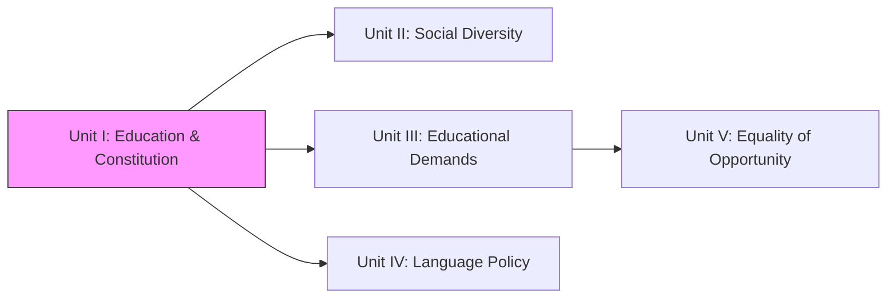
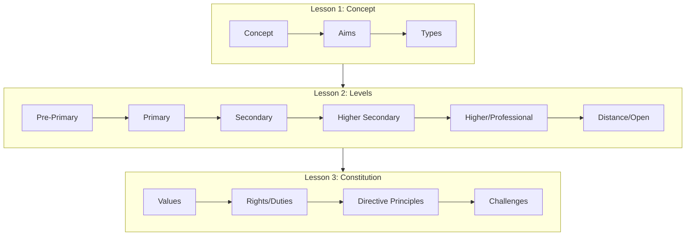
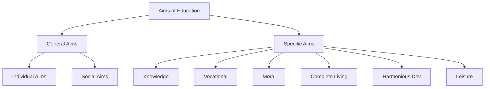

!!! abstract "Unit Overview"
    This unit explains the fundamental concepts of education, its functions, and types (formal, non-formal, informal). It details the structure of the Indian education system across various levels—from pre-primary to higher education, including professional and distance learning. Furthermore, it explores the relationship between education and the Indian Constitution, highlighting key values like Justice, Liberty, Equality, and Fraternity, fundamental rights and duties, and specific constitutional provisions and challenges related to education in India.

!!! info "Information"
    **Unit I - Education in Contemporary India and Constitutional Context**
    **Content:** Education Meaning Functions Types, Levels of Education, Indian Constitutional Values
    **Pages:** 6 - 93

## 🎯 Introduction
The first unit serves as a foundational pillar for understanding the landscape of Education in Contemporary India. It connects the philosophical interactions of "what education is" with the practical realities of "how education is delivered" and the legal framework of "guarantees for education".

**Key Learnings:**
*   Understanding the etymological and philosophical definitions of Education.
*   Differentiating between Individual, Social, and specific aims of education.
*   Recognizing the structure and objectives of the 5+ levels of the Indian Education System.
*   Analyzing the role of Open and Distance learning in democratizing education.
*   Interpreting the Indian Constitution's role in shaping educational policies, rights, and duties.

## 🔗 Connection to Other Units

| Unit | Connection |
| :--- | :--- |
| **Unit I** | **Foundations & Legal Framework (Constitution)** |
| **Unit II** | Understanding the *Who* (Diversity in Society) based on Unit I's framework |
| **Unit III** | Demands of individuals discussed in Unit I vs Diverse communities |
| **Unit IV** | Language policies arising from Constitutional provisions in Unit I |
| **Unit V** | Implementing Equality (Constitutional Value from Unit I) in opportunity |

## 📚 Unit Overview

| Lesson | Focus Area | Key Concepts |
| :--- | :--- | :--- |
| **Lesson 1** | **Concept of Education** | Definitions, Aims (Individual/Social), Functions, Types (Formal/Informal) |
| **Lesson 2** | **Levels of Education** | Pre-primary to Higher Ed, Professional Ed, Distance & Open Learning |
| **Lesson 3** | **Constitutional Values** | Preamble, Fundamental Rights/Duties, Articles 45/21A, Minorities Rights |

### Learning Outcomes
By the end of this unit, you will be able to:
1.  **Define** education using Eastern and Western perspectives.
2.  **Explain** the functions of education towards the individual, society, and nation.
3.  **Compare** formal, non-formal, and informal types of education.
4.  **Analyze** the objectives and structures of various educational levels in India.
5.  **Evaluate** the role of the Indian Constitution in guaranteeing educational rights and promoting values like equality and justice.

## 🗺️ Topic Connection Map

---

# LESSON - 1: Education: Meaning, Functions and Types

## 1:00 Introduction
This lesson attempts to explain briefly the concept of education, definitions of education, various aims of education, our national aims of education, functions of education and three types of education - formal, non-formal and informal education.

## 1:01 Concept of Education

Etymologically, the term **'Education'** is traced to different sources of derivation.

*   **Educare (Latin):** Means 'to bring up' or 'to nourish'. Implies child is brought up according to certain aims.
*   **Educere (Latin):** Means 'to lead out' or 'to draw out' ('e' = out, 'ducere' = to lead). Implies aiming to 'draw out' rather than 'put in'.
*   **Educatum (Latin):** Means 'the act of teaching or training'. Implies education is external and imposed.

!!! note "Key Points 📌"
    Modern educationists prefer the **'Educere'** sense, viewing education as growth from within rather than external imposition.

## 1:02 Indispensability of Education
Man is a social animal distinguished by superior intelligence. Unlike other creatures that are trained, man is educated.

*   **Helplessness at Birth:** The human child is dependent; education provides knowledge, skills, and habits to become a "complete man".
*   **Social Efficiency:** Learning norms makes one an efficient citizen.
*   **Long Childhood:** A blessing allowing time to learn vocational skills, culture, and develop potential.

!!! quote "Definition"
    **T. Raymonds:** "Education is a process to develop the potentials of man so as to differentiate him from other living beings."

!!! quote "Definition"
    **Aristotle:** "Just as living beings are superior to inanimate things, the educated is more valuable than the uneducated."

## 1:03 Definitions of Education

### Indian Thinkers
| Thinker | Definition |
| :--- | :--- |
| **Vivekananda** | "Education is the manifestation of divine perfection, already existing in man." (Man-making, character-building). |
| **Tagore** | "Education means enabling the mind to find out that ultimate truth... gives us the wealth, not of things but of inner light." |
| **Aurobindo Ghosh** | "Education is helping the growing soul to draw out that is in itself." |
| **Mahatma Gandhi** | "Education is the all-round drawing out of the best in child and man — body, mind and spirit." |

!!! tip "Exam Tip 📝"
    Indian views are essentially **Spiritual** and **Intellectual** in character.

### Western Thinkers
| Thinker | Definition |
| :--- | :--- |
| **Aristotle** | "Education is the creation of sound mind in a sound body." |
| **Pestalozzi** | "Education is natural, harmonious and progressive development of man’s innate powers." |
| **Adams** | "Education is a conscious and deliberate process... to modify the development of the other." |
| **T.P. Nunn** | Complete development of individuality to make original contributions. |
| **Redden** | "Deliberate and systematic influence... harmonious development of physical, intellectual, aesthetic, social and spiritual powers... directed towards the union of the educand with his creator." |

## 1:04 Nature / Characteristics of Education

1.  **Life-long Process:** From womb to tomb.
2.  **Systematic Process:** Transacted through institutions/regulations.
3.  **Development of Individual and Society:** Force for social development.
4.  **Modification of Behaviour:** Human behavior is improved.
5.  **Purposive:** Has definite goals.
6.  **Training:** Senses, mind, behavior, skills are trained.
7.  **Instruction and Direction:** Directs individual to fulfill desires.
8.  **Life:** Life experiences are educative.
9.  **Continuous Reconstruction of Experiences:** (John Dewey) Remodels experiences.
10. **Individual Adjustment:** Helps adjust with environment/society.
11. **Balanced Development:** Harmonious development.
12. **Dynamic Process:** Changes with situations and time.
13. **Bipolar Process:** (Adams) Interaction between two personalities (Teacher <-> Student).
14. **Three Dimensional Process:** (John Dewey) Teacher, Child, Society.
15. **Growth:** To produce continuous physical and psychological growth.

## 1:05 Aims of Education
Aims are long-term goals; Objectives are short-term.

### Classification of Aims

#### 1. Individual Aim
*   **Proponents:** Sir Percy Nunn.
*   **Focus:** Unfoldment of individual personality / Self-realization.
*   **Philosophy:** Progress of nations depends on individuals; education should focus on the individual, not society.

#### 2. Social Aim
*   **Proponents:** Prof. Bagley, John Dewey.
*   **Focus:** Socially efficient individuals / Citizenship.
*   **Philosophy:** Individual has no existence apart from society.
*   **Goals:** Health, vocational efficiency, cooperation, citizenship.

!!! success "Summary"
    Individual and Social aims are **Complementary**, not antagonistic. (Ross: "The circle cannot be broken.")

#### Specific Aims
3.  **Knowledge Aim:** Cognitive development; knowledge as power/happiness.
4.  **Vocational Aim:** Livelihood earning; productive hands.
5.  **Moral Aim:** (Herbart/Gandhi/Radhakrishnan) Character formation; conquest of lower impulses.
6.  **The Complete Living Aim:** (Herbert Spencer) Treat body, mind, soul; enjoy life and leisure.
7.  **Harmonious Development of Personality:** Balanced development of physical, intellectual, emotional, moral, aesthetic, social, spiritual powers.
8.  **Leisure Aim:** Using free time profitably/usefully.

### 1:05:1 National Objectives of Education in India
**Kothari Commission (1964-66)** objectives:
i) Relating education to productivity.
ii) Strengthening social and national integration.
iii) Consolidating democracy.
iv) Accelerating modernization.
v) Building character (social, moral, spiritual values).

## 1:06 Functions of Education

### Towards Individual
*   Strengthens personality.
*   Promotes ethical behavior.
*   Improves reasoning/thinking.
*   Prepares for future.

### Towards Society
*   Removes unwanted traditions.
*   Develops science and technology.
*   Promotes equality and wellness.
*   Fights prejudice; promotes friendliness.

### Towards Nation
*   Awareness of rights/duties.
*   Develops leadership.
*   Trains for democracy.
*   Promotes international understanding/globalization.

## 1:07 Nature of Education as a Separate Discipline

### 1:07:1 Definition of ‘Academic Discipline’
A branch of knowledge with its own:
*   Unique field of research.
*   Methods of research.
*   Subject contents/Theoretical structure (concepts, principles).
*   History/Origin.

### 1:07:2 Nature of Education as a Distinct Discipline
1.  **Theoretical Structure:** 'Pedagogy' (teaching) forms the core.
2.  **Process of Education:** Teaching constitutes the distinct process.
3.  **Start as a System:** Input (Students) -> Process (Teaching) -> Output (Progress).
4.  **Field of Research/Laboratory:** Schools/Classrooms are labs.
5.  **Research Method:** Unique methods (Historical, Survey, Experimental, etc.).

## 1:08 Types of Education

| Type | Characteristics | Examples |
| :--- | :--- | :--- |
| **Formal** | Fixed curriculum, teachers, premises, schedule, exams. | Schools, Colleges, Universities. |
| **Non-Formal** | Open/Flexibility in admission, curriculum, time. | Adult education, vocational training, Open Universities (in a sense). |
| **Informal** | Incidental, spontaneous, non-designed. | Family, society, play groups, conversation. |

---

# LESSON — 2: LEVELS OF EDUCATION

## 2:00 Introduction
Discussion of Pre-primary, Primary, Secondary, Higher Secondary, Higher, Professional, Distance, and Open Education.

## 2:01 Various Levels of Education
Evolution from family-based education to formal schools.
**Structure:**
*   **Pre-primary:** Age 3-5
*   **Primary:** Age 5-11
*   **Middle:** Age 11-14
*   **Secondary:** Age 14-16
*   **Senior/Higher Secondary:** Age 16-18
*   **Other:** Professional, Distance, Open.

## 2:02 Pre-primary or Nursery Level Education and its Objectives

### 2:02:1 Meaning
*   **Age:** 2½ - 5 years.
*   **Focus:** Physical health, social traits, intellectual abilities, emotional needs.
*   **Method:** Play-way, stimulating atmosphere, no formal teaching.
*   **Names:** Nursery, Kindergarten, Montessori.

### 2:02:2 Importance
a) **Physical Growth:** Space for activity/exploration.
b) **Social Development:** Compensates for nuclear families; peer interaction.
c) **Intellectual Development:** Satisfies curiosity (Pre-operative stage).
d) **Emotional Development:** Controls temper/emotions.
e) **Psychological Needs:** Satisfies ego-centrism, independence, creativity.

### 2:02:3 Objectives (Indian Education Commission 1964-66)
1.  Health habits (toilet, dressing).
2.  Social attitudes/participation.
3.  Aesthetic sense.
4.  Emotional maturity.
5.  Intellectual curiosity.
6.  opportunity to explore/experiment.
7.  Self-expression/creativity.
8.  Muscular coordination/motor skills.

### 2:02:4 Teaching Methods
Play way method, toys, conversation, songs, stories. Focus on speaking skills.

## 2:03 Primary Education and its Objectives

### 2:03:1 Primary Education Stage
*   **Start:** Age 5+.
*   **Duration:** 5 years (Class I-V).
*   **Core:** 3 R’s (Reading, Writing, Arithmetic).

### 2:03:2 Objectives
1.  Literacy, numeracy, creativity.
2.  Desire to learn.
3.  Critical thinking.
4.  Dignity of work.
5.  Social/moral values.
6.  Health/Discipline.
7.  Aesthetic values.
8.  Environment awareness.
9.  Patriotism.
10. International appreciation.

## 2:04 Secondary Education

### 2:04:1 Meaning
*   **Duration:** 5 years (after Primary) -> Classes VI-X.
*   **Structure:**
    *   **Middle/Lower Secondary:** VI, VII, VIII.
    *   **High School:** IX, X.
*   **Public Exam:** End of 10th std.

### 2:04:2 Importance
i) Continues after primary (literacy).
ii) Critical for **adolescence** (shaping character/aptitude).
iii) Source for primary teachers.
iv) Link between primary and higher education.
v) Terminal behavior (Higher Ed or Job).
vi) Strong edifice for national economic growth.

### 2:04:3 Objectives
*   **General:** Democratic citizenship, vocational efficiency, leadership, cultural appreciation (Secondary Education Commission).
*   **Specific:** 3 languages, Math, Science, Social Science, Physical Ed.

## 2:05 Higher Secondary Education

### 2:05:1 Meaning
*   **Level:** +2 (Classes XI, XII) in 10+2+3 pattern.
*   **Streams:**
    1.  **Academic:** Preparation for Higher Ed.
    2.  **Vocational:** Preparation for self-employment/jobs.

### 2:05:2 Aims (Kothari Commission)
i) Prep for university/professional ed.
ii) Strengthen vocational stream.
iii) Social/National integration.
iv) Character building.
v) Citizenship training.

## 2:06 Higher Education Stage

### 2:06:1 Meaning
University/College education after 12 years of schooling. Degrees (3 years), PG (2 years), Research (M.Phil, Ph.D).

### 2:06:2 Aims (India Education Commission 1964-66)
*   Seek/cultivate new knowledge (Truth).
*   Interpret old knowledge.
*   Provide leadership.
*   Identify gifted youth.
*   Train competent professionals.
*   Promote equality/social justice.

### 2:06:3 Problems
i) Ill-equipped/under-staffed.
ii) Isolation from socio-economic life.
iii) Low standards of research/teaching.
iv) Unemployment of graduates.

### 2:06:4 Improving Quality
i) Network of universities.
ii) Develop "Major Universities".
iii) Autonomous Status for colleges.
iv) Centres of Advanced Study.
v) Curriculum/Exam reforms.
vi) Infrastructure improvement.
vii) Teacher orientation/refresher courses.

## 2:07 Professional Education

### 2:07:1 Meaning
Training to acquire mastery in professional subjects to increase productivity (Engineering, Medicine, Law, Teaching, etc.). Focus on professional ethics.

### 2:07:2 Stages
i) Graduate.
ii) Postgraduate.
iii) Doctoral.

## 2:08 Distance Education

### 2:08:1 Meaning and Definition
*   **Definition (Helmberg 1981):** Education provided at different levels in the absence of direct and continuous supervision of teachers.
*   **Features:** "Open Education", learner freedom (speed/time).

### 2:08:2 Need
i) Manage student population explosion.
ii) Divert rush from formal universities.
iii) Education for those outside school system.
iv) Continuation of non-formal education.

### 2:08:3 Formats
*   Correspondence + Contact classes.
*   Support to school system (TV/Radio).
*   Music/Vocational lessons.
*   Radio Schools.

### 2:08:4 Salient Features
*   Teacher presence not mandatory.
*   Structured lessons/Individual study.
*   "Earning while learning".
*   Democratization of education.
*   Cost-effective.

### 2:08:5 Correspondence Courses
Dependent on printed "learning packages" and personal contact programmes (PCP).

### 2:08:6 Distance Education in India
*   **First:** Delhi University (1962).
*   **Pioneer:** IGNOU (Indira Gandhi National Open University).
*   **Tamil Nadu:** Madras, Madurai-Kamaraj, Annamalai, etc.

### 2:08:7 Advantages
*   For dropouts/discontinued.
*   Vertical mobility (promotion).
*   Self-motivated quality.
*   Reduces pressure on formal colleges.
*   Avoids traffic/congestion.

## 2:09 Open School System

### 2:09:1 Concept
*   **Entry:** No formal qualification needed; Age 16+.
*   **Focus:** Life-oriented, need-based.
*   **Method:** Modular approach, multi-sensory media.

### 2:09:2 Emergence in India
*   **1979:** Directorate of Open School Education (CBSE/NCERT).
*   **1989/1990:** **NIOS** (National Institute of Open Schooling) established.
*   **Reach:** 1500+ study centers.

### 2:09:3 Objectives
1.  Education for employed/16+.
2.  Opportunities for: Rural housewives, Drop-outs, Failed students.
3.  Relax age restrictions.

### 2:09:4 Style of Functioning
*   Levels: III, V, VIII, X, XII.
*   X/XII: 5 subjects.
*   Certificates recognized nationwide.

### 2:09:5 Advantages
*   Democratizing education.
*   Eradicating illiteracy.
*   Productivity of workforce.

---

# LESSON - 3: INDIAN CONSTITUTIONAL VALUES AND EDUCATION

## 3:00 Introduction
*   **Independence:** 15th Aug 1947.
*   **Constitution Adopted:** 26th Nov 1949.
*   **Came into Force:** 26th Jan 1950.
*   **Architect:** Dr. B.R. Ambedkar.
*   **Key Values:** Justice, Liberty, Equality, Fraternity.

## 3:01 Structure of Constitution of India
*   **Original:** Preamble, 8 Schedules, 395 Articles.
*   **Current (Approx):** 12 Schedules, 448 Articles.
*   **4th Schedule (Part IV):** Directive Principles (Guidelines, not enforceable).
*   **7th Schedule:** Lists (I-Union, II-State, III-Concurrent).

## 3:02 Preamble of Indian Constitution
*"We the people of India... Sovereign, Socialist, Secular, Democratic Republic..."*

### Core Values:
**(i) Justice:**
*   **Social:** No discrimination; special privileges for marginalized.
*   **Economic:** Minimize inequalities; standard of living.
*   **Political:** Equal rights/opportunities in politics/voting.

**(ii) Freedom (Liberty):**
*   Thought, expression, belief, faith, worship. Right to criticize.

**(iii) Equality:**
*   Equality of status and opportunity.
*   **Positive:** Equal rights, special provisions for weaker sections.
*   **Negative:** Abolishing man-made discriminations/titles.

**(iv) Fraternity:**
*   Dignity of individual + Unity/Integrity of nation. "We" feeling.

## 3:03 Fundamental Rights and Duties

### 3:03:1 Fundamental Rights (Articles 12-35)
1.  **Right to Equality (14-18):** Law, ban on discrimination/untouchability.
2.  **Right to Freedom (19-22):** Speech, assembly, profession, life.
3.  **Right against Exploitation (23-24):** Forced labour, child labour.
4.  **Right to Freedom of Religion (25-28):** Practice, propagate.
5.  **Cultural and Educational Rights (29-30):** Minorities.
6.  **Right to Constitutional Remedies (32):** Court enforcement.
7.  **Right to Education (21A):** Age 6-14 (Fundamental Right).
8.  **Right to Information (19(1)):** Access to govt info.

### 3:03:2 Fundamental Duties (Article 51A - Part IVA)
11 Duties (Added via 42nd Amendment).
*   **11th Duty:** Provide opportunities for education by parent/guardian to child (6-14 years).

## 3:04 Directive Principles of the State Policy and Education
**Part IV (Articles 36-51):** Directions for social/economic democracy.

### Key Articles:
*   **Art 38:** Social order/welfare.
*   **Art 39:** Livelihood, equal pay.
*   **Art 41:** Right to work/education.
*   **Art 45:** **Free and compulsory education (0-14 years) - Now Art 21A.**
*   **Art 46:** **Promotion of educational/economic interests of SC/ST/Weaker sections.**

### 3:04:2:01 Provisions Safeguarding Minorities
*   **Article 28:** Religious instruction freedom (No religious instruction in wholly State-funded institutions).
*   **Article 29(2):** No denial of admission based on religion/caste/language.
*   **Article 30(1):** Right of minorities to establish and administer educational institutions.
*   **Article 30(2):** No discrimination in granting aid.

## 3:05 Challenges Faced in Fulfilling Constitution
**(i) Freedom:** Misuse of freedom of speech; intolerance; fake news.
**(ii) Justice:** "Justice delayed is justice denied"; vacancies in courts; expensive.
**(iii) Equality:** Gender discrimination; honour killings; subtle untouchability.
**(iv) Fraternity:** Divisive forces (caste, religion, language); lack of "We" feeling.

---

## 📝 Quick Revision Table

| Topic | Key Concept | Article/Ref |
| :--- | :--- | :--- |
| **Education Def (West)** | "Educere" (Draw out) | Etymology |
| **Education Def (India)** | "Manifestation of perfection" | Vivekananda |
| **Social Aim** | Citizenship, Efficiency | Dewey/Bagley |
| **Primary Ed Aims** | 3 Rs, Habits | - |
| **Sec. Ed Commission** | Democratic Citizenship | 1952-53 |
| **Kothari Commission** | 10+2+3 Pattern | 1964-66 |
| **Distance Ed** | Separated by time/space | Helmberg |
| **Open School** | NIOS (1989), Age 16+ | - |
| **Fundamental Right** | Right to Education | **Art 21A** |
| **Minority Right** | Establish Institutions | **Art 30** |
| **SC/ST Promotion** | Economic/Ed Interests | **Art 46** |

## 🧠 Memory Mnemonics
*   **3 Rs:** Reading, wRiting, aRithmetic (Primary Ed basics).
*   **SOVEREIGN-SOCIALIST-SECULAR-DEMOCRATIC-REPUBLIC:** Preamble sequence.
*   **JLEF:** Justice, Liberty, Equality, Fraternity (Preamble Values).

## ❓ Review Questions
1.  What is the concept of Education? [1:01]
2.  Differentiate Formal, Non-formal and Informal Education. [1:08]
3.  What are the objectives of Pre-primary Education? [2:02:3]
4.  Explain the 10+2+3 pattern. [2:05]
5.  What are the salient features of Distance Education? [2:08:4]
6.  Explain Article 21A and Article 45. [3:03, 3:04]
7.  What rights do minorities have regarding education? [3:04:2:01]
8.  Discuss the challenges to Constitutional Equality in India. [3:05:3]

!!! success "Unit Complete"
    You have completed **Unit I**. You now understand the definitions of education, the structure of the Indian education system, and the constitutional provisions that govern it.
