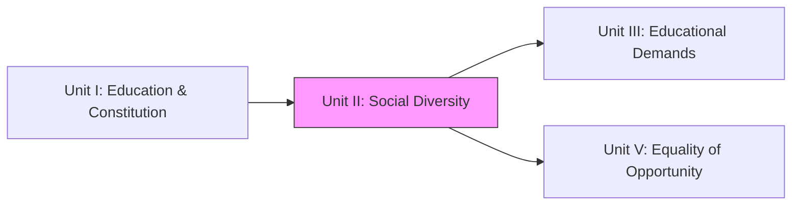
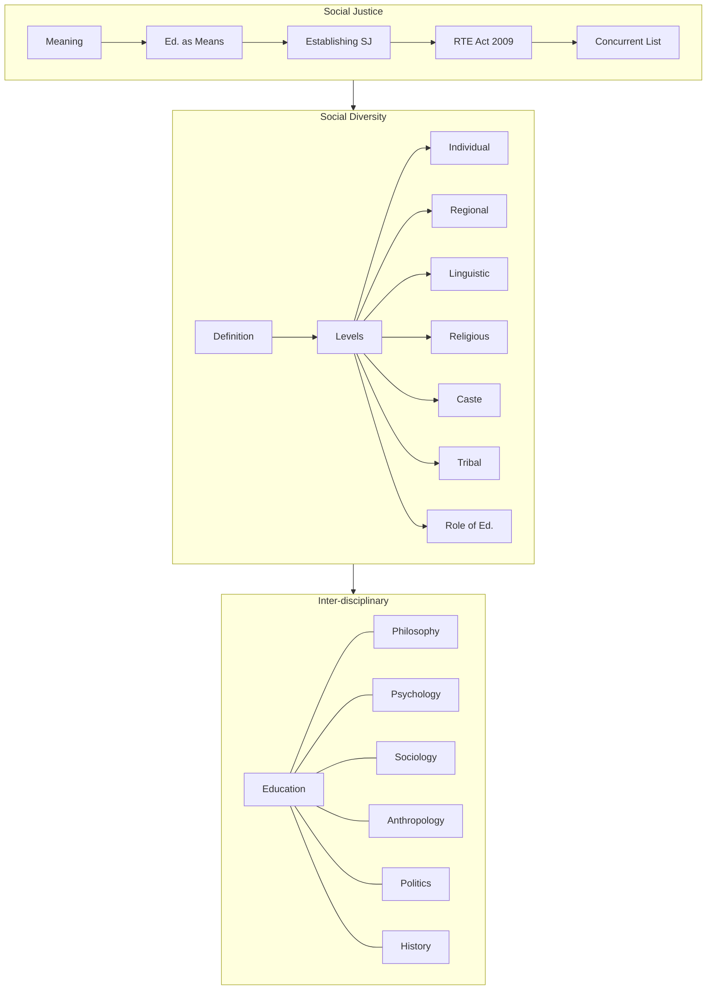
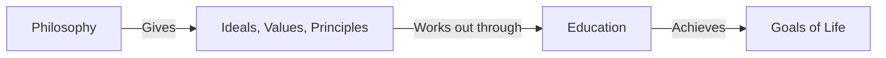
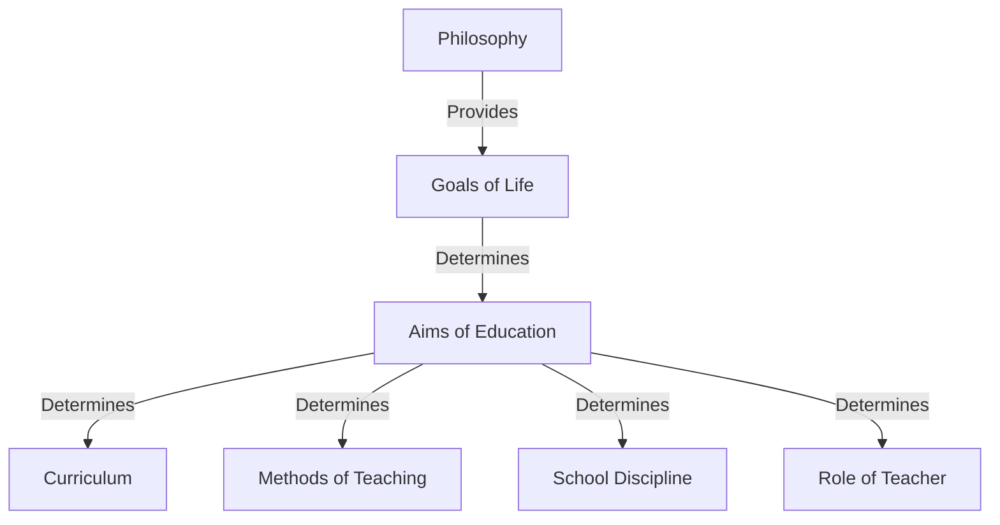
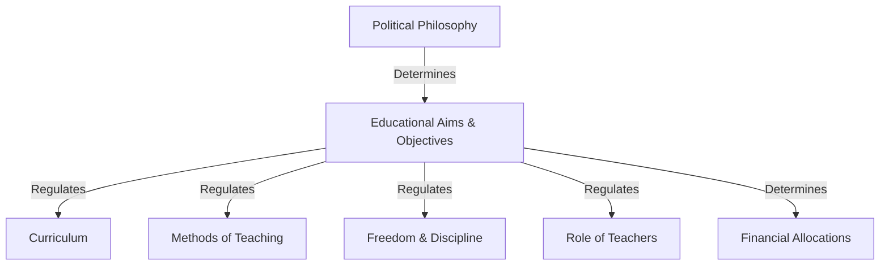
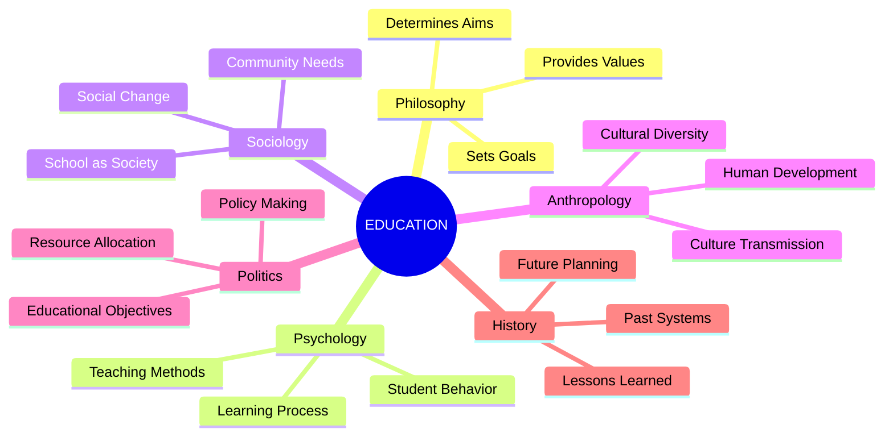

!!! abstract "Unit Overview"
    This unit explores the concept of **Social Justice** and **Social Diversity** in the Indian educational context. It comprehensively covers the Indian Constitution's role in promoting social justice through education, including the landmark **Right to Education (RTE) Act 2009**. The unit analyzes various levels of social diversity—individual, regional, linguistic, religious, caste, and tribal—and examines the critical role of education in fostering understanding and positive attitudes towards diversity. Finally, it explores the inter-disciplinary nature of education with Philosophy, Psychology, Sociology, Anthropology, Politics, and History, demonstrating how education draws from multiple disciplines to address complex societal needs.

!!! info "Unit Information"
    **Unit II - Understanding Social Diversity**  
    **Content:** Understanding Social Diversity and its Educational Implications  
    **Pages:** 53 - 87 (Source Text: 94 - 163)  
    **Focus Areas:** Social Justice, RTE Act 2009, Concurrent List, Levels of Social Diversity, Inter-disciplinary Education

## 🎯 Introduction

India is a land of vast diversity and deep-rooted social stratification. This unit focuses on how education serves as a **bridge to understanding diversity** and as a **tool for ensuring social justice**. It transitions from the constitutional and legal frameworks studied in Unit I to the sociological realities of the Indian classroom and society.

### Historical Context
The phrase **'Social Justice'** gained prominence during the 19th century due to the Industrial Revolution and civil unrest in Europe. People began opposing dangerous labor conditions, exploitation, and unfair government systems. In India, this concept has evolved to address centuries-old inequalities in the distribution of educational opportunities.

### Key Learnings in This Unit

| Topic Area | Focus |
|------------|-------|
| **Social Justice** | Meaning, role of education as means to achieve it, establishing social justice in education |
| **RTE Act 2009** | Background, salient features, role in Universalization of Elementary Education |
| **Education in Concurrent List** | Constitutional provisions, implications of 1976 shift, arguments for and against |
| **Social Diversity** | Meaning, definition, bases, levels (Individual, Regional, Linguistic, Religious, Caste, Tribal) |
| **Role of Education** | Understanding diversity, creating positive attitudes, teaching techniques |
| **Inter-disciplinary Nature** | Relationships with Philosophy, Psychology, Sociology, Anthropology, Politics, History |

## 🔗 Connection to Other Units

| Unit | Connection |
| :--- | :--- |
| **Unit I** | Provides the Constitutional values (Justice, Equality) applied here. |
| **Unit II** | **Focus on Diversity & Social Justcie** |
| **Unit III** | Understanding diverse demands of individuals/communities (based on Unit II's diversity). |
| **Unit V** | Addressing inequality (Unit II) through opportunities (Unit V). |

## 📚 Unit Overview

| Lesson | Focus Area | Key Concepts |
| :--- | :--- | :--- |
| **Lesson 3 (Cont.)** | **Social Justice & Education** | Social Justice, RTE Act 2009, Concurrent List Implications. |
| **Lesson 4** | **Social Diversity** | Meaning, Levels (Individual, Regional, Linguistic, Religious, Caste, Tribal). |
| **Lesson 4 (Cont.)** | **Ed. Implications & Inter-disciplinary** | Role of Ed in diversity, Relation with Philosophy, Psychology, etc. |

### Learning Outcomes
By the end of this unit, you will be able to:
1.  **Explain** the concept of Social Justice and the role of education in achieving it.
2.  **Analyze** the salient features of the Right to Education (RTE) Act, 2009.
3.  **Discuss** the implications of education being in the Concurrent List.
4.  **Describe** various forms of social diversity in India (Linguistic, Caste, Tribal, etc.).
5.  **Evaluate** the inter-disciplinary nature of education with other social sciences.

## 🗺️ Topic Connection Map

---

# LESSON - 3 (Continued): Social Justice and Education

## 3:06 Social Justice and Education

### 3:06:1 Meaning of ‘Social Justice’
The core concept is **fair distribution of opportunities and privileges** within a society. Originally focused on wealth/property, it now includes environment, race, gender, and education.

### 3:06:2 Education as a Means of Social Justice
*   **Silent Revolution:** Gandhiji believed education brings silent revolution.
*   **Eliminating Injustice:** Literacy is low among marginalized groups. Education eliminates social injustice.
*   **Status Improvement:** Education improves providing 'Achieved Social Status' over 'Ascribed Social Status' (birth-based).
*   **Social Displacement:** Accelerates both "Vertical" and "Horizontal" mobility.

### 3:06:3 Establishing Social Justice in Education
**Definition:** Equal opportunity for all students, equitable distribution of resources, facilities, and privileges regardless of cultural/social/economic inequalities.
**Ways to Establish:**
1.  Free and compulsory quality education.
2.  Reservations in higher/professional education.
3.  Common School System.
4.  Free uniforms/textbooks/hostels.
5.  Opening schools in rural areas.
6.  Encouraging women's education.
7.  25% reservation in private schools (RTE).

## 3:07 Right to Education Act (RTE) 2009

### 3:07:1 Background
*   **Original:** Article 45 (Directive Principle - not enforceable).
*   **Amendment:** 86th Amendment (2002) inserted **Article 21-A** making education a Fundamental Right.
*   **Act Passed:** 4th August 2009.
*   **Effect:** 1st April 2010.

### 3:07:2 Salient Features of RTE
1.  **Compulsory & Free Education:** For every child (6-14 years) in a neighborhood school (1km radius).
2.  **Benchmark Mandate:** Norms for PTR (Pupil-Teacher Ratio), classrooms, toilets, drinking water.
3.  **Special Provisions:** Age-appropriate admission for out-of-school children + special training.
4.  **Quantity and Quality of Teachers:**
    *   PTR: 1:30 (Primary), 1:35 (Upper Primary).
    *   No non-academic work (except Census, Election, Disaster).
    *   Duties: Punctuality, completion of syllabus, meeting parents.
5.  **Zero Tolerance Against Discrimination:**
    *   No screening tests/capitation fees.
    *   No corporal punishment/mental harassment.
    *   No discrimination based on caste/gender/religion.
6.  **All-round Development:** Child-friendly/Child-centered learning.
7.  **Minimise Detention:** No detention policy (until elementary completion) + CCE (Continuous and Comprehensive Evaluation).
8.  **Monitoring:** **School Management Committees (SMC)** (75% parents, 50% women).
9.  **Implementation:** Grievance Redressal Mechanism.
10. **Social Inclusion:** **25% mandated reservation** in private schools for deeper weaker sections (reimbursed by Govt).

## 3:08 Education in the Concurrent List and its Implications

### 3:08:1 Constitutional Provisions (7th Schedule)
*   **Union List (List I):** Central Govt responsibility. Entries 63, 64, 65, 66 (Central Universities, Technical Institutions, Professional training, Coordination of standards).
*   **State List (List II):** Originally, Education was here. State responsibility.
*   **Concurrent List (List III):** **Entry 25**. Joint responsibility throughout the country.

### 3:09 Impact of 42nd Amendment (1976)
Education was shifted from **State List** to **Concurrent List**.
*   **Implication:** Both Centre and State can legislate. In case of conflict, **Central law prevails**.

### 3:09:1 Implications (Arguments For)
1.  **Uniformity:** Uniform pattern (e.g., 10+2+3) across India.
2.  **Better Implementation:** Centre ensures States implement policies.
3.  **Better Funds Utilisation:** Centre monitors fund usage.
4.  **Quality Leadership:** Centre provides national direction.
5.  **Improvement in Standards:** Utilizing national research/expertise.
6.  **Discipline:** Centre can overrule States.
7.  **Emotional Integration:** Promotes national integration over regionalism.

### 3:09:2 Arguments Against (Retaining as State Subject)
1.  **Democratic Values:** Decentralization is key; States lose power.
2.  **Local Needs:** States understand local needs/language better than Centre.
3.  **Red Tapism:** Increased bureaucracy/delays seeking clearance.
4.  **Security to Minorities:** Minorities often feel safer with State govts.
5.  **Unity in Diversity:** Allows States to preserve own identity/culture.

---

# LESSON — 4: UNDERSTANDING THE SOCIAL DIVERSITY

## 4:00 Introduction
Globalization/Migration increases diversity. India is multi-lingual, multi-ethnic, multi-religious. Harmony is essential for development.

## 4:01 Meaning and Definition

### 4:01:1 Meaning
Differences based on caste, religion, race, language, region, class, occupation.

### 4:01:2 Definition
!!! quote "Definition"
    **Barker (2003):** "Diversity means variety... refers to the range of personnel who more accurately represent minority populations and people from varied backgrounds."

## 4:02 Bases and Factors
**Three Bases:**
1.  Each individual is unique.
2.  Inter-dependence of individuals/society.
3.  Dynamic nature of culture.

**Factors:** Race, Language, Life style, Religion, Gender, Age, Region, Profession, Political ideology.

## 4:03 Social Diversity in Indian Society
*   **Languages:** 18+ recognized, 3000+ dialects.
*   **Religions:** Hinduism, Islam, Christianity, Sikhism, Buddhist, Jainism.
*   **Tribes:** Irulas, Todas, Gonds.
*   **Races:** Aryan, Dravidian, Mongol.
*   **Trend:** Acceptance of **multi-culturalism** (e.g., Holidays for minority festivals).

## 4:04 Levels of Social Diversity

### 4:04:1 Individual Level
*   **Biological:** Height, skin color.
*   **Psychological:** Self-concept & Social relationships.
*   **Manifestation:** Competition for proficiency, economic status, political power.

### 4:04:2 Regional Social Diversity
*   **Basis:** Region, language, life style.
*   **Issue:** "Sons of the soil" theory vs National interest. Unequal development within states (e.g., Telangana movement).
*   **Implication:** Can lead to isolation/parochialism (Undesirable) OR unity within region (Desirable).

### 4:04:3 Social Diversity at Linguistic Level
*   **Languages:** **22 Official Languages** (8th Schedule).
*   **Families:** Indo-Aryan (North), Dravidian (South).
*   **Link Languages:** English, Hindi.
*   **Impact:** A "Museum of Languages" (A.R. Desai). Promotes tolerance/multi-culturalism if managed well.

### 4:04:4 Social Diversity Based on Religion
*   **Demography (2011):** Hindus (79.8%), Muslims (14.2%), Christians (2.3%), Sikhs (1.7%), Buddhists (0.7%), Jains (0.4%).
*   **Secular State:**
    *   Equal before law.
    *   Freedom of worship.
    *   Right to establish educational institutions (Minorities).
    *   No religious instruction in Govt-aided schools.

### 4:04:5 Social Diversity at Caste Level
*   **Uniqueness:** Hierarchical stratification (Vertical layers).
*   **Presence:** Investigated even in non-Hindu religions (Christians, Muslims, Sikhs).
*   **Change:** Urbanization/Constitution loosening rigidity. Reservation promotes Upward Social Mobility.

### 4:04:6 Social Diversity at Tribal Level
*   **Adivasis:** Indigenous people, isolated in hilly/forest areas.
*   **Population:** High in Lakshadweep, Mizoram, Nagaland, MP. None in Punjab/Haryana/Delhi.
*   **Examples:** Bhils, Gonds, Santhals, Todas, Nagas.
*   **Policy:** 7.5% reservation (Note: Text says 1%, but current norms vary; text context implies reservation exists). Integration into mainstream while preserving culture.

## 4:05 Education for Understanding Social Diversity
*   **Curriculum:** Include freedom struggle, constitutional values (equality/secularism).
*   **Geography:** teaching about different states/resources.
*   **Language Policy:** Three Language Formula (Mother tongue + Hindi + English) to bridge gaps.
*   **Co-curricular:** Festivals, NCC/NSS, Educational tours to other states.
*   **Measures:** Common School System, Inclusive Education, Reservations.

## 4:06 Role of Education in Creating Positive Attitude Towards Social Diversity

### Introduction
The role of education in Indian Society to create a positive attitude towards diversity depends largely on **teachers**. Teachers, with the help of **inclusive education**, can create positive attitudes in people, particularly among parents and those living in the neighborhood of their schools.

!!! important "The Challenge"
    The real challenge of inclusive education is to meet the special needs of **all children with and without disabilities**. The problem lies not with disabled children but with the **unwelcoming school system**.

### Changing Stakeholder Attitudes
To change the school system, there must first be change in the attitudes of:
*   Teachers
*   Students
*   Parents
*   Educational administrators

**Key Strategy:** Raise awareness of the potential benefits of inclusive education for all students.

### Three Effective Group Interaction Teaching Techniques

#### 1. Group Interactive Classroom Sessions

!!! example "Technique Description"
    This technique involves:
    
    *   **Division:** Dividing the class into small groups (5-6 students each)
    *   **Assignment:** Assigning different topics/sub-topics to each group
    *   **Discussion:** Group members discuss and engage in learning activities
    *   **Supervision:** Teachers supervise and provide guidance when required

**Central Idea:** Students learn through interacting among themselves. Activities include:
*   Discussing subject matter
*   Reviewing taught content
*   Conducting related experiments

#### 2. Co-operative Learning

!!! quote "Definition"
    "Co-operative learning is a learning process which provides students opportunities to learn in a group by forming a number of teams, each consisting of a small number of students of **different levels of learning ability** for understanding the subject."

**Process:**
1.  Subject unit divided into small segments/subunits
2.  Given to different teams (5-8 students each)
3.  Team members collect relevant information
4.  Share information within their team
5.  Within 10-15 minutes, gain significant attainment
6.  All teams assemble and discuss learning outcomes
7.  Students return to teams, discuss all subunits
8.  Final assembly: All groups share learning outcomes

**Key Features:**
*   Students of different learning abilities work together
*   Sharing of knowledge and understanding
*   Attaining prefixed level of learning proficiency

#### 3. Collaborative Learning

!!! quote "Definition"
    "Two or more students joining together, sharing their learning activities and trying to achieve learning proficiency."

**Example:** Three friends learning together:
*   **Student 1:** Gathers information using internet (expertise in technology)
*   **Student 2:** Processes and organizes information (good language ability)
*   **Student 3:** Classifies and reorganizes under different heads (analytical skills)
*   All three study individually, then discuss and exchange views
*   Master the subject matter together

**Key Elements:**
*   Mutual dependence
*   Sharing of learning tasks
*   Accepting responsibilities for learning outcomes

!!! note "Important"
    Some educationists consider collaborative learning as just another type of cooperative learning.

### How These Techniques Develop Positive Attitudes

These teaching techniques help students realize that learning achievement relies on:

| Factor | Description |
|--------|-------------|
| **Own Responsibility** | Student's individual effort and commitment |
| **Group Performance** | Performance of all group members collectively |
| **Face-to-face Interaction** | Sharing knowledge and information with peers |
| **Social Skills** | Use of interpersonal and communication skills |
| **Group Involvement** | Entire group's participation in completing tasks |
| **Infrastructure** | School facilities enabling students to learn together |

!!! success "Outcome"
    These techniques go a long way in **developing positive attitude in students towards diversity**.

---

## 4:07 Inter-disciplinary Nature of Education with Philosophy, Psychology, Sociology, Anthropology, Politics and History

### 4:07:1 Meaning of 'Inter-disciplinary Nature'

!!! quote "Definition"
    For understanding a concept in a particular discipline completely and its multiple applications in different walks of human life, we may need to learn the concept from the **perspectives of different related academic disciplines**, by making use of their principles, theories and methods of solving problems.

!!! quote "Kockelmans' Definition"
    "While attempting to solve a particular problem if it is felt that the knowledge of a single discipline is not enough for solving a problem, then the knowledge and methodology of related disciplines are integrated and applied."

**In Simple Terms:** The integration and interaction of two or more academic disciplines in the study of a subject is known as its **inter-disciplinary nature**.

### 4:07:1:01 Inter-disciplinary Nature of the Academic Discipline 'Education'

!!! quote "Pestalozzi's Definition of Education"
    "Education is natural harmonious and progressive development of man's innate powers."

**Teaching-learning activities** serve as the fulcrum in education. For thorough understanding of the educative process, one should know:

1.  **What to teach** (Content)
2.  **How to teach** (Methodology)
3.  **Conducive environment** for teaching (Context)
4.  **How educational activities have changed** over the years
5.  **Factors influencing educational activities**

**Key Academic Disciplines Related to Education:**
*   Philosophy
*   Psychology
*   Sociology
*   Anthropology
*   Politics
*   History

!!! info "Why Inter-disciplinary?"
    Many concepts, principles and practices of the discipline 'Education' have been influenced by the above-mentioned academic disciplines. Therefore, Education exhibits **inter-disciplinary nature and approach**.

---

### 4:07:1:02 Close Relationship Between Education and Philosophy

#### Apparent Difference
*   **Philosophy:** Speculative (Theory)
*   **Education:** Practical (Practice)

#### Intimate Relationship

!!! important "Core Connection"
    Philosophy determines the **supreme aim of life** and sets **standards and values** that should guide and direct man's educational efforts to achieve them.

#### Four Aspects of the Relationship

##### i) Philosophy Points Out the Way to be Followed by Education

**The Problem:**
*   Education means modification of child's native behavior
*   But in which direction should modification be carried out?
*   What should be the standards and values to strive for?

**The Solution:**
*   Philosophy solves this problem
*   Points out the way for the educator

!!! note "Key Principle"
    *   **Philosophy:** Deals with the **ENDS**
    *   **Education:** Deals with the **MEANS** to achieve those ends
    
    **Therefore:** Education is the **dynamic side of philosophy** OR Philosophy is the **theory of education**.

**Process Flow:**

##### ii) Education is the Best Means for the Propagation of Philosophy

**The Philosopher's Journey:**
1.  Through contemplation and deliberation, philosopher arrives at truth
2.  Lays down aims, ideals and values
3.  Lives according to those aims and values
4.  Wants others to be converted to his beliefs
5.  **This is achieved through EDUCATION**

!!! quote "Ross's Observation"
    "Philosophy and education are the two sides of the same coin; the former is the **contemplative** while the latter is the **active** side."

**Clear Statement:**
*   **Philosophy:** Sets the goal of life
*   **Education:** Provides the means for its achievement

##### iii) All Great Philosophers Have Also Been Great Educators

**Historical Evidence:**
*   From Plato to present day
*   Great philosophers reflected their philosophical views in educational schemes

**Modern Examples:**

| Philosopher | Country | Contribution |
|-------------|---------|--------------|
| **Rabindranath Tagore** | India | Educational system based on cultural ideals |
| **Mahatma Gandhi** | India | Basic Education system |
| **John Dewey** | America | Progressive education |

All took keen interest in educational problems and evolved new systems based on their own ideals.

##### iv) Philosophy Determines All Broad Aspects of Education

**The Hierarchy:**

!!! success "Conclusion"
    So long as we need aims of education based on the ultimate goal of life, **philosophy will continue influencing and determining the matter and method of education**.

**Summary Statement:**
Philosophy and education are intricately inter-related:
*   **Philosophy:** Sets the goals
*   **Education:** Devises the methods and means of achieving the goals

---

### 4:07:1:03 Inter-Relationship Between Education and Psychology

#### Division of Responsibilities

| Discipline | Role |
|------------|------|
| **Philosophy** | Determines aims and goals - **WHAT to teach** |
| **Psychology** | Shows the way - **HOW to teach** |

#### Psychology's Contribution to Education

!!! important "Core Function"
    All educational activities revolve around the **teaching-learning process**. Psychology provides principles and theories that help modify students' behavior in the desirable direction.

!!! quote "Definition: Educational Psychology"
    "Application of the principles and laws of psychology in educational situations, to solve different problems faced in the educative process, so as to make it more effective and efficient."

#### Essential Knowledge Areas for Teachers

Every practicing teacher needs knowledge of:

| Area | Application |
|------|-------------|
| **Attention** | Things that attract and distract students' attention |
| **Cognitive Development** | Developmental stages, characteristics, suitable teaching methods |
| **Transfer of Learning** | Theories related to transfer of learning/training |
| **Motivation** | Theories and classroom techniques of motivating pupils |
| **Personality** | Theories of personality development |
| **Memory** | Memory, forgetting and related theories |
| **Mental Health** | Techniques of promoting students' mental health |

#### The Effective Teacher

!!! success "Key Characteristics"
    An effective teacher is one who:
    
    1.  Is **proficient in the subject content**
    2.  Possesses **requisite skills** to select and use appropriate teaching methods
    3.  Knows both **the subject of study** and **the learners**

#### Conclusion

!!! note "Summary"
    When principles and laws of psychology are applied in education, the new branch called **'Educational Psychology'** emerges.
    
    **Critical Point:** No teacher without the knowledge of educational psychology can become effective and efficient in the teaching profession.

**Strength of Relationship:**
The academic discipline of education has **more close relationship with psychology than any other academic discipline**.

---

### 4:07:1:04 Inter-Relationship Between Education and Sociology

#### What is Sociology?

**Branches of Social Sciences:**
*   Economics
*   Political Science
*   Sociology
*   Psychology
*   Social Anthropology

!!! quote "Sociology's Unique Focus"
    Sociology, as distinct from other disciplines, studies the behavior of **'Man' in 'Society'**.

**What Sociology Studies:**
*   NOT just man as he 'is' or as he 'was'
*   BUT man in his **behavioral reactions with other men in society**
*   His reactions with **social institutions**
*   His reactions in the **group where he lives**

#### Educational Sociology

!!! quote "Definition by Finney and Zeleny"
    "The discipline which interprets educational problems on the basis of sociology."

#### How Sociology Influences Education

1.  **Goals Setting:** Educational institutions set goals according to **expectations of the society**
2.  **Activities:** Curricular programmes depend on **present demands and future plans of society**
3.  **School as Miniature Society:** Educational institutions function as small-scale societies
4.  **Agent of Change:** Education serves as a powerful **agent of social change**

#### Important Objectives of Educational Sociology

Educational Sociology helps us understand:

| # | Objective |
|---|-----------|
| i | The **role of the teacher** in the community |
| ii | The role of **school as an instrument of social change** |
| iii | The **needs of the society** in which the school functions |
| iv | Ways of developing healthy **teacher-student relationship** |
| v | Need for close relationship between **school and other social organizations** |
| vi | **Social factors** that affect the school |
| vii | **Social determinants** of education and making them conducive for teaching-learning |
| viii | How to **socialize the curriculum** |

#### Flexible Approach Required

!!! important "Key Principle"
    All societies do not have the same:
    
    *   Social environment
    *   Attitudes
    *   Problems
    
    **Therefore:** Educational institutions should understand the needs and social environment of their society and adopt **flexible approaches** in their programmes and practices.

#### Conclusion

!!! success "Summary"
    Educational sociology helps to:
    
    1.  **Modify education** to meet the needs of society
    2.  Serve as an **instrument of social change**
    
    In this way, the academic disciplines of **education and sociology are closely related**.

---

### 4:07:1:05 Close Relationship Between Education and Anthropology

#### What is Anthropology?

!!! quote "Definition"
    "The science which studies human beings and their ancestors through time and space and in relation to physical character, environmental and social relations and culture."

**Focus Areas:**
*   Human origin
*   Biological and physical development
*   Customs and beliefs
*   Human communities, their culture and development

**Research Focus:**
*   Comparison of different societies
*   Understanding the scope of **human cultural diversity**

#### Three Functions of Education Related to Culture

| Function | Description |
|----------|-------------|
| **1. Transmission (Acculturation)** | Passing cultural values and traditions from one generation to the next |
| **2. Conservation** | Preserving cultural components and traditions |
| **3. Enrichment** | Bringing necessary modifications to meet changing needs |

#### Cultural Components Schools Should Preserve

Every school should strive to collect and preserve information regarding:

*   Folksongs
*   Fine arts
*   Literature
*   Recreations
*   Religious functions and celebrations
*   Rural crafts and occupations
*   Traditional dress and food habits
*   *...of the community in which it functions*

!!! important "Educational Responsibility"
    Schools should educate youngsters to:
    
    1.  **Know** these cultural components
    2.  **Adopt** them to the extent possible
    3.  **Enrich** the culture by bringing necessary modifications

#### Education and Cultural Diversity

**Beyond Local Culture:**
Education helps people:
*   Learn about **other cultures**
*   **Appreciate cultural diversity**
*   Inculcate human values:
    *   Tolerating differences
    *   Developing compassion
    *   Living in peace and harmony

#### Contribution of Anthropology to Education

!!! success "Key Benefits"
    Anthropological findings help us understand:
    
    *   Human beings in a **detached, holistic manner**
    *   Human progress and development
    *   The path to **universal brotherhood**

**Vision for the Future:**
A world that not just knows and respects cultural differences but **celebrates differences**.

#### Conclusion

Anthropology and Education work together to develop a society that embraces diversity and works toward universal brotherhood.

---

### 4:07:1:06 Close Relationship Between Education and Politics

#### What is Politics?

!!! quote "Definition"
    "Politics refers to the work and ideas that are connected with governing a country, a town etc."

**As a Social Science:**
Politics attempts to explain how societies and social organizations use **power** to:
*   Establish regulations
*   Allocate finance and other resources

#### How Government Influences Education

**Policy Decisions:**
Government, based on their power to regulate and allocate resources, take policy decisions regarding:
*   How educational institutions should function
*   Implementation to achieve proclaimed goals

**Resource Allocation:**
*   Huge budgets allocated for education (elementary to post-graduate and research)
*   Through education departments and institutions:
    *   University Grants Commission (UGC)
    *   Universities
    *   National Council of Educational Research and Training (NCERT)

**Organizational Structure:**
*   Hierarchical setup from village schools to Ministry of Education
*   Roles and functions well-defined at each level

#### Impact of Political Philosophy on Education

The philosophical stand of the ruling government determines educational aims and practices.

##### 1. Individualism

**Educational Aims:**

| Focus | Implementation |
|-------|----------------|
| Full scope for individual talents | Promoting competition |
| Ability-based opportunities | Charging fees at all levels |
| Merit-based selection | Private enterprise in education |

##### 2. Democracy

**Educational Aims:**

| Focus | Implementation |
|-------|----------------|
| Nurturing individual talents for social development | Full personality development |
| Vocational skills promotion | Citizenship training |
| Free primary education for all | Equality of educational opportunities |
| Support for disadvantaged | Scholarships and financial assistance |

##### 3. Socialism

**Core Objectives:**
1.  Achieving social and economic equality
2.  Optimum utilization of national resources

**Educational Steps:**

*   **(i)** Linking education with **productivity**
*   **(ii)** Strengthening **national and social integration**
*   **(iii)** Accelerating **modernization**
*   **(iv)** Developing **moral and ethical values**

##### 4. Communism (Totalitarianism)

**Political Features:**
*   All resources belong to government
*   No individual hoarding of wealth
*   No private ownership of huge properties

**Educational Aims:**

| Aim | Implementation |
|-----|----------------|
| Promotion of patriotism | State-controlled curriculum |
| Vocational skills development | Vocationalizing education |
| Manual labour compulsory | Work experience programs |
| Obedience, courage, discipline | Strict training regimens |
| Free education at all levels | Merit-based admission in higher education |

#### The Connection Flow

#### Conclusion

!!! success "Summary"
    **Politics influences all components of education** and educational practices.
    
    Therefore, **politics and education have close relationship** between them.

---

### 4:07:1:07 Close Relationship Between Education and History

#### What is History?

!!! quote "Definition"
    "History is the study of the human past as it is described in written documents left behind by humans."

!!! quote "John Jacob Anderson's Definition"
    "History is a narration of the events which have happened among mankind including an account of the rise and fall of nations, as well as of other great changes which have affected the political and social conditions of the human race."

#### History of Education

**Fundamental Principle:**
Everything has a past of its own. **Education too has its past.**

!!! important "When Applied to Education"
    When History is applied to Education, **'History of Education'** emerges.

**What History of Education Studies:**
*   How society passed knowledge, values and skills to new generations
*   Different social-historical contexts
*   Educational processes from the past

**Historical Development:**
*   **History of Schooling:** Emerged in the beginning of the 20th century
*   **Branch:** Social history that studies the educational process from the past

#### Six Benefits of Studying History of Education

##### 1. Understanding Present Systems

!!! info "Benefit"
    Helps us understand **how past events shaped present educational systems**, theories and phenomena.

**Application:**
*   Teacher education in particular
*   Education in general

##### 2. Appreciating Education's Importance

!!! info "Benefit"
    Enables us to appreciate the **importance of education to mankind**:
    
    *   Since time immemorial
    *   Across generations

##### 3. Understanding Transformation

!!! info "Benefit"
    Enables us to **critically examine the role education plays** in the transformation of society.

##### 4. Examining Present Trends

!!! info "Benefit"
    Prepares teachers to **examine present trends and dynamics** in education.

##### 5. Drawing Practical Lessons

!!! info "Benefit"
    Helps to:
    
    *   **Draw practical lessons** from the past
    *   **Avoid possible mistakes**
    *   **Initiate viable plans** for society's benefit

##### 6. Planning for Future

!!! info "Benefit"
    Throws light on:
    
    *   **Achievements** of past educational systems
    *   **Purposes** they served
    *   **Shortcomings** to avoid

**Result:** By examining them critically, we can **plan educational trends for present and future**.

#### Powerful Metaphor

!!! quote "Foundation and Structure"
    History of education serves as the **BASE** for the construction of a **PALACE** called 'Modern Education System'.

#### Conclusion

!!! success "Summary"
    It becomes clear that **education and history have close relationship** between them.

---

## 📊 Inter-disciplinary Relationships Summary Table

| Discipline | Primary Contribution | Key Question Answered | Relationship Type |
|------------|---------------------|----------------------|-------------------|
| **Philosophy** | Aims, Values, Goals | **WHY** educate? | Theory-Practice (Ends-Means) |
| **Psychology** | Methods, Learning Process | **HOW** to teach? | Science of Teaching |
| **Sociology** | Social Context, Change | **WHERE** (Society)? | School-Society Link |
| **Anthropology** | Culture, Diversity | **WHAT** culture to transmit? | Cultural Preservation |
| **Politics** | Policy, Resources | **WHO** controls? | Power-Resource Allocation |
| **History** | Past Lessons, Evolution | **WHEN** did it develop? | Past-Present-Future Link |

---

## 📝 Complete Relationship Diagram

---

## 📝 Quick Revision Table

| Discipline | Contribution to Education |
| :--- | :--- |
| **Philosophy** | Aims, Values, Curriculum (The *Why*) |
| **Psychology** | Teaching Methods, Learning Process (The *How*) |
| **Sociology** | Social Change, School-Society Link (The *Where*) |
| **Anthropology** | Culture Transmission (The *What*) |
| **Politics** | Policy, Funding, Control (The *Who governs*) |
| **History** | Evolution, Past Lessons (The *When*) |

## 🧠 Memory Mnemonics
*   **RTE 2009:** **F**ree & **C**ompulsory (FC), **N**eighborhood School, **S**MC, **25%** Reservation.
*   **Concurrent List:** **1976** (42nd Amendment) -> Education went from **State** to **Concurrent**.
*   **Diversity Levels:** **I**ndividual, **R**egional, **L**inguistic, **R**eligious, **C**aste, **T**ribal (**I** **R**eally **L**ike **R**ed **C**at **T**oys).

## ❓ Review Questions
1.  What is 'Social Justice'? [3:06:1]
2.  List 5 salient features of RTE Act 2009. [3:07:2]
3.  Why was Education shifted to Concurrent List? [3:09:1]
4.  Define Social Diversity. [4:01:2]
5.  What are the 3 teaching techniques for positive attitude? [4:06]
6.  How are Philosophy and Education related? [4:07:1:02]

!!! success "Unit Complete"
    You have completed **Unit II**. You now understand the sociological foundations of Indian education, the legal push for social justice via RTE, and the complex web of social diversity that education must navigate and integrate.
