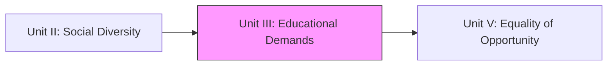
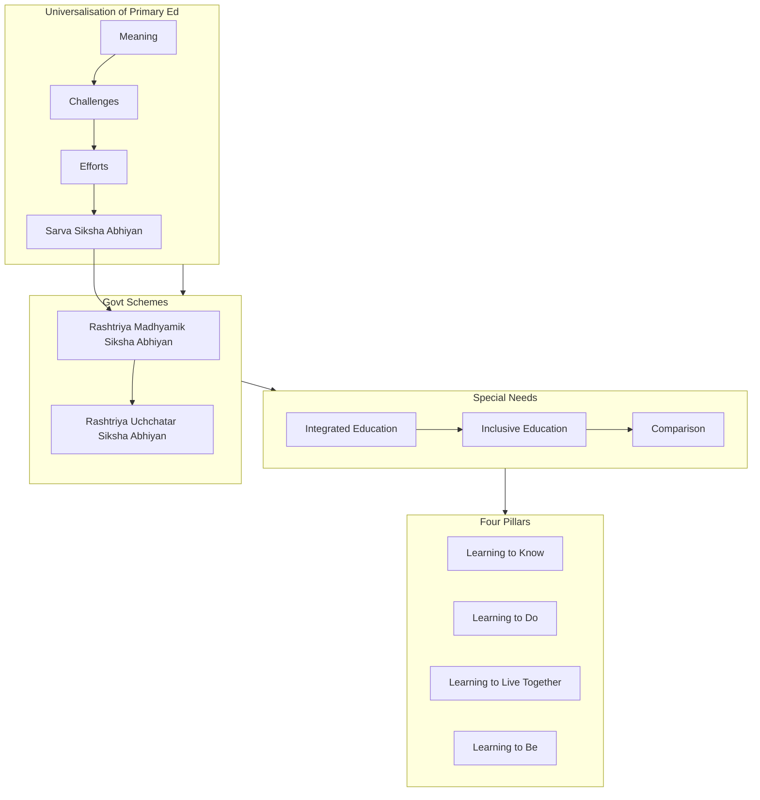

!!! abstract "Unit Overview"
    This unit addresses the diverse educational demands of individuals and communities in India. It focuses on the constitutional mandate for Universalisation of Primary Education (UEE) and the challenges in achieving it. Key government schemes like Sarva Siksha Abhiyan (SSA), Rashtriya Madhyamik Siksha Abhiyan (RMSA), and Rashtriya Uchchatar Siksha Abhiyan (RUSA) are detailed. The unit also differentiates between Integrated and Inclusive Education and explores the "Four Pillars of Education" for collective and peaceful living as recommended by the Delors Commission.

!!! info "Unit Information"
    **Unit III - Educational Demands of Individuals and Diverse Communities**  
    **Content:** Educational Demands, Government Schemes (SSA, RMSA, RUSA), Inclusive Education, Four Pillars of Education  
    **Pages:** 88 - 108 (Source Text: 164 - 205)  
    **Study Time:** 6-8 hours

## 🎯 Introduction

**Context:** Indian society consists of diverse communities with varying educational needs. The poor, oppressed, and marginalized people find it difficult to send their children to school. Children with disabilities are unable to attend common schools. It is the government's duty in democratic countries to fulfill the basic educational needs of all such people.

**Key Learnings:**

- **Universalisation of Primary Education (UEE):** Constitutional mandate, challenges, and solutions
- **Government Schemes:** SSA (Primary), RMSA (Secondary), and RUSA (Higher Education)
- **Special Education:** Integrated Education vs. Inclusive Education
- **Four Pillars of Education:** UNESCO's framework for 21st-century learning

**Why This Unit Matters:**

1. Understanding constitutional obligations (Article 45)
2. Analyzing major educational policies and their implementation
3. Recognizing diverse educational needs in society
4. Preparing for collective and peaceful living in a globalized world

## 🔗 Connection to Other Units

| Unit | Connection |
| :--- | :--- |
| **Unit II** | Established the existence of diverse communities. |
| **Unit III** | **Focuses on Demands & Solutions (Schemes)** for these communities. |
| **Unit V** | Continues the theme of Equality (Opportunity) discussed in Unit III's Inclusive Education. |

## 📚 Unit Overview

| Lesson | Focus Area | Key Concepts |
| :--- | :--- | :--- |
| **Lesson 5** | **Universalisation & Schemes** | UEE, SSA, RMSA, RUSA. |
| **Lesson 5 (Cont.)** | **Inclusion & Pillars** | Integrated vs Inclusive Ed, Delors Commission (4 Pillars). |

### Learning Outcomes
By the end of this unit, you will be able to:
1.  **Analyze** the challenges in achieving Universal Primary Education in India.
2.  **Evaluate** the objectives and strategies of SSA, RMSA, and RUSA.
3.  **Differentiate** between Integrated Education and Inclusive Education.
4.  **Explain** the vital role of the Four Pillars of Education in the 21st century.

## 🗺️ Topic Connection Map

---

# LESSON - 5: EDUCATIONAL DEMANDS OF INDIVIDUAL AND DIVERSE COMMUNITIES

## 5:00 Introduction
Government's duty to provide basic education for all, especially marginalized, poor, and disabled. Introduction of schemes: SSA, RMSA, RUSA, Integrated/Inclusive Education.

## 5:01 Universalisation of Primary Education

### 5:01:1 Meaning of "Universal Primary Education"

**Definition:** Universalisation of Primary Education means providing free and compulsory education to all children from age 6 to 14, as mandated by the Indian Constitution.

**Constitutional Basis:** Article 45 of the Indian Constitution states:
> "It is the endeavour of the State to provide free and compulsory education to all children from age 6 to 14 and this should be realised within 10 years from the commencement of the Constitution."

**Key Implications:**

1. **Free Education:** Primary education of 8 years should be made free to all children
2. **Compulsory Enrollment:** All 5-year-old children should be compulsorily enrolled in Class I of primary schools
3. **Compulsory Attendance:** All children of age 6 to 14 should go to school
4. **Universal Retention:** Children admitted in Class I should be retained in schools till they complete Class VIII

!!! note "Important"
    Universalisation of Primary/Elementary Education is the constitutional duty of both Central and State governments.

### 5:01:2 Challenges in Achieving Universal Primary Education

**Historical Context:** The goal of achieving universal primary education was first set for 1960 but has been successively modified to 1970, 1976, 1988, 1990, 1995, 2000, etc. due to various challenges. Currently, efforts continue through Sarva Siksha Abhiyan scheme.

**Major Challenges:**

#### 1. Economic Factors
- **Issue:** Acute poverty, particularly in rural areas
- **Impact:** Young children forced to take petty jobs as domestic servants to augment family income
- **Example:** When Rajasthan government imprisoned parents who didn't send children to school, many parents preferred jail over sending children, ultimately forcing withdrawal of penal provisions

#### 2. Ignorance of Parents
- **Issue:** Uneducated parents do not realize the importance of education
- **Impact:** Main obstacle in getting children admitted in primary schools
- **Result:** Children are not sent to school despite availability

#### 3. Communal and Ethnic Barriers
- **Affected Groups:** 
  - Tribal people (e.g., Narikoravas)
  - Religious minorities, particularly Muslims
  - Backward Class and Most Backward Class communities
  - Denotified communities
- **Impact:** Children don't join schools; prefer jobs or family business/occupation

#### 4. Obstacles Due to Social and Religious Practices
- **Issue:** Cultural restrictions based on religion and caste
- **Examples:**
  - Some Hindu families don't allow girls to attend schools after puberty
  - Muslim families often don't send girls to schools

#### 5. Geographical Locale as a Barrier
- **Affected Areas:**
  - Hilly areas
  - Drought-prone regions
  - Remote rural villages
- **Problem:** No schools available; children discouraged by long travel distances

#### 6. Educational Reasons
- **Twin Problems:** 'Wastage' and 'Stagnation'
- **Issue:** School education appears uninteresting and divorced from practical life
- **Result:** Pupils not attracted towards schools; high dropout rates

#### 7. Paucity of Funds
- **Issue:** State governments lack funds for opening new schools in rural areas
- **Reality:** Governments (State and Centre) allocate less than 3% of budget to primary education
- **Impact:** Insufficient infrastructure and resources

#### 8. Administrative Lapses
- **Problems:**
  - Dysfunctional schools
  - Poor quality education in government schools
  - Bad administration and management
- **Result:** Private schools thrive due to government school failures

#### 9. Individual Related Problems
- **Affected Students:**
  - Mentally challenged pupils
  - Pupils with emotional disturbances
  - Students with severe behavioral problems
- **Impact:** Cannot get along in normal schools; forced to stop education

#### 10. Population Explosion
- **Root Cause:** The fundamental problem underlying all other issues
- **Statistics:**
  - 1971 Census: 11.7 crore children (age 6-14)
  - 2021 Projection: 36 crores children
- **Requirement:** Teacher strength needs to increase to 58 lakhs
- **Challenge:** Mammoth financial burden; expansion beyond government capacity

!!! warning "Critical Analysis"
    It is not practically possible to achieve universal primary education through the formal system of education alone. Non-formal education should be given due importance and implemented throughout the country.

### 5:01:3 Efforts Taken to Provide Universal Primary Education

#### 1. Expansion in Primary Education
- **1947 (Independence):** 173 thousand primary schools
- **1990-91:** 500 thousand schools
- **2015:** 840 thousand schools
- **Tamil Nadu Example:** Schools opened in small hamlets with population of 300 people
- **Impact:** Significant increase in middle schools as well

#### 2. Enrollment of Pupils
- **Achievement:** Number of pupils enrolled multiplied manifold compared to independence
- **Progress:** Substantial increase in access to primary education

#### 3. Useful Curriculum and Interesting Methods of Teaching
- **Curriculum Focus:**
  - Environmental education
  - Population education
  - Vocational education
  - Value education
  - Education through mother tongue
- **Teaching Methods:**
  - Activity Based Learning (ABL) Method in Tamil Nadu primary schools
  - Child-centered approaches
  - Meaningful experiences related to immediate needs and living conditions

#### 4. Special Focus on Education of Children from Weaker Sections
- **Constitutional Basis:** Article 46 emphasizes educational progress of Scheduled Castes and Scheduled Tribes
- **Support Provided:**
  - Liberal grant of scholarships
  - Financial assistance
  - Free textbooks and dress materials for school uniform
  - Free stay and boarding in hostels
- **Purpose:** Motivate educational and economic advancement

#### 5. Student Welfare Schemes
- Free nutritious noon-meal scheme
- Free transport
- Free textbooks and stationeries
- Free uniforms
- Free medical facilities

#### 6. Priority to Girls' Education
- Campaigns emphasizing girls' education
- Special focus on bridging gender gaps

#### 7. Higher Financial Allocation
- **Government Allocation:** Both Centre and State make significant annual budget allocations
- **Primary Education Share:** About 48.5% spent on primary education
- **Additional Resources:** Private agencies also spend huge amounts on education

#### 8. New Education Policy (1986) Initiatives

##### i) Operation Black Board
- Basic infrastructure improvement scheme for primary schools

##### ii) Sarva Siksha Abhiyan (SSA)
- **Coverage:** Implemented to benefit 20.5 crore people covering 11 lakh villages
- **Scope:** Comprehensive primary education scheme

##### iii) Minimum Levels of Learning
- Child-centered teaching methods
- Activity Based Learning implementation

##### iv) School Calendar Revision
- Working days and holidays adjusted to suit rural student needs

##### v) District Institutes of Education and Training (DIET)
- Established in each district
- Purpose: Improve standard of primary education

##### vi) Examination Reforms
- More objective examinations
- No retention policy from Std. I to V
- Automatic promotion to reduce dropout

##### vii) Non-Formal Education
- **Target Groups:**
  - Primary school dropouts
  - Children without nearby schools
  - Working children
- **Example Scheme:** CAPE (Continuing and Adult Primary Education)

##### viii) Flexible Education System
- Children studying through non-formal education can switch to formal system
- Promotes educational continuity and opportunity

!!! success "Current Implementation"
    Sarva Siksha Abhiyan is being vigorously implemented to provide education to:
    
    - Children who had not been to school so far
    - Children who dropped out without completing primary education
    - Child laborers
    
    Following SSA's success, next stages (RMSA and RUSA) are now being undertaken.

## 5:02 Sarva Siksha Abhiyan (SSA)

**Definition:** The English equivalence of SSA is "The Education for All Movement," sometimes referred to as "each one teach one."

**Launch Details:**
- **Period:** Launched during the Ninth Five Year Plan (1997-2002)
- **Purpose:** Achieving Universalisation of Elementary Education (UEE) in a time-bound manner
- **Constitutional Mandate:** As mandated by the 86th amendment to the Constitution of India, making free and compulsory education to children of ages 6 to 14 a fundamental right

**Scope:**
- **Target Population:** 20.5 crore children (estimated 30.6 crore by 2021)
- **Coverage:** 11 lakh villages across India
- **Implementation:** Executed by Government of India with full cooperation of State Governments
- **Tamil Nadu Administration:** Executed under the supervision of an IAS Officer

### 5:02:1 Aims of SSA

#### Primary Aims:
1. **Quality Education:** To achieve the goal of universalisation of elementary education of satisfactory quality by 2010
2. **Social Equity:** To bridge social, regional, and gender gaps with active community participation in school management

### 5:02:1:01 Objectives of SSA

**Time-Bound Objectives:**

| Year | Objective |
|------|-----------|
| **2003** | Admitting all children in School, Education Guarantee Centre, or Alternate School |
| **2007** | Ensuring all children complete five years of primary schooling |
| **2007** | Bridging gaps between gender and social categories at primary education stage |
| **2010** | Ensuring all children complete eight years of schooling |
| **2010** | Bridging gaps at elementary education level |
| **2010** | Practicing universal retention |

**Additional Objectives:**
- Focusing on providing elementary education of satisfactory quality
- Emphasis on education for life
- Ensuring no child is left behind

### 5:02:2 Operational Strategies of SSA

#### Infrastructure Development:
1. **New Schools:** Opening new schools in habitations without school facilities
2. **School Improvement Grants:** Strengthening existing school infrastructure through:
   - Additional classrooms
   - Toilets
   - Drinking water facilities

#### Human Resources:
3. **Additional Teachers:** Providing teachers to schools with inadequate teaching strength
4. **Teacher Training:** Enhancing capacity through extensive in-service programs
5. **Teaching-Learning Materials:** Liberal grants for developing educational materials

#### Quality Enhancement:
6. **Academic Support:** Strengthening academic support structure at cluster, block, and district levels
7. **Quality Education:** Ensuring quality elementary education including life-skills
8. **Computer Literacy:** Providing basic computer literacy to students

#### Special Focus:
9. **Girls' Education:** Special focus on education of girls
10. **Special Needs:** Focused attention on children with special needs

### 5:02:3 Funding for SSA Project

#### Sharing Arrangement Between Centre and State:

| Plan Period | Centre Share | State Share |
|-------------|--------------|-------------|
| **IX Plan** | 85% | 15% |
| **X Plan** | 75% | 25% |
| **After X Plan** | 50% | 50% |

#### Key Funding Provisions:

1. **State Investment Maintenance:**
   - States must maintain their 1999-2000 level of investment in elementary education
   - State share for SSA is over and above this investment

2. **Fund Release Mechanism:**
   - Central Government releases funds directly to State Implementation Society
   - Further installments released only after:
     - State transfers its matching share to the Society
     - At least 50% of funds (Centre + State) has been spent

3. **Scheme Convergence:**
   - Existing elementary education schemes converge into SSA after IX Plan
   - **Exceptions:** Mahila Samakhya, National Bal Bhawan, and NCTE
   - Mid-Day Meal remains a distinct intervention

4. **District Education Plans:**
   - Must show funds/resources from:
     - PMGY (Prime Minister Gramodaya Yojana)
     - JGSY (Jawahar Gram Samridhi Yojana)
     - PMRY (Prime Minister Rozgar Yojana)
     - Sunishchit Rozgar Yojana
     - MP/MLA Area Development Fund
     - State Plan
     - Foreign funding (if any)
     - NGO sector resources

5. **Decentralization of Funds:**
   - Funds for upgradation, maintenance, repair, and teaching-learning equipment transferred to:
     - Village Education Committees
     - School Management Committees
     - Gram Panchayat
     - Other village/school level arrangements
   - Village/school-based body makes resolution regarding procurement

6. **State-Funded Schemes:**
   - Scholarships and uniforms continue under State Plan
   - Not funded under SSA program

!!! tip "Exam Focus"
    Remember the progressive funding ratio: 85:15 → 75:25 → 50:50. This shows increasing state responsibility over time.

## 5:03 Rashtriya Madhyamik Siksha Abhiyan (RMSA)

**Definition:** RMSA is a scheme designed to admit all eligible children in secondary schools and improve the quality of secondary education.

**Launch:** 2009

**Coverage:** Standards VI to XII

**Target Age Group:** 14 to 18 years

### Vision for Secondary Education

**Core Vision Statement:**
To provide quality secondary education to all youth in the age group 14 to 18, making it:

1. **Easily Accessible**
2. **Economical**
3. **Universally Available**

#### Implementation Requirements:

**Accessibility Goals:**
- Secondary school within 5 kilometers radius of every habitation
- Higher secondary school within 7 to 10 kilometers of every habitation

**Enrollment Goals:**
- **By 2017:** 100% enrollment of age group 14-18
- **By 2020:** All enrolled students complete the course (zero dropouts)

**Priority Groups:**

The following sections of society should have enhanced opportunities to join and complete secondary education:

1. Economically weaker sections
2. Girls
3. Handicapped children
4. Children living in rural areas
5. Marginalized sections of society:
   - Scheduled Castes
   - Scheduled Tribes
   - Other Backward Classes (OBC)
   - Educationally backward minority communities

### 5:03:1 Goals and Objectives of RMSA

### 5:03:1:01 Goals

**New Design Philosophy:**
Secondary education should have a new design to provide quality education to all youths in the age group 14 to 18.

**Key Goals:**

#### 1. Easy Access to Secondary Education
- All eligible persons should have convenient access to secondary schools
- Removal of geographical barriers

#### 2. Equality and Social Justice
- Ensuring equitable education opportunities
- Special focus on disadvantaged groups

#### 3. Contemporary and Development-Oriented Education
- Secondary education should suit changing times
- Aligned with developmental needs
- In tune with overall educational structure

#### 4. Common School System
- Encouraging same schools for all children (rich or poor)
- Achieving goals of equity through common schooling
- Breaking economic and social barriers

#### 5. Inclusive Participation
- Ensuring all youth get secondary education
- Particular focus on underprivileged
- Special attention to people living below poverty line

### 5:03:1:02 Objectives

#### Objective 1: Infrastructure and Facilities
**Requirement:**
- All secondary schools must have prescribed:
  - School places with adequate infrastructure
  - Material resources
  - Necessary facilities

**Implementation:**
- **Government/Municipal/Aided Schools:** Additional expenditure borne by government
- **Private (Unaided) Schools:** Suitable controlling mechanism to ensure prescribed facilities

#### Objective 2: Residential Schools in Tribal Areas
- Establishing residential schools specifically in tribal areas
- Addressing geographical and social barriers
- Ensuring tribal children receive quality secondary education

#### Objective 3: Efficient Transport System
- School management must provide efficient transport
- Benefits both staff and students
- Removes accessibility barriers

#### Objective 4: Non-Discrimination Principle
**Principle:** No child should be deprived of secondary education because of:
- Gender
- Socio-economic factors
- Physical handicap
- Any other discriminatory reasons

#### Objective 5: Progress Towards Common School System
- The above objectives indicate progress towards common school system
- Ensures equality of educational opportunity
- Reduces disparity in quality of education

!!! note "RMSA Significance"
    RMSA extends the success of SSA to the secondary level, creating a seamless educational pathway from elementary to secondary education.

## 5:04 Rashtriya Uchchatar Siksha Abhiyan (RUSA)

**Definition:** RUSA is a comprehensive scheme for reforming and developing higher education in India.

**Launch:** 2013 by the Ministry of Human Resources and Development

**Progression Context:**
- **1997:** SSA launched for Universalisation of Primary Education
- **2009:** RMSA launched for Secondary Education
- **2013:** RUSA launched as natural development for Higher Education

### Purpose and Structure

**Primary Purpose:**
- A new central organization will be created to:
  - Suggest introduction of reforms in higher education
  - Help in planning developmental schemes
  - Supervise all State-administered universities

**Key Functions:**
- Provide help towards greater autonomy for State Universities
- Introduce examination reforms
- Transform higher education landscape

### Salient Functions of RUSA

#### 1. International Standard Universities
- Upgrading selected universities to achieve international standards
- Quality enhancement at university level

#### 2. New Universities
- Permitting the opening of new universities
- Expanding access to higher education

#### 3. Cluster College System
- Linking colleges in the neighborhood of a university
- Creating cluster colleges affiliated to the university
- Promoting collaboration and resource sharing

#### 4. Model Colleges
- Upgrading full-fledged degree colleges into model colleges
- Setting benchmarks for quality education

#### 5. State Councils of Higher Education
- Creating State Councils of Higher Education
- Decentralizing higher education governance

#### 6. New Funding Mechanism
**Revolutionary Change:**
- Central aid to universities and colleges funneled through State Councils
- **Not through UGC (University Grants Commission)**
- Promotes state-level autonomy and accountability

#### 7. Funding Ratio
**For New Expenditure:**

| Source | Percentage |
|--------|-----------|
| **Central Government** | 90% |
| **State Governments** | 10% |

**Significance:** Reduces financial burden on states while ensuring central support

#### 8. Private Institution Inclusion
- Even private (unaided) colleges and universities can get funds
- **Condition:** Subject to certain conditions and quality standards

### Expected Outcomes

**Gross Enrolment Rate (GER) Targets:**

| Timeline | Target GER |
|----------|------------|
| **Current (2013)** | 18% |
| **End of 12th Plan** | 25.2% |
| **End of 13th Plan** | 32% |

**Financial Projection:**
- **Total Estimated Expenditure:** ₹99,000 crores
- **Coverage:** All schemes in higher education including existing institutions

**Impact:**
- Substantial increase in number of people receiving higher education
- Improved quality of higher education institutions
- Greater autonomy for state universities
- Enhanced examination and governance systems

!!! success "Three-Tier Educational Framework"
    **SSA → RMSA → RUSA** creates a comprehensive educational pathway:
    
    - **SSA:** Elementary Education (Age 6-14)
    - **RMSA:** Secondary Education (Age 14-18)
    - **RUSA:** Higher Education (Age 18+)
    
    This ensures educational continuity from primary to higher education.

## 5:05 Integrated Education

### 5:05:1 Concept of Integrated Education

**Definition:**
Educating children with special needs as well as those with different kinds of disabilities, in the mainstream settings of common schools, along with normal children is known as **'Integrated Education'**.

**Origin:**
The concept arose from the **National Policy on Education (1986)**, which recommended:
- Providing equal opportunity in education for all
- Not only for access but also for complete development
- Integration refers to interactions of disabled children with normal children in the same school educational setting

**Key Terms:**
- **Integration in Education:** Also known as "mainstreaming" or "normalization"
- **Mainstream Settings:** Regular school classrooms where normal children study
- **Specialized Educational Help:** Additional support services provided to disabled children

**Philosophy:**
Children with less amount of disability can be educated in common school classes along with normal children by providing some specialized educational help and services.

### 5:05:2 Implementing Integrated Education

**Principle:** Depending upon the extent of disability, exceptional children can attend classes with normal children either on:
- Part-time basis, OR
- Full-time basis

**Two Implementation Strategies:**

#### Strategy 1: Full-Time Integration

**Description:**
Making exceptional children learn in the regular classroom along with normal children, following the normal curriculum, on a full-time basis.

**Special Help Provided:**
- Audio aids for the hearing impaired
- Books in Braille for the visually impaired children
- Other assistive devices as needed
- Additional support within the classroom

**Characteristics:**
- Children spend entire school day with normal peers
- Follow same curriculum
- Receive in-class support
- Full participation in all classroom activities

#### Strategy 2: Part-Time Integration (Resource Room Model)

**Description:**
Children with moderate level of disability attend classes with normal children on a part-time basis.

**Daily Schedule:**
- **Half Day:** Regular classroom with normal children
- **Half Day:** Special education room with special education teacher

**Co-curricular Participation:**
- Children participate in all co-curricular activities along with normal children
- Promotes social integration
- Develops peer relationships

**Special Education Room Features:**
- Located in the common school campus
- Equipped with:
  - All materials required for special education
  - Specialized equipment and facilities
  - Assistive devices
- Staffed by:
  - Fully trained special education teacher
  - Experienced in working with disabled children

**Summary Definition:**
Integrated education is the educational program in which exceptional children attend classes with normal children either on a part-time or full-time basis. It is the placement of disabled children in ordinary schools with some specialized educational help and services.

!!! info "Key Concept"
    **Integration = Mainstreaming**
    
    The focus is on bringing disabled children into the mainstream educational environment while providing necessary support services.

## 5:06 Inclusive Education

### 5:06:1 Meaning of Inclusive Education

**Comprehensive Definition:**
Inclusive Education means that all students attend and are welcomed by their neighborhood schools in age-appropriate, regular classes and are supported to learn, participate, and contribute in all aspects of the life of the school.

**Design Philosophy:**
Inclusive education is about how we develop and design:
- Schools
- Classrooms
- Programs
- Activities

So that **all types of students** learn and participate together.

**Key Characteristics:**
- Students with special needs spend **most or all** of their time with non-disabled students
- **Rejects** the use of special schools or classrooms to separate students with disabilities
- Students with disabilities remain in regular classrooms alongside their peers

**Broad Scope:**
Inclusive education includes all students who are away from education for one reason or another:
- Physically or mentally challenged
- Economically or socially deprived
- Belonging to any caste, creed, and gender
- Any other marginalized group

**Brief Statement:**
In inclusive education, disabled children are treated with normal children in the same setting without separation or segregation.

### 5:06:2 Definition of Inclusive Education

**UNESCO Definition:**
> "Inclusion is a process of addressing and responding to the diversity of needs of all learners through increasing participation in learning, cultures and communities, and reducing exclusion within and from education.
>
> It involves changes and modifications in content, approaches, structures and strategies, with a common vision which covers all children of the appropriate age range and a conviction that it is the responsibility of the regular system to educate all children."

**Key Elements of UNESCO Definition:**

1. **Process-Oriented:** Inclusion is an ongoing process, not a one-time event
2. **Diversity Recognition:** Addresses diverse needs of all learners
3. **Increased Participation:** Focus on participation in:
   - Learning
   - Cultures
   - Communities
4. **Reduced Exclusion:** Eliminating barriers within and from education
5. **System Changes:** Requires modifications in:
   - Content
   - Approaches
   - Structures
   - Strategies
6. **Common Vision:** Covers all children of appropriate age range
7. **System Responsibility:** Regular education system must educate all children

### 5:06:3 Difference Between 'Education for All' and 'Inclusive Education'

#### Historical Context:

**Education for All (Pre-2000):**
- The Indian government interpreted "ALL" to mean normal children with average intelligence
- Efforts till 1990 focused on achieving 100% literacy for students aged 6-14
- Targeted only public school students
- Goal not fully achieved even today

**Shift to Inclusive Education (Post-2000):**
- **Catalyst:** UNESCO-sponsored Conference by World Education Forum in Dakar, Senegal (2000)
- New interpretation: "ALL" means **all children** without exception

**"ALL" in Inclusive Education includes:**
1. Children from culturally and ethnically diverse backgrounds
2. Children from remote and nomadic dwellers
3. Street children
4. Working children
5. Children of OBCs (Other Backward Classes), most disadvantaged and poor
6. Children with disabilities including mental retardation
7. Children affected by HIV/AIDS
8. Children affected by war and conflict

**Paradigm Shift:**
The conference recommended that Education for All should take account of the needs of:
- The poor
- The most disadvantaged
- Including children from ethnic, cultural, and linguistic minorities
- Working children
- Rural and remote populations
- Those affected by conflict

!!! warning "Critical Understanding"
    **Education for All ≠ Inclusive Education (Initially)**
    
    Education for All originally meant normal children only. Inclusive Education expanded this to truly mean ALL children, including those with special needs and from marginalized communities.

### 5:06:4 Comparison Between 'Inclusive Education' and 'Integrated Education'

| Component | Integrated Education | Inclusive Education |
|-----------|---------------------|---------------------|
| **Place of Study for the Disabled** | Regular classroom in the public school + special education classroom in the school campus | Regular classroom in the public school |
| **Duration of Study with Normal Children** | During all class hours (Full-time) OR Half day in regular, half day in special room (Part-time) | During all the class hours |
| **Duration of Study in Special School Setting** | i) Exceptional children learning with full-time special help, OR ii) Half a day in special education classroom located in same campus | Besides attending regular classes, the disabled can also get special education in the school campus itself through the itinerary teacher, outside class hours |
| **Teacher's Skills** | Regular class teachers having skills in teaching general subjects + basic skills in special education OR Special education teacher who visits the school | The regular class teachers having skills in teaching general subjects + basic skills in special education |
| **Special Facilities for the Disabled** | Basic facilities (special seats, enough space for wheelchairs, teaching aids for disabled etc.) in the public school | Basic facilities for the disabled in public school regular classroom. Most facilities required for disabled |
| **Component of Achievement of Disabled Students** | Achievement in curriculum subjects to certain extent + good improvement in social skills | Though achievement is less in curricular subjects, their social skills will significantly improve |

**Key Differences Summary:**

#### 1. Philosophical Approach:
- **Integrated:** Child must adapt to fit into existing system
- **Inclusive:** System must adapt to accommodate all children

#### 2. Placement:
- **Integrated:** May involve separate special education room
- **Inclusive:** Always in regular classroom

#### 3. Teacher Training:
- **Integrated:** May involve specialized special education teacher
- **Inclusive:** All regular teachers trained in inclusive methods

#### 4. Focus:
- **Integrated:** Balance between academic and social development
- **Inclusive:** Strong emphasis on social integration with academic support

!!! tip "Exam Focus"
    **Remember:** Inclusive Education is more comprehensive and radical than Integrated Education. It requires systemic change rather than just providing additional support.

## 5:07 Education for Collective Living and Peaceful Living

### Introduction: Need for Societal Reconstruction

**Shakespeare's Quote:**
> "We know that what we are, but know not what we may be."

**Current Context:**
- Indian society needs reconstruction accomplished through education
- Requires transmitting best of Indian culture linked with western knowledge
- Teachers must develop forward-looking outlook among students

**Essential Skills Education Must Develop:**
1. Self-learning skills useful throughout life
2. Vocational skills for efficient work
3. Unity in diversity skills
4. Problem-solving through negotiations
5. Whole personality development

**Teacher's Role:** Develop wholesome 'Occupational personality' that is liberal in outlook and progressive in beliefs.

### 21st Century Challenges

**Three Major Issues:**
1. War and Peace
2. Man and Environment
3. Culture and Technology

**Additional Pressures:** Population explosion, knowledge explosion, rising expectations creating tension on all fronts

### Jacques Delors Commission Report (1996)

**Report:** "Learning: The Treasure Within" submitted to UNESCO

**Core Message:**
> "Education is at the heart of both personal and community development; its mission is to enable each of us, without exception, to develop all our talents to the full and to realize our creative potential, including responsibility for our own lives and personal aims, besides developing the capacity for collective and peaceful living."

**Values to be Developed:** Non-violence, Cooperation, Selfless attitude, Respecting others, Accepting differences, Realizing mutual interdependence

## 5:08 Four Pillars of Education as Viewed by Delors Commission Report

### 5:08:1 Concept of Learning to Know

**Definition:** Learning to know refers to **'learning how to learn'** - denoting concentration, memory skills, and ability to think.

#### Hidden Talents in Every Individual:
1. Memory
2. Reasoning
3. Imagination
4. Physical ability
5. Aesthetic sense
6. Aptitude to communicate

#### Three Key Skills Development:

##### 1. Concentration Skills
From infancy, young people must learn to concentrate on objects and people. Development aided by:
- Games
- Work experience programs
- Travel
- Practical science activities

##### 2. Memory Skills
- **Importance:** Excellent tool for countering instant information overload
- Human memory outperforms machines in establishing connections
- Selectivity required in choosing facts to learn by heart
- Learning with association and understanding improves retention
- Traditional memorization exercises should not be discontinued

##### 3. Thinking Skills
- Children learn thinking from parents, then teachers
- Teacher helps students encompass practical problem-solving and abstract thought
- Use both inductive and deductive reasoning
- Employ scientific method and laboratory work
- Develop through subject matter, library work, activities

#### Summary:
Learning to Know denotes the ability to get knowledge needed for globalized information society, develop cognitive skills for learning 'how to learn', and independently acquire knowledge. Result: Person transformed as more enlightened, empowered, and enriched.

### 5:08:2 Learning to Do

**Definition:** Putting knowledge learned into practice. Competency is necessary to use acquired knowledge properly.

#### Assessment of Competency

Assessed by mix of:
- Various skills and talents
- Social behavior
- Self-initiative
- Willingness to work hard

**Also Called:** Inter-personal skills or soft skills (essential for service sector)

#### Personal Skills Required:

1. **Social Behavior** - Appropriate interaction with others
2. **Personal Initiative** - Self-motivation and proactive approach
3. **Willingness to Work Hard** - Dedication and effort
4. **Communication Skills** - Effective expression and understanding
5. **Problem-Solving Skill** - Analytical and creative thinking
6. **Skill of Adaptability** - Flexibility in changing situations
7. **Social Responsibility** - Awareness of duties towards society
8. **Leadership Skills** - Ability to guide and inspire others
9. **Establishing Rapport** - Interested to move with others amicably
10. **Life Skills** - Practical skills for daily living
11. **Group Functioning Skills** - Teamwork and collaboration

#### Summary:
Second important function of education is developing: ability to use acquired knowledge properly, function as a group, make decisions after deliberation, steadfastness in implementation, leadership qualities, and problem-solving skills.

### 5:08:3 Learning to Live Together

**Definition:** Living in peace and harmony is a **dynamic and holistic process** of learning, internalizing social values, and practicing them throughout life.

#### Core Social Skills and Values:

1. Having respect and concern for others
2. Realizing need for unity among people differing in race, caste, religion, language, sex, culture
3. Getting along with others smoothly

#### Two Complementary Approaches:

##### Approach 1: Discovering Human Diversity (Early Childhood)

**Method:**
- Teacher explains about human diversity
- Instilling awareness of similarities alongside differences
- Understanding interdependency among social groups

**Helpful School Subjects:** Geography, History, Foreign languages, Literature, History of religions, Citizenship education

##### Approach 2: Common Community Projects (From Age 10-12 Onwards)

**Activities:**
- Collaborative learning projects
- Slum area renovation
- Helping senior citizens and disadvantaged people
- Mass literacy programs
- Social service
- Environmental degradation prevention awareness
- Human rights safeguarding awareness
- AIDS and drug abuse prevention campaigns

**Outcome:** Develops social concern and social responsibility

#### Values to be Learned:
1. Non-violence
2. Cooperation
3. Selfless attitude
4. Respecting others
5. Accepting human diversity
6. Understanding interdependence

#### Summary:
One can live independently in amity and peace with others only by acquiring social concern, social skills, ability for self-learning, and using knowledge innovatively. Education should prepare students for useful, purposeful life in society.

### 5:08:4 Learning to Be

**Definition:** All-round development of the **whole person**.

#### Core Philosophy

**Unique Individuality:** Unlike soap cakes, all pupils have different natures and abilities. Various inherent potentials exist in each individual.

**Main Aim of Education:** Nurture those potentials and make every individual a unique personality

**Holistic Development:** Education should help develop:
- **Body** - Physical development
- **Mind** - Intellectual development
- **Spirit** - Emotional and spiritual development

#### Development from Early Childhood

Students from early childhood should receive education that equips them to develop:

1. **Independent, Critical Thinking** - Own way of thinking and judgement
2. **Sound Judgement** - Ability to judge situations
3. **Decision Making** - Making up minds on best courses of action in different circumstances
4. **Physical Health** - Being healthy with strong physique

#### Summary:
The main aim of education is to help each student develop inherent talents and abilities, develop body, mind, and spirit, and become a whole person excelling in different ways. Education should make each individual a unique, well-rounded personality.

!!! success "Four Pillars Integration"
    These Four Pillars work together to create complete human beings capable of:
    
    - **Knowing:** Acquiring and processing knowledge
    - **Doing:** Applying knowledge practically
    - **Living Together:** Functioning harmoniously in society
    - **Being:** Developing as unique, whole individuals

---

## 📝 Quick Revision Table

| Scheme/Concept | Full Form/Key Idea | Target/Year |
| :--- | :--- | :--- |
| **SSA** | Sarva Siksha Abhiyan (Education for All) | Primary (6-14) / 1997 |
| **RMSA** | Rashtriya Madhyamik Siksha Abhiyan | Secondary (14-18) / 2009 |
| **RUSA** | Rashtriya Uchchatar Siksha Abhiyan | Higher Ed / 2013 |
| **Integrated Ed** | Disabled in normal school (Mainstreaming) | - |
| **Inclusive Ed** | System changes for ALL learners | - |
| **4 Pillars** | Know, Do, Live Together, Be | Delors Report (1996) |

## 🧠 Memory Mnemonics
*   **Schemes Progression:** **S**SA (Primary) -> **R**MSA (Secondary) -> **R**USA (University/Higher).
*   **4 Pillars:** **K-D-L-B** (Know, Do, Live Together, Be). *Kids Do Love Books*.
*   **Inclusive vs Integrated:** **Integrated** = Child fits system (mostly). **Inclusive** = System fits child (fully).

## ❓ Review Questions

### Short Answer Questions (2-3 Marks)

1. What do you mean by 'Universalisation of Primary Education'? [5:01:1]
2. What is 'Integrated Education'? [5:05:1]
3. What does Article 45 of the Indian Constitution imply? [5:01:1]
4. What do you mean by 'Sarva Siksha Abhiyan' Scheme? [5:02]

### Medium Answer Questions (5-7 Marks)

5. List 5 reasons for failure to achieve Universal Primary Education even after 74 years of independence. [5:01:2]
6. What are the main objectives of SSA? [5:02:1:01]
7. Explain the goals and objectives of Rashtriya Madhyamik Siksha Abhiyan Scheme. [5:03:1]
8. Describe the salient features of Rashtriya Uchchatar Siksha Abhiyan Scheme. [5:04]
9. Differentiate between Integrated and Inclusive Education. [5:06:4]
10. Explain the difference between 'Education for All' and 'Inclusive Education'. [5:06:3]

### Long Answer Questions (10-15 Marks)

11. Explain why even after 74 years of getting independence, provisions of Article 45 of the Indian Constitution could not be complied with fully? [5:01:1 + 5:01:2]
12. Describe the efforts taken by the Central and State governments to provide 'Education for All'. [5:01:3]
13. Explain briefly the aims and functions of Sarva Siksha Abhiyan Scheme. [5:02:1:01 + 5:02:2]
14. Describe how Sarva Siksha Abhiyan Scheme is being implemented. [5:02 + 5:02:1 + 5:02:1:01 + 5:02:2 + 5:02:3]
15. Explain the Four Pillars of Education as recommended by the Delors Commission. [5:08]
16. Explain "Learning to Live Together" and "Learning to Be" with examples. [5:08:3 + 5:08:4]
17. Compare and contrast Inclusive Education and Integrated Education with suitable examples. [5:06:4]

### Application-Based Questions

18. As a teacher, how would you implement the Four Pillars of Education in your classroom?
19. Suggest measures to overcome challenges in achieving Universal Primary Education in India.
20. Design a school that truly practices Inclusive Education. What facilities and training would you provide?

## 📊 Exam Preparation Tips

### Must Remember Points:

**Constitutional Provisions:**
- Article 45: Free and compulsory education (age 6-14)
- Article 46: Educational progress of SC/ST
- 86th Amendment: Making elementary education a fundamental right

**Schemes Timeline:**
- SSA: 1997 (Primary)
- RMSA: 2009 (Secondary)
- RUSA: 2013 (Higher)

**Funding Ratios:**
- SSA: 85:15 → 75:25 → 50:50 (Centre:State)
- RUSA: 90:10 (Centre:State for new expenditure)

**Four Pillars:**
1. Learning to Know
2. Learning to Do
3. Learning to Live Together
4. Learning to Be

### Common Exam Patterns:

1. **Define and Explain:** UEE, SSA, Integrated Education, Inclusive Education
2. **List and Explain:** Challenges in UEE, Efforts for UEE, Objectives of SSA
3. **Compare and Contrast:** Integrated vs. Inclusive Education
4. **Detailed Discussion:** Four Pillars of Education, Education for Collective Living
5. **Critical Analysis:** Why UEE goals not achieved, Need for value education

!!! tip "Exam Strategy"
    - Use headings and subheadings in answers
    - Include specific examples from the text
    - Remember key years and statistics
    - Draw diagrams for Four Pillars
    - Create comparison tables for Integrated vs. Inclusive
    - Quote important definitions verbatim

## 📚 Conclusion

This unit comprehensively covers:

1. **Constitutional Framework:** Understanding Article 45 and the mandate for Universal Primary Education
2. **Implementation Challenges:** Analyzing 10 major obstacles preventing achievement of UEE
3. **Government Initiatives:** Detailed study of SSA, RMSA, and RUSA schemes creating educational pathways from primary to higher education
4. **Special Education:** Clear distinction between Integrated and Inclusive Education approaches
5. **Philosophical Foundation:** Four Pillars of Education providing framework for 21st-century learning
6. **Value Education:** Emphasis on collective and peaceful living in diverse society

**Key Takeaway:** Education in contemporary India must address diverse needs while promoting equity, quality, and values necessary for democratic citizenship and peaceful coexistence.

!!! success "Unit Complete"
    You have completed **Unit III - Educational Demands of Individuals and Diverse Communities**. This unit provided comprehensive understanding of how India attempts to meet diverse educational needs through constitutional mandates, government schemes, inclusive practices, and value-based education for collective living.
