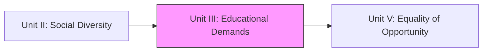
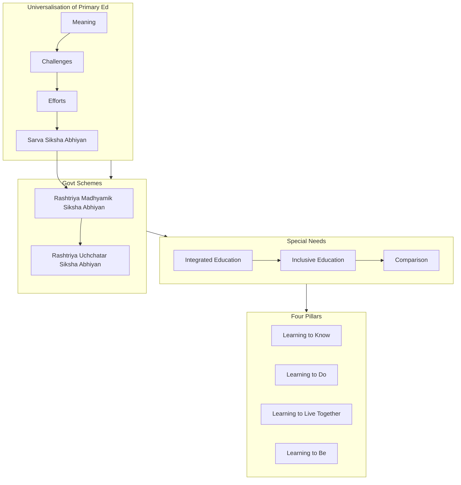

!!! abstract "Unit Overview"
    This unit addresses the diverse educational demands of individuals and communities in India. It focuses on the constitutional mandate for Universalisation of Primary Education (UEE) and the challenges in achieving it. Key government schemes like Sarva Siksha Abhiyan (SSA), Rashtriya Madhyamik Siksha Abhiyan (RMSA), and Rashtriya Uchchatar Siksha Abhiyan (RUSA) are detailed. The unit also differentiates between Integrated and Inclusive Education and explores the "Four Pillars of Education" for collective and peaceful living as recommended by the Delors Commission.

!!! info "Information"
    **Unit III - Educational Demands of Individuals and Diverse Communities**
    **Content:** Educational Demands, Government Schemes (SSA, RMSA, RUSA), Inclusive Education, Four Pillars of Education.
    **Pages:** 88 - 108 (Source Text: 164 - 205)

## 🎯 Introduction
India's diverse society necessitates varied educational approaches. This unit explores how the government attempts to meet these demands through specific schemes and how education must evolve to foster collective living.

**Key Learnings:**
*   **Universalisation of Primary Education (UEE):** Meaning, challenges, and efforts.
*   **Government Schemes:** Detailed study of SSA (Primary), RMSA (Secondary), and RUSA (Higher Education).
*   **Special Education:** Concepts of Integrated vs. Inclusive Education.
*   **Four Pillars of Education:** Learning to Know, Do, Live Together, and Be (Delors Commission).

## 🔗 Connection to Other Units

| Unit | Connection |
| :--- | :--- |
| **Unit II** | Established the existence of diverse communities. |
| **Unit III** | **Focuses on Demands & Solutions (Schemes)** for these communities. |
| **Unit V** | Continues the theme of Equality (Opportunity) discussed in Unit III's Inclusive Education. |

## 📚 Unit Overview

| Lesson | Focus Area | Key Concepts |
| :--- | :--- | :--- |
| **Lesson 5** | **Universalisation & Schemes** | UEE, SSA, RMSA, RUSA. |
| **Lesson 5 (Cont.)** | **Inclusion & Pillars** | Integrated vs Inclusive Ed, Delors Commission (4 Pillars). |

### Learning Outcomes
By the end of this unit, you will be able to:
1.  **Analyze** the challenges in achieving Universal Primary Education in India.
2.  **Evaluate** the objectives and strategies of SSA, RMSA, and RUSA.
3.  **Differentiate** between Integrated Education and Inclusive Education.
4.  **Explain** the vital role of the Four Pillars of Education in the 21st century.

## 🗺️ Topic Connection Map

---

# LESSON - 5: EDUCATIONAL DEMANDS OF INDIVIDUAL AND DIVERSE COMMUNITIES

## 5:00 Introduction
Government's duty to provide basic education for all, especially marginalized, poor, and disabled. Introduction of schemes: SSA, RMSA, RUSA, Integrated/Inclusive Education.

## 5:01 Universalisation of Primary Education

### 5:01:1 Meaning
Derived from **Article 45** (Constitution):
1.  Free primary education (8 years).
2.  Compulsory enrollment (Age 5 in Class I).
3.  Compulsory attendance (Age 6-14).
4.  Universal retention (No dropout till Class VIII).

### 5:01:2 Challenges in Achieving UEE
1.  **Economic Factors:** Poverty forces child labor.
2.  **Ignorance of Parents:** Lack of awareness.
3.  **Communal/Ethnic Barriers:** Cultural reluctance (Tribes, Minorities).
4.  **Social/Religious Practices:** Restrictions on girls (puberty).
5.  **Geographical Locale:** Remote/Hilly areas inaccessible.
6.  **Educational Reasons:** "Wastage" and "Stagnation"; boring curriculum.
7.  **Paucity of Funds:** Low budget allocation (<3%).
8.  **Administrative Lapses:** Bad management.
9.  **Individual Problems:** Mental/emotional challenges.
10. **Population Explosion:** Rate of growth exceeds resource expansion.

### 5:01:3 Efforts Taken
*   **Expansion:** Schools increased from 173k (1947) to 840k (2015).
*   **Enrollment:** Manifold increase.
*   **Curriculum:** Relevent topics (Environment, vocational). Activity Based Learning (ABL).
*   **Weaker Sections:** Article 46 implementation (Scholarships, free books).
*   **Welfare Schemes:** Mid-day meal, free transport/uniforms.
*   **Girls' Education:** Priority campaigns.
*   **New Policy Initiatives (1986 NPE):**
    *   Operation Black Board.
    *   **Sarva Siksha Abhiyan (SSA).**
    *   DIETs (District Institutes).
    *   Non-formal education.

## 5:02 Sarva Siksha Abhiyan (SSA)
"The Education for All Movement". Launched in 9th Five Year Plan (1997-2002).

### 5:02:1 Aims
*   UEE of quality by 2010.
*   Bridge social/regional/gender gaps.

### 5:02:1:01 Objectives
*   All children in school by 2003.
*   Complete 5 years primary by 2007.
*   Complete 8 years schooling by 2010.
*   Bridge gender/social gaps by 2010.
*   Universal retention by 2010.

### 5:02:2 Strategies
*   New schools in habitations without them.
*   School Improvement Grants (Infrastructure).
*   Additional teachers.
*   In-service teacher training.
*   Focus on girls/special needs.
*   Computer literacy.

### 5:02:3 Funding
*   Shared between Centre and State (Decreasing ratio: 85:15 -> 75:25 -> 50:50).
*   Funds released to **State Implementation Society**.

## 5:03 Rashtriya Madhyamik Siksha Abhiyan (RMSA)
Scheme for **Secondary Education** (Age 14-18, Class VI-XII).

### 5:03:1 Vision
*   Quality secondary education for all.
*   Accessible (within 5km for secondary, 7-10km for higher secondary).
*   Economical.
*   **Target:** 100% Enrollment by 2017; Universal retention by 2020.

### 5:03:1:01 Goals & Objectives
*   Equality and social justice.
*   **Common School System** encouragement.
*   Infrastructure in all schools (Govt/Aided).
*   Residential schools in tribal areas.
*   Efficient transport.
*   No deprivation based on gender/socio-economic status.

## 5:04 Rashtriya Uchchatar Siksha Abhiyan (RUSA)
Scheme for **Higher Education** (Launched 2013).

### Key Features
*   Strategic funding to State Higher Education institutions.
*   Create new central organization for reforms.
*   **Objectives:**
    *   Upgrade universities to international standards.
    *   Open new universities.
    *   Cluster colleges.
    *   Upgrade colleges to **Model Colleges**.
    *   Creates **State Councils of Higher Education**.
    *   Funds routed through State Councils (not UGC).
    *   **Funding Ratio:** 90% Centre : 10% State (New expenditure).
*   **Target:** Increase Gross Enrolment Rate (GER) to **32%** by end of 13th Plan.

## 5:05 Integrated Education

### 5:05:1 Concept
Educating children with special needs in **mainstream settings** (common schools) along with normal children.
"Mainstreaming" or "Normalization".

### 5:05:2 Implementation Strategies
1.  **Full Time:** Regular class with special help (Braille, Audio aids).
2.  **Part Time:** Half day regular class, Half day **Special Education Room** (resource room).

## 5:06 Inclusive Education

### 5:06:1 Meaning
**All** students attend neighborhood schools in age-appropriate regular classes and are supported to participate in **all** aspects. Rejects separation.
Includes physical/mental challenges, economic/social deprivation, caste/creed/gender.

### 5:06:2 Definition (UNESCO)
"Inclusion is a process of addressing and responding to the diversity of needs of all learners... reducing exclusion within and from education."

### 5:06:4 Comparison: Inclusive vs Integrated

| Feature | Integrated Education | Inclusive Education |
| :--- | :--- | :--- |
| **Concept** | Placement of disabled in ordinary schools. | System adapts to fit the child. |
| **Place** | Regular class (with special help) OR Part-time special room. | **Regular classroom** (always). |
| **Duration** | Full or Part time with normal children. | **All class hours** with normal children. |
| **Teacher** | Regular teacher + skills OR Special educator visit. | Regular teacher trained in inclusive methods. |
| **Facilities** | Basic facilities (Ramp etc.). | Most facilities within regular classroom. |
| **Achievement** | Academic achievement focus. | Social skills significantly improve + Academic. |

## 5:07 Education for Collective Living (Four Pillars)
**Delors Commission Report (1996):** "Learning: The Treasure Within".
Recommended **4 Pillars of Education** to address 21st-century issues (War, Environment, Culture).

### 5:08:1 Learning to ‘Know’
*   **Concept:** "Learning how to learn".
*   **Skills:** Concentration, Memory, Thinking (Inductive/Deductive).
*   **Outcome:** Independent acquisition of knowledge.

### 5:08:2 Learning to ‘Do’
*   **Concept:** Putting knowledge into practice. Competency.
*   **Skills:** Personal competence, Communication, Problem-solving, Leadership, Teamwork.
*   **Focus:** Skill mix over certified skills; Service sector needs (Social skills).

### 5:08:3 Learning to ‘Live Together’
*   **Concept:** Living in peace/harmony. **Dynamic/Holistic process**.
*   **Values:** Non-violence, Cooperation, Respect, Accepting differences.
*   **Approaches:**
    1.  **Discovering Diversity:** Teaching about human diversity/similarities (Geography, History).
    2.  **Common Projects:** Working together on community/social service projects (e.g., Slum renovation, AIDS awareness).

### 5:08:4 Learning to ‘Be’
*   **Concept:** All-round development of the **whole person** (Body, Mind, Spirit).
*   **Goal:** Nurture inherent potentials/talents. Make every individual a unique personality.
*   **Outcome:** Critical thinking, independent judgement.

---

## 📝 Quick Revision Table

| Scheme/Concept | Full Form/Key Idea | Target/Year |
| :--- | :--- | :--- |
| **SSA** | Sarva Siksha Abhiyan (Education for All) | Primary (6-14) / 1997 |
| **RMSA** | Rashtriya Madhyamik Siksha Abhiyan | Secondary (14-18) / 2009 |
| **RUSA** | Rashtriya Uchchatar Siksha Abhiyan | Higher Ed / 2013 |
| **Integrated Ed** | Disabled in normal school (Mainstreaming) | - |
| **Inclusive Ed** | System changes for ALL learners | - |
| **4 Pillars** | Know, Do, Live Together, Be | Delors Report (1996) |

## 🧠 Memory Mnemonics
*   **Schemes Progression:** **S**SA (Primary) -> **R**MSA (Secondary) -> **R**USA (University/Higher).
*   **4 Pillars:** **K-D-L-B** (Know, Do, Live Together, Be). *Kids Do Love Books*.
*   **Inclusive vs Integrated:** **Integrated** = Child fits system (mostly). **Inclusive** = System fits child (fully).

## ❓ Review Questions
1.  What does Article 45 imply for Universal Primary Education? [5:01:1]
2.  List 5 reasons for failure to achieve UEE. [5:01:2]
3.  What are the main objectives of SSA? [5:02:1:01]
4.  What is RUSA? Explain its funding model. [5:04]
5.  Differentiate between Integrated and Inclusive Education. [5:06:4]
6.  Explain "Learning to Live Together" with examples. [5:08:3]

!!! success "Unit Complete"
    You have completed **Unit III**. This unit guided you through the practical application of educational policies in India, from primary to higher education, and the philosophical shift towards inclusive and collective learning for a better future.
