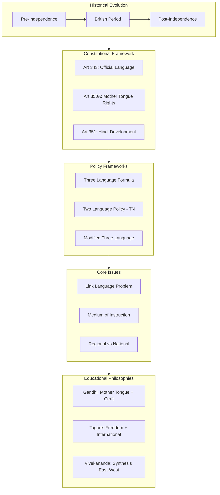

!!! abstract "Unit Overview"
    This unit examines the complex **Language Policy in Education** in India, a multilingual nation with over 3000 dialects. It traces the evolution of language policy from pre-independence (Sanskrit, Pali, Persian, English) through post-independence constitutional provisions (Articles 343-351). Key topics include the **Three Language Formula**, **Two Language Policy of Tamil Nadu**, the debate over **Medium of Instruction** (Mother Tongue vs. English vs. Regional Language), and the challenge of establishing a **Link Language** for national integration.

!!! info "Unit Information"
    **Unit IV - Language Policy in Education**
    
    **Content Coverage:**
    - Language Policy During Pre-independent Periods in India
    - Efforts to Resolve Language Issue Post-Independence
    - The Language Problem in Education
    - Changes in Language Policy Post-Independence
    - Three Language Formula and Modified Three Language Formula
    - Two Language Formula in Tamil Nadu
    - Language Policy in the Indian Constitution (Articles 343-351)
    - Problem of Link Language
    - Place of English in National Language Policy
    - Problem of Medium of Instruction
    - Critical Analysis of National Language Policy
    - Views of Tagore, Gandhi, and Vivekananda on Medium of Instruction
    
    **Pages:** 109 - 132 (Source Text: 206 - 253)

---

## 📖 6:0 Introduction

### **Context: India as a Multilingual Nation**

India is a linguistically diverse country where **more than 3000 dialects** are spoken and in practical use. From Kashmir to Kanyakumari, despite regional linguistic differences, common cultural elements bind the nation together.

### **Historical Evolution of Link Languages in India**

Different languages served as link languages and medium of instruction at various historical periods:

| Period | Link Language | Medium of Instruction |
|--------|--------------|----------------------|
| **Vedic Period to 3rd Century AD** | Sanskrit | Sanskrit |
| **Jain & Buddhist Periods** | Pali | Pali |
| **9th to 15th Century (Muslim Rule)** | Arabic, Persian, Urdu | Arabic, Persian, Urdu |
| **Post 15th Century (British Rule)** | English | English (for elite schools) |

**Regional Languages Emerged:** The mingling of languages like Urdu, Persian with Sanskrit led to the emergence of regional languages such as Bengali, Hindi, Marathi, Gujarati, etc., which became the medium of instruction for common people in their respective regions.

### **Unit Scope**

This unit discusses:
1. Language policy in India **before and after independence**
2. **Official language policy** as mentioned in the Indian Constitution
3. Thoughts of **Three Great Indian Thinkers** - Rabindranath Tagore, Gandhiji, and Swami Vivekananda - on the medium of instruction

---

## 🔗 Connection to Other Units

| Unit | Connection |
| :--- | :--- |
| **Unit I** | Constitutional Articles in Unit I lay the groundwork for Language Articles (343-351) in Unit IV. |
| **Unit IV** | **Language** is a key aspect of **Social Diversity** (Unit II) and a tool for **Equality** (Unit V). |

## 📚 Unit Overview

| Lesson | Focus Area | Key Concepts |
| :--- | :--- | :--- |
| **Lesson 6** | **Policy & Constitution** | 3-Language Formula, Articles 343-351, Tamil Nadu Policy. |
| **Lesson 6 (Cont.)** | **Debates & Thinkers** | Medium of Instruction, Link Language, Gandhi/Tagore/Vivekananda Views. |

### Learning Outcomes
By the end of this unit, you will be able to:
1.  **Trace** the evolution of language policy in India.
2.  **Explain** the Three Language Formula and the reasons for Tamil Nadu's opposition.
3.  **Analyze** the Constitutional provisions (Arts 343-351) related to language.
4.  **Evaluate** the pros and cons of English vs. Mother Tongue as a medium of instruction.
5.  **Compare** the educational philosophies of Gandhi, Tagore, and Vivekananda regarding language.

## 🗺️ Conceptual Framework

---

# 📚 LESSON - 6: LANGUAGE POLICY IN EDUCATION

---

## 6:01 Language Policy During Pre-Independent Periods in India

### **British Impact on Language Policy (15th Century onwards)**

After the British arrived in the 15th century, there was a huge impact on education, similar to politics and other fields.

!!! note "Pre-1835 Scenario"
    - Regional languages were used as spoken languages and medium of instruction in **Street Schools**
    - No formal educational system was established until 1835
    - English schools were established by East India Company for children of British Officers

### **Key Developments in Language Policy**

#### **1. Macaulay's Minute (1835) - Downward Filtration Theory**

**Definition:** Macaulay's policy aimed to create "a class of persons, Indian in blood and colour, but English in taste, in opinions, in morals, and in intellect" who would act as interpreters between the British government and the masses.

**Key Features:**
- English education for a select few (elite class)
- These educated Indians would then "filter down" knowledge to the masses
- English became the medium of instruction in schools under East India Company

#### **2. Wood's Despatch (1854)**

**Background:** In 1853, British Parliament directed the East India Company to take responsibility for providing education to Indians. A Committee under **Charles Wood** surveyed educational needs in India and submitted the report in 1854 to Lord Dalhousie.

**Recommendations:**
| Education Level | Language Policy |
|----------------|-----------------|
| **Primary School** | Vernacular languages allowed |
| **Schools under East India Company** | English should continue as medium of instruction |

**Implementation:** Governor General Lord Dalhousie made necessary arrangements to implement these recommendations.

#### **3. Hunter Commission (1882)**

**Appointed by:** Viceroy Lord Rippon  
**Chairman:** William Hunter

**Recommendation:**
- Medium of instruction at primary education level: **Vernacular languages or English**
- Students should be allowed to get education through their **respective mother tongue**

**Status:** This position continued till India got independence.

### **Impact on Indian Leaders**

Notable Indian leaders like:
- Raja Ram Mohan Roy (supported English education)
- Swami Vivekananda
- Rabindranath Tagore
- Pandit Jawaharlal Nehru
- Mohandas Karamchand Gandhi
- Aurobindo Ghosh
- Pandit Madan Mohan Malaviya
- Gopal Krishna Gokhale

All received their education through **English as the medium of instruction**, which later influenced their perspectives on language policy.

---

## 6:02 Efforts Taken to Resolve the Language Issue in the Post-Independent India

### 6:02:1 The Language Problem in Education

**Context:** When India got independence, **English was the Official Language**. After independence, people of each State expressed the view that their own regional language should be:
- The State language
- The administrative language
- The language of educational instruction

**Result:** The language problem became **explosive** and brought **tension among different sections** of people.

!!! danger "The Core Language Problem"
    The language problem in India pertains to the difficulty in taking decisions with respect to the following issues:

**Key Issues in the Language Problem:**

| Issue | Questions to be Resolved |
|-------|-------------------------|
| **1. Medium of Instruction** | Which language should be the medium of instruction at various levels (schools, colleges, universities)? Is it the mother tongue or regional language? |
| **2. Link Language** | What should be the 'Link Language'? Is it Hindi? If so, what is the place of English? |
| **3. Language Load** | How many languages should we teach to our children and at what stage? |
| **4. Classical Languages** | What is the position of classical languages such as Sanskrit and Arabic? |

### 6:02:2 Changes that Took Place in Language Policy in the Post-Independent Period

#### **Major Policy Changes:**

1. **Mother Tongue Accepted as Medium**
   - Mother tongue or regional language gained acceptance as the medium of instruction at schools

2. **Basic Education Adopted**
   - Immediately after independence, 'Basic Education' was adopted as the **'National Policy of Education'**
   - Primary education to be provided **only through the mother tongue** of the child

3. **Constitutional Rights**
   - Right to learn through one's mother tongue was incorporated in the **fundamental rights** of Indian Constitution

4. **Hindi as Official Language**
   - **Hindi with 'Devanagari Script'** was made the Official language of the Indian Union
   - **English** was allowed to continue as the **associate official language** for a period of **15 years**
   - After 15 years, English was to be withdrawn in phases to facilitate Hindi to take its rightful place as the sole official language

!!! warning "1965 Language Crisis"
    **The January 26, 1965 Incident:**
    
    On 26th January 1965, Hindi was declared as the sole official language of the Indian Union. This led to:
    
    - **Anti-Hindi agitations** in different parts of the country
    - In **Tamil Nadu**, the agitation was **intensive and wide-spread**
    - Resulted in **loss of life** among the student community
    - Following the violent turn of events, **Pandit Nehru** (Prime Minister) gave an assurance in Parliament
    
    **Nehru's Assurance:** English will continue as the 'Associate Official Language' along with Hindi, the Official language, **as long as the people in the Non-Hindi speaking states want it**.

5. **National Language Development Programmes**

For promotion and propagation of Hindi, various programmes were undertaken by the Central Ministry of Education:

| Programme | Description |
|-----------|-------------|
| **a) Financial Grants** | Liberal financial grants for voluntary service organizations working for promotion of Hindi |
| **b) Specialized Institutions** | Establishment of institutions like **Dakshina Bharath Hindi Prachar Sabha** for research and training of Hindi teachers |
| **c) Scholarships** | **Post-matric Hindi scholarships** for students in Non-Hindi speaking areas who opt for study of Hindi |
| **d) Hindi Encyclopedia** | Efforts to publish a Hindi Encyclopedia with 10 volumes |
| **e) Central Hindi Directorate** | Started for the promotion of Hindi |

---

### 6:02:3 Recommendations of Secondary Education Commission

**Commission Details:**
- **Appointed:** 1952
- **Chairman:** Dr. A. Lakshmanaswamy Mudaliar
- **Report Submitted:** 1954

#### **Recommendations on Language Problem:**

**1. Medium of Instruction:**
- Mother tongue or regional language should generally be the medium of instruction throughout the **secondary education stage**
- **Special facilities** should be made available for **linguistic minorities**

**2. Languages at Middle School Stage:**
- Every child should be taught **at least two languages**
- At Junior Secondary Stage, **Hindi and English** should be introduced
- **Important Principle:** No two languages should be introduced in the same year

**3. Languages at High and Higher Secondary Stages:**

Everyone is required to learn **at least two languages** which should include:

| Priority | Language Category | Options |
|----------|------------------|---------|
| **(a)** | **Primary Language** | Mother tongue or Regional language |
| **(b)** | **Additional Languages** (Choose from below) | |
| i) | **Hindi** | For those whose mother tongue is not Hindi |
| ii) | **Elementary English** | For those who have not learned English in earlier stage |
| iii) | **Advanced English** | For those who have studied English in earlier stage |
| iv) | **Modern Indian Language** | Other than Hindi |
| v) | **Classical Language** | Sanskrit, Arabic, etc. |

---

### 6:02:4 Three Language Formula

**Origin and Development:**
- **Year:** 1956
- **Body:** Central Advisory Board of Education (CABE)
- **Purpose:** Examined the 'complex problem of teaching of language in relation to needs of the country and requirements of the Constitution'
- **Acceptance:** Conference of Chief Ministers (1961)
- **Approval:** National Integration Council

!!! info "Definition: Three Language Formula"
    The Three Language Formula is a formula devised to establish **parity in the study of languages** between students living in Hindi and non-Hindi areas. It ensures that students in both regions carry an equal language learning burden.

#### **The Formula:**

**Core Principle:**
- Students in **non-Hindi areas** learn Hindi as third language
- Students in **Hindi-speaking areas** learn another Indian language (other than Hindi) as third language

**Every secondary school student has to study the following three languages:**

| Language Position | For Non-Hindi Speaking Areas | For Hindi Speaking Areas |
|-------------------|----------------------------|------------------------|
| **1. Mother Tongue** | Mother tongue or Regional language | Hindi (Mother tongue) |
| **2. Link Language** | Hindi | English or Modern European language |
| **3. Additional Language** | English or Modern European language | Another Modern Indian Language (preferably South Indian) |

**Simplified:**
- **Non-Hindi Areas:** Mother Tongue + Hindi + English
- **Hindi Areas:** Hindi + English + South Indian Language

#### 6:02:4:01 Difficulties in Implementing Three Language Formula

!!! warning "Implementation Challenges"

| Problem | Description |
|---------|-------------|
| **1. Heavy Curriculum Load** | School curriculum became heavy due to increase in language load |
| **2. Dislike in Hindi Areas** | Students in Hindi speaking areas showed dislike to study another Indian language |
| **3. Resistance in Non-Hindi Areas** | Strong resistance to study of Hindi in some non-Hindi speaking areas, **especially Tamil Nadu** |
| **4. High Cost** | Heavy cost and efforts involved in providing teaching of second and third languages for **five to six years (Class VI to XII)** |
| **5. Defective Planning** | Defective planning and ineffective implementation of the three language formula |
| **6. Lack of Facilities** | Lack of facilities for the study of the third language |

---

### 6:02:5 Kothari Education Commission (1964-66)

**Commission Status:**
- The Kothari Commission (1964-66) **did not endorse** the three language formula fully
- Advocated some **changes** and evolved a **Modified Three Language Formula**

#### **Modified Three Language Formula**

!!! info "Definition: Modified Three Language Formula"
    The Modified Three Language Formula requires every student to study three specific categories of languages with more flexibility in choice.

**Every Student Must Study:**

| Position | Language Category | Description |
|----------|------------------|-------------|
| **i)** | **Mother Tongue** | The mother tongue OR the regional language |
| **ii)** | **Official/Associate Official Language** | Hindi (official language of Union) OR English (associate official language - so long as it exists) |
| **iii)** | **Additional Language** | A modern Indian OR foreign language NOT covered under (i) and (ii) above AND other than that used as medium of instruction |

#### 6:02:5:01 Bases for the Modified Three Language Formula

**Guiding Principles:**

1. **Priority to Hindi**
   - Hindi, being the official language of the Indian Union, enjoys importance **next only to the mother tongue**

2. **Importance of English**
   - English being the medium of education at university stage and language of administration at the Centre and in many States
   - Will be a **valuable asset** for all students

3. **Quality over Duration**
   - A **short period** under favourable conditions might achieve better results than a longer period of learning without proper facilities

4. **Suitable Stage**
   - The suitable stage for making learning of three languages compulsory is the **lower secondary stage (Classes VIII to X)**

5. **State Flexibility**
   - Left to discretion of each State regarding:
     - Stage at which Hindi or English should be introduced on compulsory basis
     - Period for which it should be taught

6. **No Four Language Burden**
   - **At no stage** should learning of **four languages** be made compulsory

#### 6:02:5:02 Recommended Ways to Implement the Three Language Formula

**Stage-wise Implementation:**

| Classes | Language Requirements | Details |
|---------|----------------------|---------|
| **I - IV** | **One Language** | Mother tongue or Regional language |
| **V - VII** | **Two Languages (Compulsory)** | 1) Mother tongue or regional language 2) Official or associate official language of Union |
| | **Optional** | Facilities should be provided for study of third language on **optional basis** |
| **VIII - X** | **Three Languages (Obligatory)** | Study of third language becomes **obligatory** The official language of Union OR associate official language which student had NOT studied at higher primary stage |
| **XI - XII** | **Two Languages (Compulsory)** | Only **two languages** compulsory Student has **option to select** any two from: |
| | | **(Option 1)** Any two of three languages studied earlier |
| | | **(Option 2)** Combination from: (1) Modern Indian language (2) Modern Foreign language (3) Classical language - Indian and Foreign |

---

## 6:03 The Two Language Formula Followed in Tamil Nadu

!!! important "Tamil Nadu's Unique Position"
    In Tamil Nadu, the three language formula is **NOT favoured**. Instead, **Tamil and English** are the two languages taught in schools to all students **compulsorily**.

### **Current Language Policy in Tamil Nadu:**

**Two Languages:**
1. **Tamil** - Official language of the State
2. **English** - Link language and window to the world

**Usage:**
- **Tamil:** Extensively used in all Government Offices and educational institutions
- **English:** Used as link language for communicating with Central and other State Governments

**Educational Implementation:**
- **Tamil:** Facilities created to teach from Pre-primary to University stage
- **English:** Taught from Elementary to Higher education level

### 6:03:1 Reasons for Non-acceptance of Three Language Formula in Tamil Nadu

!!! danger "Why Tamil Nadu Rejected Three Language Formula"

| Reason | Explanation |
|--------|-------------|
| **i) Prominence to Hindi over Tamil** | Giving prominence to the North Indian language **Hindi** over the **classical language of Tamil** is unacceptable |
| **ii) Second Class Citizen Status** | Compulsory imposition of Hindi was considered as making **Tamil people as second class citizens** |
| **iii) Unfair Burden** | **Unfair** to make Tamil Nadu students learn **Hindi along with mother tongue and English** (3 languages), while North Indian students get privilege of learning effectively **only one language** (Hindi as mother tongue + medium of instruction) |
| | This attempt will **increase educational burden** of Tamil Nadu school students |
| **iv) English Sufficiency** | Since **English language serves well** at present as the link language to communicate between States and Centre, there is **no need for switching over to Hindi** |
| | Moreover, **English serves as International link language** |

---

## 6:04 Language Policy as Mentioned in the Indian Constitution

!!! info "Constitutional Framework"
    **Articles 343 to 350** of the Indian Constitution clarify the language policy of our country. A brief summary is presented below.

### 6:04:1 Article 343 — Official Language of the Indian Union

#### **Clause (1) - Hindi as Official Language**

!!! quote "Article 343(1)"
    The official language of the Union shall be **Hindi in Devanagri script**. The form of numerals to be used for the official purposes of the Union shall be the **international form of Indian numerals**.

#### **Clause (2) - 15-Year Transition Period**

!!! quote "Article 343(2)"
    Notwithstanding anything in clause (1), for a period of **fifteen years** from the commencement of this Constitution, the **English language shall continue** to be used for all the official purposes of the Union for which it was being used immediately before such commencement.
    
    **Provided that** the President may, during the said period, by order authorise the use of the **Hindi language in addition to English** and of the **Devanagari form of numerals in addition to international form** of Indian numerals for any of the Official Purposes of the Union.

#### **Clause (3) - Post 15-Year Provision**

!!! quote "Article 343(3)"
    Notwithstanding anything in this Article, Parliament may by law provide for the use, **after the said period of fifteen years**, of:
    
    (a) the **English language**, or  
    (b) the **Devanagari form of numerals**,
    
    for such purposes as may be specified in the law.

---

### 6:04:2 Article 344 — Commission and Committee of Parliament on Official Language

#### **Clause (1) - Constitution of Commission**

The President shall:
- At **expiration of 5 years** from commencement of Constitution
- And thereafter at expiration of **10 years** from such commencement
- By order constitute a **Commission** consisting of:
  - A Chairman
  - Other members representing different languages specified in **Eighth Schedule**

#### **Clause (2) & (3) - Duty of Commission**

The Commission shall make recommendations to the President on:

| Area | Recommendation Topic |
|------|---------------------|
| **a)** | Progressive use of **Hindi language** for official purposes of Union |
| **b)** | Restrictions on use of **English language** for official purposes |
| **c)** | Language to be used for purposes mentioned in **Article 348** |
| **d)** | Form of **numerals** to be used |
| **e)** | Any other matter referred by President regarding official language, link language between Union and State, or between one State and another |

#### **Clause (4) - Due Regard**

!!! important "Protection for Non-Hindi Speakers"
    In making recommendations, Commission shall have **due regard** to:
    - Industrial, cultural and scientific advancement of India
    - **Just claims and interests** of persons belonging to **non-Hindi speaking areas** in regard to **public services**

#### **Clause (5) - Parliamentary Committee**

A Committee shall be constituted consisting of **30 members**:
- **20 members** from Lok Sabha
- **10 members** from Rajya Sabha
- Elected through system of **proportional representation** by single transferable vote

#### **Clause (6) - Committee's Duty**

Examine Commission's recommendations and report their opinion to the President

#### **Clause (7) - President's Directions**

President may, after considering the report, issue directions in accordance with whole or any part of that report.

---

### 6:04:3 Article 345 — Official Language of the State

!!! quote "Article 345"
    Subject to provisions of Articles 346 and 347, the **Legislature of a State** may by law adopt **any one or more** of the languages in use in the State or Hindi as the language(s) to be used for all or any official purposes of that State.
    
    **Provided that**, until the Legislature provides otherwise, **English shall continue** to be used for official purposes within the State for which it was being used before commencement of Constitution.

---

### 6:04:4 Article 346 — Official Language for Communication Between One State and Another or Between a State and the Union

!!! quote "Article 346"
    The language for the time being authorized for use in the Union for official purposes shall be the **official language for communication**:
    - Between one State and another State
    - Between a State and the Union
    
    **Provided that** if two or more States agree that **Hindi language** should be the official language for communication between such States, that language may be used for such communication.

---

### 6:04:5 Article 347 — Special Provision Relating to Language Spoken by a Section of the Population of a State

!!! quote "Article 347"
    On a demand being made, if President is satisfied that a **substantial proportion** of the population of a State desire the use of any language spoken by them to be recognised by that State, the President may direct that such language shall also be **officially recognised** throughout that State or any part thereof for such purpose as he may specify.

---

### 6:04:6 Article 348 — Language to be Used in the Supreme Court and in the High Courts and for Acts, Bills etc.

#### **Clause (1) - English in Courts and Acts**

Until Parliament provides otherwise:

**(a) Supreme Court and High Courts:**
- All proceedings shall be in **English language**

**(b) Authoritative Texts:**
- Bills introduced in Parliament or State Legislature
- Acts passed by Parliament or State Legislature
- Ordinances promulgated by President or Governor
- Orders, rules, regulations, and bye-laws issued under Constitution
- All these shall be in **English language**

#### **Clause (2) - State High Courts**

Governor of a State may, with **previous consent of President**, authorise use of:
- **Hindi language**, or
- Any other language used for official purposes of State

in proceedings in High Court having principal seat in that State.

**Provided that** nothing applies to any judgment, decree, or order passed by such High Court.

#### **Clause (3) - Translation Requirement**

Where State Legislature has prescribed any language **other than English** for use in Bills/Acts/Ordinances, a **translation in English** published under authority of Governor in Official Gazette shall be deemed to be the **authoritative text**.

---

### 6:04:7 Article 349 — Special Procedure for Enactment of Certain Laws Relating to Language

!!! quote "Article 349"
    During the period of **fifteen years** from commencement of Constitution:
    
    - No Bill or amendment making provision for language to be used for purposes mentioned in **Article 348(1)** shall be introduced or moved in either House of Parliament **without previous sanction of President**
    
    - President shall not give sanction **except after** he has taken into consideration:
      - Recommendations of Commission under **Article 344(1)**
      - Report of Committee under **Article 344(4)**

---

### 6:04:8 Article 350 — Language to be Used in Representations for Redress of Grievances

!!! quote "Article 350"
    Every person shall be entitled to submit a **representation** for redress of any grievance to any officer or authority of Union or State in **any of the languages** used in the Union or in the State, as the case may be.

#### **Article 350-A — Facilities for Instruction in Mother-tongue at Primary Stage**

!!! important "Mother Tongue Education Rights"
    It shall be the **endeavour** of every State and local authority to provide **adequate facilities** for instruction in the **mother-tongue** at **primary stage** of education to children belonging to **linguistic minority groups**.
    
    The President may issue such **directions** to any State as he considers necessary for securing provision of such facilities.

#### **Article 350-B — Special Officer for Linguistic Minorities**

**Clause (1) - Appointment:**
- A **Special Officer for linguistic minorities** shall be appointed by President

**Clause (2) - Duty:**
- Investigate all matters relating to **safeguards** provided for linguistic minorities under Constitution
- Report to President at intervals directed by President
- President shall cause all reports to be:
  - Laid before each House of Parliament
  - Sent to Governments of States concerned

---

### 6:04:9 Article 351 — Directive for Development of the Hindi Language

!!! quote "Article 351"
    It shall be the **duty of the Union** to promote the spread of Hindi language, to develop it so that it may serve as a **medium of expression for all elements of composite culture of India** and to secure its enrichment by:
    
    - Assimilating **without interfering with its genius**, the forms, style and expressions used in Hindustani and in other languages of India
    - Drawing, wherever necessary or desirable, for its vocabulary:
      - **Primarily on Sanskrit**
      - **Secondarily on other languages**

---

### **Summary of Important Constitutional Articles**

!!! summary "Key Articles Summary"
    The Indian Constitution has analysed the language policy in detail through **more than eight Articles**, of which the most important are:
    
    | Article | Focus |
    |---------|-------|
    | **343** | Official Language of Union (Hindi) |
    | **345** | Official Language of State (State's choice) |
    | **348** | Language in Supreme Court, High Courts (English) |
    | **350** | Right to use any language for grievances |
    | **350-A** | Mother tongue education at primary level |
    | **351** | Duty to develop Hindi |

---

## 6:05 The Problem of Link Language

!!! info "Definition: Link Language"
    A **Link Language** is a common language that helps to foster communication, common culture, common ideals and goals, common faith and aspirations across different linguistic regions of a nation.

### **The Challenge**

**Lack of a link language** has been one of the **chief disintegrating factors** in India. A common language would help to:
- Foster common culture
- Develop common ideals and goals
- Build common faith and aspirations
- Strengthen national integration

### **Historical Background**

The problem of national language has been a concern for national leaders from the **inception of the national movement**. They:
- Considered claims of different languages
- Proclaimed **Hindi as the prospective and possible national link language**

### **Constitutional Position**

**Article 343 states:**
> "The official language of the Union shall be Hindi in Devanagiri script."

**Article 343 further states:**
> "For a period of 15 years from the commencement of this Constitution, English shall continue to be used for official purposes of the Union for which it was being used before such commencement."

### **The Ongoing Battle**

Despite these Constitutional Articles, the **battle of languages is still continuing** in one form or the other.

#### **The 1965 Crisis**

**What Happened:**

| Date | Event | Consequence |
|------|-------|-------------|
| **January 26, 1965** | As per Article 343, Hindi declared as **sole official language** (15 years after commencement of Constitution) | **Violent agitations** in South India, especially **Tamil Nadu** |
| | Student protests | **Loss of life** among student community |
| **Response** | **Parliamentary Assurance** | Written assurance given in Indian Parliament to permit **continuance of English as associate official language** till all Southern States accept special status of Hindi |

### **Path Forward: Voluntary Acceptance**

!!! important "How Hindi Can Become Link Language"

**What Protagonists of Hindi Should Understand:**

1. **No Force, Only Choice**
   - Hindi **cannot gain** status of link language by **force or strict imposition**
   - It has to be **accepted by all people** out of:
     - Clear understanding
     - Voluntary choice

2. **Antagonism Doesn't Help**
   - Antagonism to English does **not pave the way** for expansion of Hindi

3. **Extensive Popularization Needed**
   - Attempts to popularise Hindi in non-Hindi-speaking areas should be made **elaborately and extensively** before it can be used for:
     - Means of inter-state communication
     - Medium of inter-university transaction
     - All India official language

### **Multilingualism: Not an Evil**

!!! success "Positive Perspective on Multilingualism"

**Key Points:**

- **Multilingualism is NOT a social evil** if there is proper understanding and appreciation
- **Wrong approach leads to:**
  - Development of discord
  - Imbalance
  - Linguistic prejudices
- **Proper approach:**
  - Multiplicity of languages should **not** be taken to:
    - Promote disunity
    - Destroy national cohesion
    - Cause disintegration
    - Lead to linguistic insanity

### **Recommendations for Developing Link Language**

**Education and Capacity Building:**
- People in India must be educated to develop:
  - Capacity for clear thinking
  - Felicitous expression

**Joint Deliberations:**
- National link language should be promoted by **joint deliberations** of:
  - Educationists
  - Administrators
  - Statesmen
  - Policy makers

**Channelizing Energy:**
- Private and public energy must be channelised to achieve establishing a national link language that gains **all India currency for all times to come**

**Role of Education:**
- Education can do much to popularise Hindi as the link language
- Development of Hindi as national link language helps foster **national integration**
- Should be **without detriment** to interests of:
  - Regional languages
  - English

**Patience Required:**
- Though all these may require a **long period**
- It is wise to **patiently wait for smooth transition**

---

### 6:05:1 Programmes Undertaken to Develop Hindi as the Link Language

| Programme | Description |
|-----------|-------------|
| **1) Three-Language Formula** | Developed in educational field to acquaint people with national link language **from childhood** |
| **2) Secondary Level Teaching** | In many non-Hindi-speaking states, Hindi being taught as **second language** up to secondary level of education |
| **3) Government Officials Examination** | Government Officials of non-Hindi-speaking areas expected to pass **minimum stipulated examination in Hindi** **Incentive:** Their increments linked to it after appointment or promotion to certain cadres |
| **4) Dakshina Bharat Hindi Prachar Sabha** | Has done **pioneering work** to popularise Hindi in South India |
| **5) Scholarships** | Government of India instituted **large number of scholarships** for study of Hindi by people of non-Hindi-speaking areas |
| **6) Devanagari Script** | Devanagari developed as the **common script** for Hindi |
| **7) Central Departments** | Posts and Telegraphs department, Railways, etc. using Hindi will help popularisation |

---

## 6:06 The Place of English in the National Language Policy

!!! info "Importance of English"
    English is one of the **richest languages** among world languages. We should value it for both cultural and political reasons as the medium of intercourse in the international sphere.

### **Significance of English**

**Global Reach:**
- Language of **widest international currency**
- Language of **science and literature** of the world

**In India:**
- Widely known among **educated classes**
- Brought about **political awakening** in the nation
- Helped our **cultural renaissance**
- Has produced many Indian:
  - Scholars
  - Poets
  - Politicians
  - Statesmen
  - Scientists

### **Need to Maintain English Standards**

!!! quote "Dr. K.G. Saiyidain"
    "India has a great and significant contribution to make to the thought and culture of the world and she will do so both through her own language and through English."

**Key Points:**
- English has **special relation** with people and other languages of India
- Hence, **not an alien language**
- We should take care to maintain **high standards** of English in our country

### **The North-South Conflict**

**Conflict About:**
- Continuance of English as **administrative language**

**North's Argument:**
- Only a **small percentage** of people know English
- Hence cannot be the **common language** of India
- Intend to **replace English by Hindi**

**South's Response:**
- Not willing to accept Hindi replacement

**South's Counter-Arguments:**
- Through English language we can keep **contact with any part of the world**
- It will be a **great loss** if we give up this language

### **Conclusion**

!!! success "Balanced Approach"
    It is wise to continue **English as the Associate Official Language** of the country till people in the South also **concur emotionally** with the decision of making Hindi as the sole official language of India.

---

## 6:07 The Problem of Medium of Instruction

!!! info "Definition: Medium of Instruction"
    The **Medium of Instruction** is the language in which a child learns the lessons in the class. Whatever language is used for teaching forms the medium of instruction for the child.

### **The Fundamental Question**

**At all levels of education, which language should be the medium of instruction?**

Options:
1. Mother Tongue
2. Regional Language (if different from mother tongue)
3. Hindi (Link language)
4. English (International language)

### **The Mother Tongue Advantage**

!!! success "Why Mother Tongue is Best"
    Learning through one's own **mother tongue is the best**, as it is quite **natural for the child to think** through its native language.

**Benefits:**
- Becomes **easier** to understand and react to what others say
- Makes learning **economical**
- Eliminates **loss of time and money**

### **The Burden of Alien Language**

**When taught through a language other than mother tongue:**

**The Twin Burden:**
1. **Mastering the content** (subject matter)
2. **Getting proficiency** in the language of medium of instruction (which is alien)

**Consequences:**
- Pupils become **tired mentally**
- Resort to **short cuts:**
  - Seeking help of **cheap notes and guides** available in market
  - **Mug them up blindly** instead of gaining real knowledge through standard text books
- This hampers ability to:
  - Think critically
  - Assimilate content learned

**Educationists' Stand:**
> All educationists advocate that children are to be taught through their **mother tongue only**

**Facilities Required:**
- All facilities should be provided to **linguistic minorities** in a region
- To learn through their mother tongue at least at:
  - Primary level
  - Secondary level

### **Medium of Instruction at Higher Education**

**Need for Common Federal Language:**

At **colleges and universities**, it is better to adopt a **common federal language** as medium of instruction to:
- Facilitate **intellectual intercourse**
- Enable **natural exchange of ideas** among educated people in different States
- Prevent educated people in different States from:
  - Getting isolated
  - Functioning as if they are in different islands

**India's Challenges:**
- Lack of a link language
- Absence of national system of education
- Foreign rule for centuries
- Multilingual nature of nation

All these are responsible for **non-development of a common medium** of instruction for entire country.

**Solution:**
- Till all people unanimously accept Hindi as link language
- Better to continue **English as common federal language**
- **Still better:** Provision for students to choose either **Hindi or English** as medium of instruction for higher education

### **Claims of Regional Languages**

**Regional Languages as Instructional Media:**

- Have **claims** to be instructional media in respective states
- If two or three languages are predominantly spoken by majority of a State, they become regional languages of the State
- Then **all of them** will have claims for being instructional media
- State governments have to provide instruction in these media according to **needs and demands**

**Impact on Students:**
- If mother tongue is other than regional language, they have to learn regional language also
- This enables students to **compete with others** in matter of government jobs

---

### 6:07:1 Advantages of Learning Through the Mother Tongue

!!! success "Benefits of Mother Tongue Education"

| Advantage | Explanation |
|-----------|-------------|
| **1. Minimizes Student Burden** | Learning through mother tongue, particularly up to **secondary education stage**, minimizes student's burden, saves cost and time, and eliminates **wastage and stagnation** to a great extent |
| **2. Easy Mastery** | Students could **easily master** what they learn, as there is **no language barrier** to comprehend the content learned |
| **3. Critical Thinking Development** | **Critical thinking** in students gets enhanced Need for students seeking help of **cheap notes and guides** is eliminated If taught through foreign language, things are simply **cramped and reproduced** as students don't have perfect command over foreign medium |
| **4. Joy and Satisfaction** | Students could feel the **joy and satisfaction** resulting from learning through mother tongue It is the **language of the heart** and **emotional bounds** are attached to it |

---

### 6:07:2 Medium of Instruction in India: The Present Position

**Current Scenario:**

| Region | School Education | College/University |
|--------|-----------------|-------------------|
| **North Indian States** | **Hindi** medium | **Hindi** medium (dominant) English very rare |
| **Southern States** | **Regional language** medium till secondary level | **English** medium (all colleges and universities) In some disciplines, regional language also used |

### **The Divide**

**Mushroom Growth of English Medium Schools:**
- English schools in **every nook and corner**
- Adopting English as instructional medium **right from pre-primary classes**

**Two-Tier System:**
1. **English Medium Schools:**
   - Serve mostly **elites and urbanites**
   - Students prefer to continue higher education **only through English**

2. **State Schools (Regional Medium):**
   - Common man attends these schools
   - Regional language is medium of instruction
   - Students find it **difficult to cope** with:
     - Demands of higher education
     - Getting employed in multinational organisations
     - Pursuing research

### **Continuing Confusion**

!!! warning "The Unresolved Issue"
    **Summarizing all observations:**
    
    - There is **no common medium of instruction** for entire country
    - Language problem continues to **haunt us even today**
    - Hotly debated: English OR Regional language as medium of instruction?
    
    **No One Can Deny:**
    - Advantages of learning through **one's own mother tongue**
    
    **But Creates:**
    - A situation of **islands of educated intelligentsia** in country
    - With practically **no mutual rapport** among themselves
    
    **Arguments for English:**
    - Significantly large number argue English is best suited for medium of instruction at **higher education**
    - Standard of higher education maintained only by continuing English
    - Facilitates rapport with educational experts abroad
    - Especially in today's conditions of **globalisation**
    - Widens scope of education and employment
    
    **Result:**
    - The confusion in medium of instruction continues to prevail
    - Affecting achievement of students, particularly from **middle class families**

---

## 6:08 A Critical Analysis of Our National Language Policy

### **Indian National Policy on Official Language**

The Indian Government has accepted the **Three Language Formula** as its **national policy** on study of languages.

!!! info "Three Language Formula Summary"
    According to the three language formula, every student is required to study:
    1. His/her **mother tongue**
    2. **Hindi or English**
    3. An **additional Indian or European language**

### **Medium of Instruction and the Mother Tongue**

!!! quote "Definition"
    In whichever language a child learns the lessons in the class, that forms the **medium of instruction** for the child.

**Consensus on Mother Tongue:**

The advantages of learning through **mother tongue** have been emphasized by:
- Educationists
- Psychologists
- Linguistic experts (all over the world)

**Prominent Indian Supporters:**
- **Dr. S. Radhakrishnan** - Former President of India
- **Dr. A. Lakshmanaswami Mudaliar** - Former Vice-Chancellor of Madras University and Chairman of Secondary Education Commission

**Benefits:**
- Helps **quick cognitive development** in children
- Promotes **meaningful learning**
- Avoids **cramming** by pupils

**International Examples:**
- Industrially developed nations like **Japan and Russia**
- Provide education with **mother tongue as medium of instruction** till **university stage**

**Conclusion:**
> It is a **welcome step** in including the mother tongue in the three language formula.

### **National Integration and Hindi**

**Context:**
- Many States in India where different regional languages are spoken
- **No single language** common to all people to communicate among themselves

**Hindi's Position:**
- Among Indian languages, Hindi is spoken by **38% of population**

**Purpose of Hindi in Three Language Formula:**
- Strengthen **federal set up** in India
- Promote **effective communication** among people of different States
- Develop **national and emotional integration**
- Hence, **prime place** is assigned to Hindi in three language formula

### **Science and Technology Development and English**

!!! info "English as Window to the World"
    English serves as the **mirror** to reflect latest advances made in science and technology all over the world and is the **window** for international communication and global business.

**Current Status:**
- English is fast developing as **international language** for:
  - Science
  - Information technology
- Spoken by about **750 million people** across the world

**Scientific Importance:**
- Scientific and technological advances made in Western countries are mostly reported in **English journals**
- Therefore, eliminating English from our land is akin to **closing the window to view the world**

**Conference and Research:**
- Most conferences and seminars in science and technology held across world are conducted in **English**
- **80% of research journals** are in English

**Conclusion:**
> In this situation, it is **unwise to belittle English** in our country. Hence, English is also given an **important place** in the three language formula.

---

## 6:09 Views of Three Great Indian Thinkers on "Medium of Instruction"

The views of **Rabindranath Tagore, Mahatma Gandhi and Swami Vivekananda** on medium of instruction in education are presented below in detail.

---

### 6:09:1 Views of Rabindranath Tagore

#### **Educational Philosophy**

**Core Principles:**
- All lessons should be based on **creativity**
- All should study **history**
- At higher stages, **science** should be given importance

#### **Primary Stage Education**

**Medium of Instruction:**
- Better to have **mother tongue** as medium of instruction
- Combined with **practicing manual labour**

**Subjects of Study:**
| Subject | Focus |
|---------|-------|
| Language | Mother tongue development |
| Literature | Cultural enrichment |
| Geography | Understanding environment |
| Natural Science | Scientific temper |
| Music and Fine Arts | Aesthetic development |

**Rich Learning Activities:**
- Dance
- Drama
- Drawing
- Painting
- Handicraft
- Gardening

**Individual Development:**
> It is essential that students' **individual special talents** be identified and nurtured in **natural and unhindered environment**. Trying to provide the **same kind of education to all** is harmful.

#### **Higher Education Stage**

**Language Policy:**
- While Tagore insisted upon providing **primary education in mother tongue**
- He stressed that arrangements should be made for **high school and higher education students** to learn the **languages of their choice**

**International Outlook:**
- Tagore wanted everyone to develop **'International Outlook'**
- Preserve **'International Brotherhood'**

**At Shantiniketan and Viswabarathi University:**

Made arrangements to teach:

| Language Category | Languages Taught |
|------------------|------------------|
| **Western Languages** | English, French, German |
| **Oriental Languages** | Hindi, Bengali, Chinese, Sanskrit |

**Special Institutions:**

1. **"China Bhavan" (Cheena Bhavan)**
   - Separate wing created
   - Provided higher education in:
     - Chinese language
     - Chinese religion
     - Chinese philosophy

2. **"Hindi Bhavan"**
   - Encouraged activities to develop:
     - Hindi language
     - Hindi literature

---

### 6:09:2 Views of Gandhiji

#### **Stance on English**

!!! warning "Gandhi's Opposition to English"
    Gandhiji was **against the inclusion of English** in the school curriculum. He emphasized:
    - Learning of **Indian languages**
    - In particular, providing education through **mother tongue**

#### **Basic Education Philosophy**

**Craft as Central Component:**
- In Gandhiji's Basic Education, **craft** was included as an **important component**
- Craft should **not be provided just like any other subject**
- It should be the **medium to correlate all subjects** of study

**Learning by Doing:**
- Correlating craft with all subjects paves way for **'learning by doing'**
- Gandhiji is of view that there is **no use in rote learning** information unrelated to life

#### 6:09:2:01 Salient Features of Gandhiji's Basic Education

| Feature | Description |
|---------|-------------|
| **1. Free and Compulsory Education** | For all boys and girls (ages 7-14) |
| **2. Education Through Craft** | Through the chosen craft |
| **3. Correlation Method** | Craft is not learned as separate subject along with others All subjects are to be taught **through the chosen craft** Using correlational approach This **integrates all knowledge** and encourages **self-activity** rather than rote memory |
| **4. Productivity** | Productivity of educational process **Self-supporting aspect** of education |
| **5. Community Life** | Teachers and students stay together Lead simple **co-operative community life** |
| **6. Mother Tongue Medium** | **Mother tongue of child** is the medium of instruction |
| **7. Religious and Moral Training** | Emphasis on religious and moral training |

---

### 6:09:3 Views of Swami Vivekananda

#### **Curriculum Philosophy**

**Vivekananda's Approach:**
- Did **not spell out** any particular curriculum
- Advocated that curriculum should be framed to help develop:
  - **Knowledge**
  - **Vocational skills**

**Recommended Subjects:**

| Subject | Purpose |
|---------|---------|
| 1. Regional Language | Communication and cultural identity |
| 2. Sanskrit | Classical knowledge and heritage |
| 3. English | Modern knowledge and global connection |
| 4. History | Understanding past |
| 5. Geography | Understanding world |
| 6. Economics | Understanding economy |

**Purpose:** To make curriculum **broad-based** and develop **overall personality** of students.

#### **Emphasis on Vocational and Technical Education**

**Vocational Education:**
- Gave importance to **Vocational Education** in school curriculum

**Technical Education:**
- Gave importance to **Technical Education** in school curriculum

**Balanced Curriculum:**
- Along with **oriental subjects** (Vedanta, Religion, Philosophy)
- **Western subjects** should be included (Science, Engineering, Technology)

**School Infrastructure:**
> Every school campus should be a place of vocational training having:
> - Workshop
> - Agricultural Farm
> - Industrial units

#### **Language Policy**

**Primary Education:**
- Was in favour of providing primary education through **mother tongue**

**Instructional Materials:**
- Considered essential to provide:
  - Text books in **regional languages**
  - Other instructional materials in **regional languages**

**English Language:**
- Had a **favourable attitude** for:
  - Having **English as a language subject**
  - Using **English as medium of instruction** (especially for higher education)

**Rationale:**
- Given his emphasis on Science, Engineering, Technology
- English was necessary to access Western knowledge

---

## 6:10 Comparison of the Views of Gandhiji, Vivekananda and Tagore on the Medium of Instruction

### **Comparative Analysis**

| Aspect | Gandhiji | Vivekananda | Tagore |
|--------|----------|-------------|--------|
| **Primary Education Medium** | **Mother Tongue only** | **Mother Tongue** | **Mother Tongue** |
| **English in Curriculum** | **Totally against** including English in school curriculum | **Favourable** - English as language subject and medium of instruction | **Favourable** - Freedom to choose English at higher levels |
| **Teaching Method** | **Activity Based Teaching** Education through chosen craft Against Verbal Method | Broad-based curriculum including practical skills | **Creativity Based** Nature-based learning |
| **Higher Education** | Mother tongue/Hindi only | English as medium for Science & Technology | Freedom to choose - Western (English, French, German) or Oriental (Sanskrit, Hindi, Chinese) languages |
| **Focus** | **Mother Tongue + Hindi** Hindustani as link | **Synthesis of East and West** Vedanta + Science | **International Brotherhood** More freedom to students |

---

### **Gandhiji's Position**

!!! info "Gandhi: Strict Mother Tongue Advocate"

**Firm Views:**
- Education at **school level** should be provided **only through mother tongue/regional language**
- **Totally against** including English in school curriculum

**Preferences:**
1. **'Activity Based Teaching'** over 'Verbal Method of Teaching'
2. **Education through a chosen craft**
3. **Mother tongue of students** as medium rather than regional language

**Link Language:** Favoured Hindi/Hindustani

---

### **Vivekananda's Position**

!!! info "Vivekananda: Synthesis Approach"

**Balanced View:**
- Gave importance to:
  - Science
  - Industrial training
  - Technical education in school curriculum

**Language Policy:**
- **Favourable** to have English as:
  - A language subject
  - Medium of instruction (especially for higher education)

**Rationale:**
- English necessary to access Western scientific knowledge
- While preserving Eastern philosophical wisdom (Vedanta)

---

### **Tagore's Position**

!!! info "Tagore: Freedom and Internationalism"

**Primary Level:**
- Like Gandhiji, stressed that medium should be **mother tongue**

**Higher Levels:**
- Gave emphasis for:
  - Developing **creativity** in students
  - **Universal brotherhood**
  - **More freedom** to students

**Higher Secondary and Higher Education:**
- Students should have **freedom to choose and study:**
  - **Western languages:** English, French, German
  - **Oriental languages:** Sanskrit, Hindi, Chinese

---

### **Conclusion: Key Differences**

!!! summary "Comparative Summary"
    
    **Gandhiji:**
    - Supported learning of **Mother Tongue and Hindi only**
    - Strictly opposed to English
    
    **Vivekananda and Tagore:**
    - In favour of students learning **other languages** along with mother tongue
    - Recognized importance of English for different reasons:
      - **Vivekananda:** For Science and Technology
      - **Tagore:** For International Brotherhood and Freedom

---

## 📋 Conclusion

This unit has comprehensively covered:

### **Topics Discussed:**

1. ✅ **Language policy followed in India** at various periods, before and after independence
2. ✅ **Changes made in language policy** in India after independence
3. ✅ **Language Policy as mentioned in the Indian Constitution**
4. ✅ **Problems faced** in implementing national language policy and three language formula
5. ✅ **Two language policy** followed in Tamil Nadu
6. ✅ **Problem of Link language**
7. ✅ **Place of English** in National Language Policy
8. ✅ **Problem regarding medium of instruction**
9. ✅ **Present position** of medium of instruction in India
10. ✅ **Thoughts of three Great Indian thinkers:**
    - Rabindranath Tagore
    - Gandhiji
    - Swami Vivekananda
    
    on medium of instruction

---

## 📝 Quick Revision Tables

### **Historical Timeline**

| Period | Policy | Key Feature |
|--------|--------|-------------|
| **Vedic to 3rd Century AD** | Sanskrit | Link language & medium |
| **Jain/Buddhist Period** | Pali | Link language & medium |
| **9th-15th Century** | Persian/Urdu | Muslim rule |
| **1835** | Macaulay's Minute | Downward Filtration Theory |
| **1854** | Wood's Despatch | Vernacular at primary, English at higher |
| **1882** | Hunter Commission | Mother tongue at primary |
| **1947** | Post-Independence | Multiple reforms |
| **1956** | Three Language Formula | CABE |
| **1965** | Language Crisis | Hindi as sole official language |

### **Constitutional Articles**

| Article | Provision |
|---------|-----------|
| **343** | Official Language of Union - Hindi (Devanagari) |
| **344** | Commission on Official Language |
| **345** | Official Language of State |
| **346** | Language for communication between States |
| **347** | Recognition of minority languages |
| **348** | Language in Supreme Court/High Courts |
| **349** | Special procedure for language laws |
| **350** | Language for grievances |
| **350-A** | Mother tongue instruction at primary stage |
| **350-B** | Special Officer for Linguistic Minorities |
| **351** | Directive for development of Hindi |

### **Three Language Formula**

| Student Location | Language 1 | Language 2 | Language 3 |
|-----------------|------------|------------|------------|
| **Non-Hindi Areas** | Mother Tongue | Hindi | English |
| **Hindi Areas** | Hindi | English | Another Indian Language |

### **Thinkers' Views**

| Thinker | Primary Medium | Higher Medium | English | Special Feature |
|---------|---------------|---------------|---------|-----------------|
| **Gandhi** | Mother Tongue | Mother Tongue/Hindi | **Against** | Craft-centered education |
| **Vivekananda** | Mother Tongue | English favourable | **For** (Science/Tech) | Synthesis of East-West |
| **Tagore** | Mother Tongue | Student's choice | **For** (Internationalism) | Creativity & Freedom |

---

## 🧠 Memory Aids

### **Mnemonics for Articles:**
- **343:** **"O"**fficial language (3+4+3=10 → **O**)
- **350A:** **"A"** for **A**BC - Primary/**A**djacent to mother tongue
- **351:** **"1"** for **1** India - One language spread (Hindi)

### **Mnemonics for Thinkers:**
- **G**andhi = **G**round (Roots/Mother Tongue/Craft/Against English)
- **V**ivekananda = **V**itality (Science/West + East/English **V**alued)
- **T**agore = **T**ree (Nature/International/**T**olerance/Freedom)

### **Remembering Three Language Formula Issues:**
**"DRRHDF"**
- **D**islike (Hindi areas to learn South Indian language)
- **R**esistance (South to Hindi)
- **R**esources (Financial burden)
- **H**eavy (Curriculum load)
- **D**efective (Planning)
- **F**acilities (Lack of)

---

## ❓ Review Questions

### **Category A: Long Answer Questions (Detailed Analysis Required)**

1. **Explain in detail the language problem prevailing in India.** [Answer: 6:02:1 + 6:02:4 + 6:02:4:01 + 6:05 + 6:06 + 6:07]

2. **Critically examine the statement that "It is good to have education through the mother tongue at all levels of education."** [Answer: 6:07 + 6:07:1]

3. **Explain the problem of medium of instruction and discuss the present position of medium of instruction in India.** [Answer: 6:07 + 6:07:1 + 6:07:2]

4. **Critically examine the National Language Policy.** [Answer: 6:08]

5. **Explain the language policy as mentioned in the Indian Constitution.** [Answer: 6:04 + 6:04:1 to 6:04:9]

6. **Explain the views of Rabindranath Tagore, Gandhiji and Vivekananda on the medium of instruction.** [Answer: 6:09 + 6:09:1 to 6:09:3]

7. **Compare and contrast the views of Rabindranath Tagore, Gandhiji and Vivekananda on the medium of instruction.** [Answer: 6:09 + 6:09:1 + 6:09:2 + 6:09:3 + 6:10]

8. **Explain the efforts taken in free India to solve the language problem.** [Answer: 6:02:1 + 6:02:2 + 6:02:3 + 6:02:4 + 6:02:5 + 6:02:5:01 + 6:02:5:02]

---

### **Category B: Medium Answer Questions**

9. **Explain the changes that took place in the language policy in India after independence.** [Answer: 6:02:2]

10. **Explain the language policy prevailed during the various periods of time, before Indian independence.** [Answer: 6:01]

11. **Describe the recommendations of Secondary Education Commission on language problem in education.** [Answer: 6:02:3]

12. **Explain the problem of link language in India.** [Answer: 6:05]

13. **Describe the place of English in the National Language Policy.** [Answer: 6:06]

14. **What are the steps taken to popularize Hindi as the link language?** [Answer: 6:05:1]

---

### **Category C: Short Answer Questions (Definitions and Brief Explanations)**

15. **What do you understand by "Three language formula"?** [Answer: 6:02:4]

16. **What are the problems encountered in implementing the three language formula?** [Answer: 6:02:4:01]

17. **State the recommendations of Kothari Education Commission regarding the languages to be taught in schools.** [Answer: 6:02:5]

18. **State the modified three language formula.** [Answer: 6:02:5]

19. **What are the ways recommended to implement the three language formula?** [Answer: 6:02:5:02]

20. **Explain the two language policy of Tamil Nadu.** [Answer: 6:03]

21. **Explain the reasons for non-acceptance of three language formula in Tamil Nadu.** [Answer: 6:03:1]

22. **What are the benefits of learning through mother tongue?** [Answer: 6:07:1]

---

## 🎯 Exam Preparation Tips

### **For Long Questions (15-20 marks):**

!!! tip "Strategy"
    - Start with a clear **definition**
    - Provide **historical context**
    - Explain with **tables/comparisons**
    - Include **Constitutional provisions** where relevant
    - Give **examples** (e.g., 1965 crisis)
    - End with **critical analysis** or conclusion
    - Expected length: 3-4 pages

### **For Medium Questions (10 marks):**

!!! tip "Strategy"
    - Begin with brief introduction
    - Cover all **key points**
    - Use **bullet points** or **numbered lists** for clarity
    - Include **relevant examples**
    - Brief conclusion
    - Expected length: 1.5-2 pages

### **For Short Questions (5 marks):**

!!! tip "Strategy"
    - Direct **definition** or explanation
    - Cover **3-5 key points**
    - Be concise and precise
    - No need for lengthy introduction
    - Expected length: Half to 1 page

---

## 📚 Important Definitions to Remember

!!! note "Key Definitions"

**1. Link Language:**
: A common language that helps to foster communication, common culture, common ideals and goals across different linguistic regions of a nation.

**2. Medium of Instruction:**
: The language in which a child learns the lessons in the class. Whatever language is used for teaching forms the medium of instruction.

**3. Three Language Formula:**
: A formula devised to establish parity in the study of languages between students living in Hindi and non-Hindi areas, ensuring equal language learning burden.

**4. Mother Tongue:**
: The first language a child learns from birth; the native language of a person.

**5. Regional Language:**
: The language predominantly spoken by the majority in a particular state or region, which may be different from the mother tongue of linguistic minorities.

**6. Downward Filtration Theory (Macaulay):**
: Policy of creating a class of English-educated Indians who would act as interpreters between the British government and the masses, with knowledge filtering down to common people.

**7. Basic Education (Gandhi):**
: Educational system where craft is the central medium through which all subjects are taught, emphasizing learning by doing and self-supporting education through mother tongue.

---

## 🔑 Key Points Summary

### **Must Remember for Exams:**

#### **1. Pre-Independence (1835-1947):**
- Macaulay's Minute (1835) - Downward Filtration Theory
- Wood's Despatch (1854) - Vernacular at primary
- Hunter Commission (1882) - Mother tongue recommended

#### **2. Post-Independence Changes:**
- Hindi as Official Language (Devanagari script)
- English as Associate Official Language
- 1965 Crisis and Nehru's Assurance
- Basic Education adopted

#### **3. Three Language Formula:**
- **Non-Hindi areas:** Mother Tongue + Hindi + English
- **Hindi areas:** Hindi + English + South Indian Language
- Difficulties: Heavy load, resistance, cost

#### **4. Tamil Nadu's Stand:**
- Two Language Policy: Tamil + English
- Rejected Three Language Formula
- Reasons: Classical language pride, unfair burden, English sufficiency

#### **5. Constitutional Articles:**
- **343:** Hindi as Official Language
- **350-A:** Mother tongue at primary stage
- **351:** Directive to develop Hindi

#### **6. Three Thinkers:**
- **Gandhi:** Mother tongue only, anti-English, craft-centered
- **Vivekananda:** Mother tongue + English for science
- **Tagore:** Mother tongue + freedom to choose international languages

---

## ✅ Self-Assessment Checklist

Before the exam, ensure you can:

- [ ] Explain the historical evolution of language policy from Vedic period to present
- [ ] Define and explain Three Language Formula with examples
- [ ] State all Constitutional Articles (343-351) with key provisions
- [ ] Explain the 1965 language crisis and its resolution
- [ ] Compare Three Language Formula with Tamil Nadu's Two Language Policy
- [ ] List advantages of mother tongue as medium of instruction
- [ ] Analyze the current problems in medium of instruction
- [ ] Compare views of Gandhi, Tagore, and Vivekananda
- [ ] Explain the role of English in national language policy
- [ ] Discuss the link language problem and solutions

---

!!! success "Unit Complete"
    **Congratulations!** You have completed **Unit IV - Language Policy in Education**.
    
    This unit has equipped you with:
    - ✅ Historical and legal context of language debate in India
    - ✅ Understanding of Constitutional provisions
    - ✅ Knowledge of policy frameworks and their implementation challenges
    - ✅ Insights from great educational thinkers
    - ✅ Critical analysis skills for language policy issues
    
    **You are now exam-ready for all questions related to Language Policy in Education!**

---
