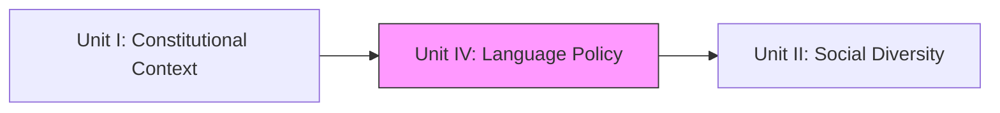
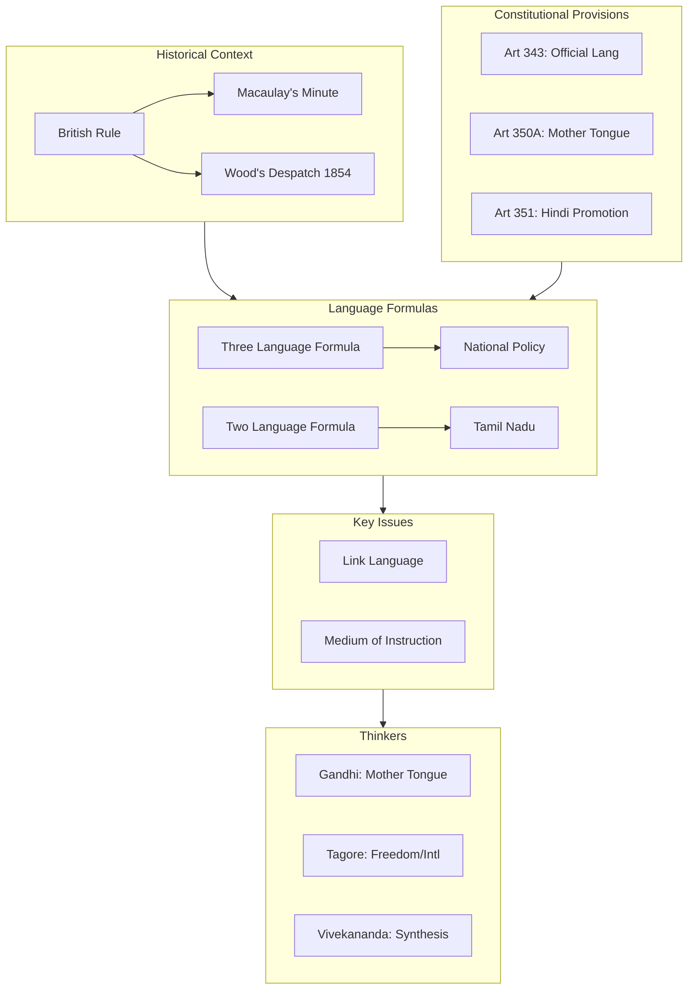

!!! abstract "Unit Overview"
    This unit examines the complex **Language Policy in Education** in India. It traces the policy from pre-independence eras to post-independence constitutional provisions (Articles 343-351). Key topics include the **Three Language Formula**, the **Two Language Policy of Tamil Nadu**, and the debate over the **Medium of Instruction** (Mother Tongue vs. English). The unit also analyzes the views of great thinkers like **Tagore, Gandhi, and Vivekananda** on the medium of education.

!!! info "Information"
    **Unit IV - Language Policy in Education**
    **Content:** Language Policy (Pre/Post Independence), Constitutional Provisions, Three Language Formula, Tamil Nadu's Policy, Views of Thinkers.
    **Pages:** 109 - 132 (Source Text: 206 - 253)

## 🎯 Introduction
India is a linguistic mosaic with over 3000 dialects. Finding a balance between maintaining cultural heritage (Mother Tongue), ensuring national integration (Link Language), and accessing global knowledge (English) has been a significant educational challenge.

**Key Learnings:**
*   **Historical Context:** Language policies under British rule (Macaulay, Wood's Despatch).
*   **Post-Independence:** The Official Language issue (Hindi vs. English).
*   **Formulas:** Three Language Formula (National) vs. Two Language Formula (Tamil Nadu).
*   **Constitutional Articles:** 343 (Official Language) to 351 (Directive for Hindi).
*   **Medium of Instruction:** The debate between Mother Tongue and English.
*   **Thinkers' Views:** Gandhi (Mother Tongue), Vivekananda (Synthesis), Tagore (Internationalism).

## 🔗 Connection to Other Units

| Unit | Connection |
| :--- | :--- |
| **Unit I** | Constitutional Articles in Unit I lay the groundwork for Language Articles (343-351) in Unit IV. |
| **Unit IV** | **Language** is a key aspect of **Social Diversity** (Unit II) and a tool for **Equality** (Unit V). |

## 📚 Unit Overview

| Lesson | Focus Area | Key Concepts |
| :--- | :--- | :--- |
| **Lesson 6** | **Policy & Constitution** | 3-Language Formula, Articles 343-351, Tamil Nadu Policy. |
| **Lesson 6 (Cont.)** | **Debates & Thinkers** | Medium of Instruction, Link Language, Gandhi/Tagore/Vivekananda Views. |

### Learning Outcomes
By the end of this unit, you will be able to:
1.  **Trace** the evolution of language policy in India.
2.  **Explain** the Three Language Formula and the reasons for Tamil Nadu's opposition.
3.  **Analyze** the Constitutional provisions (Arts 343-351) related to language.
4.  **Evaluate** the pros and cons of English vs. Mother Tongue as a medium of instruction.
5.  **Compare** the educational philosophies of Gandhi, Tagore, and Vivekananda regarding language.

## 🗺️ Topic Connection Map

---

# LESSON - 6: LANGUAGE POLICY IN EDUCATION

## 6:00 Intro & Pre-Independence Policy

**Historical Link Languages:** Sanskrit (Vedic), Pali (Buddhist/Jain), Persian/Urdu (Muslim Rulers), English (British).

### 6:01 Pre-Independent Period
*   **1835:** **Macaulay's Minute** - "Downward Filtration Theory". English introduced for a select few.
*   **1854:** **Wood's Despatch** - Permitted vernaculars at Primary level; English at higher levels.
*   **1882:** **Hunter Commission** - Recommended Mother Tongue for Primary education.

## 6:02 Post-Independence Language Policy

### 6:02:1 The Problem
*   **Medium of Instruction:** Mother Tongue vs. Regional Language vs. English?
*   **Link Language:** Hindi vs. English?
*   **Burden:** How many languages to teach?

### 6:02:2 Changes Adopted
1.  **Mother Tongue:** Accepted as medium for schools.
2.  **Basic Education:** Adopted as National Policy (Mother Tongue medium).
3.  **Hindi:** Official Language (Devanagari script).
4.  **English:** Associate Official Language (initially for 15 years, then extended).

### 6:02:4 Three Language Formula (1956/1961)
Devised by **CABE (Central Advisory Board of Education)** to equalize the burden between Hindi and Non-Hindi speaking areas.

| Area | Language 1 | Language 2 | Language 3 |
| :--- | :--- | :--- | :--- |
| **Non-Hindi Areas** (e.g., TN) | Mother Tongue (Regional) | Hindi | English |
| **Hindi Areas** (e.g., UP) | Hindi | English | Another Modern Indian Lang (e.g., Tamil) |

#### 6:02:4:01 Difficulties
*   Heavy curriculum load.
*   Resistance in South (Tamil Nadu) against Hindi imposition.
*   Resistance in North to learn a South Indian language.
*   Financial burden (hiring extra teachers).

### 6:02:5 Kothari Commission (1964-66) Modified Formula
1.  Mother Tongue / Regional Language.
2.  Official Language (Hindi) OR Associate Official (English).
3.  A Modern Indian or Foreign Language (not covered above).

**Rule:** No language should be compulsory at higher education if not chosen. Focus on **Lower Secondary (VIII-X)** for 3 languages.

## 6:03 Tamil Nadu's Two Language Formula
Tamil Nadu **rejected** the Three Language Formula.
**Policy:**
1.  **Tamil** (Official State Language).
2.  **English** (International/Link Language).
**No Hindi.**

### 6:03:1 Reasons for Rejection
*   **Anti-Imposition:** Viewed as forcing North Indian dominance.
*   **Burden:** Why should TN students learn 3 languages when Hindi students only effectively learn 2 (Hindi + English)?
*   **English Sufficiency:** English already serves as a Link Language and International window.

## 6:04 Constitutional Provisions (Articles 343-351)

| Article | Provision |
| :--- | :--- |
| **Art 343** | **Official Language of Union** is Hindi (Devanagari). English continues for 15 years. |
| **Art 344** | Commission on Official Language (Review progress of Hindi). |
| **Art 345** | **Official Language of State** (State can choose its own). |
| **Art 346** | Link Language between Union and State (Hindi or English). |
| **Art 347** | Recognition of languages spoken by a section of population. |
| **Art 348** | Language of **Supreme Court / High Courts** & Acts (English until Parliament changes). |
| **Art 350A** | **Facilities for Mother Tongue instruction at Primary Stage** (Minorities). |
| **Art 351** | **Directive to Develop Hindi** (Union's duty to spread Hindi). |

## 6:05 The Link Language Problem
*   Constitution designates Hindi.
*   **1965 Crisis:** Violent anti-Hindi agitations in Tamil Nadu when the 15-year English period ended.
*   **Resolution:** Nehru's assurance -> English continues as **Associate Official Language** as long as non-Hindi states want it.
*   **Conclusion:** Hindi cannot be imposed. Multilingualism > Monolingualism.

## 6:07 Medium of Instruction Debate

### 6:07:1 Advances of Mother Tongue Medium
1.  **Natural Thinking:** Best for cognitive development.
2.  **Economical:** Saves time/effort.
3.  **Better Comprehension:** No language barrier.
4.  **Critical Thinking:** Reduces rote memorization (cramming).
5.  **Equality:** English medium often elitist; Regional medium accessible to masses.

### 6:07:2 Present Position
*   **North:** Hindi medium dominant in schools/colleges.
*   **South:** Regional language in schools; English dominant in Colleges/Universities.
*   **Elitism:** Mushrooming of English medium schools creates a class divide.

## 6:09 Views of Great Thinkers

### 6:09:1 Rabindranath Tagore
*   **Primary:** Strictly **Mother Tongue**.
*   **Higher:** Freedom to choose. Supported **Internationalism** (English, French, German) alongside Oriental languages (Sanskrit, Chinese - *Cheena Bhavan*).
*   **Curriculum:** Nature-based, Arts (Music, Dance), Creativity.

### 6:09:2 Mahatma Gandhi (Basic Education)
*   **Stance:** **Anti-English** domination. "English has enslaved us."
*   **School:** Only **Mother Tongue**.
*   **Method:** **Craft-Centered Education** (Basic Education/Nai Talim). Learning by doing.
*   **Link:** Hindustani (Hindi + Urdu).

### 6:09:3 Swami Vivekananda
*   **Stance:** Synthesis.
*   **Mother Tongue:** For Primary.
*   **English:** Necessary for **Science, Technology, and Western Knowledge**.
*   **Curriculum:** Broad-based (Vedanta + Science).
*   **Goal:** Man-making education.

## 📝 Quick Revision Table

| Topic | Key Fact / Formula |
| :--- | :--- |
| **Official Language** | **Article 343** (Hindi). |
| **Instruction Basis** | **Article 350A** (Mother Tongue at Primary). |
| **3-Lang Formula** | Non-Hindi Areas: **MT + Hindi + English**. |
| **TN Policy** | **2-Language**: **Tamil + English**. |
| **Macaulay** | 1835 Minute ("Downward Filtration", English). |
| **Gandhi** | Mother Tongue only; Craft-centered. |
| **Tagore** | Mother Tongue Primary; Openness to Foreign Langs. |
| **Vivekananda** | MT Primary; English for Science/Tech. |

## 🧠 Memory Mnemonics
*   **Articles:**
    *   **343:** **O**fficial (3+4+3=10 -> O).
    *   **350A:** **A** for **A**bc (Primary/Mother Tongue).
    *   **351:** **1** for **1**ndia (One language spread - Hindi).
*   **Thinkers:**
    *   **G**andhi = **G**round (Roots/Mother Tongue/Craft).
    *   **V**ivekananda = **V**itality (Science/West + East).
    *   **T**agore = **T**ree (Nature/International/Freedom).

## ❓ Review Questions
1.  What is the **Three Language Formula**? Why did Tamil Nadu reject it? [6:02:4]
2.  Explain the provisions of **Articles 343 and 350A**. [6:04]
3.  Critically analyze the advantages of **Mother Tongue** as the medium of instruction. [6:07:1]
4.  Compare the views of **Gandhi** and **Vivekananda** on English education. [6:10]
5.  What was the **"Downward Filtration Theory"**? [6:01]

!!! success "Unit Complete"
    You have completed **Unit IV**. This unit has equipped you with the legal and historical context of the language debate in India, helping you understand the balance between regional identity and national integration.
