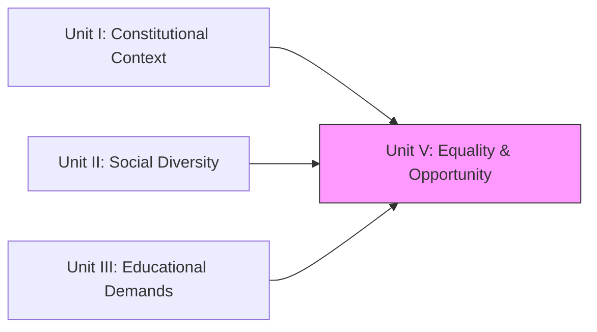
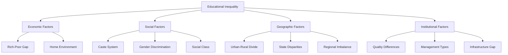
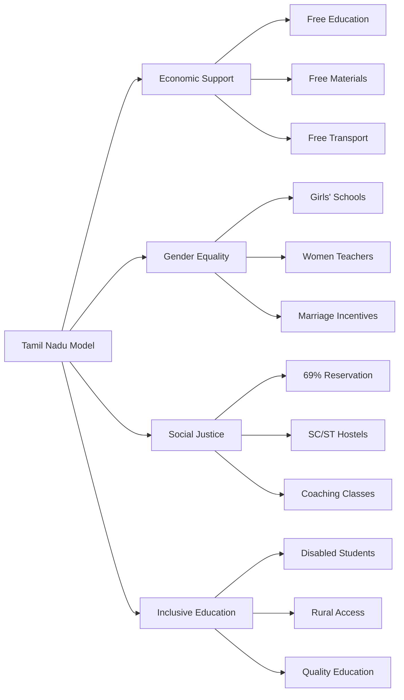
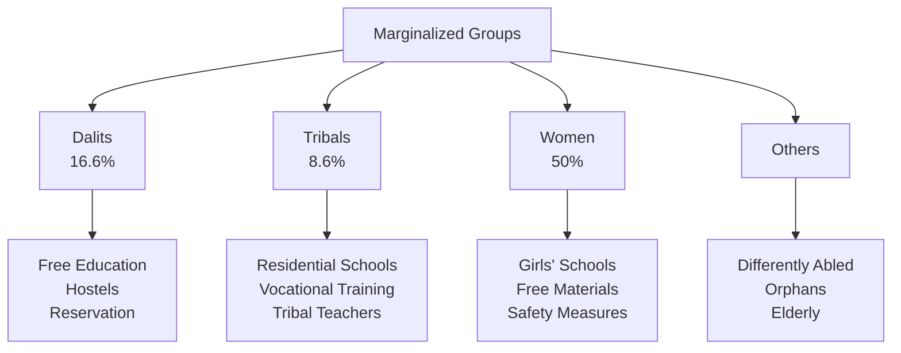

!!! abstract "Unit Overview"
    **Unit V - Implications of Equality of Educational Opportunities**
    
    This unit examines the constitutional foundations of equality in education and the ground realities of inequality in India. It critically analyzes how caste, class, gender, and regional factors create educational disparities and explores solutions to ensure equal opportunities for all citizens, especially marginalized groups.
    
    **Source:** Pages 133 - 166 (Contemporary India and Education)

!!! info "Learning Objectives"
    By the end of this unit, you will be able to:
    
    1. **Explain** the meaning of equality in education as per NPE 1986
    2. **Analyze** Constitutional provisions (Articles 14-18) ensuring equality
    3. **Identify** causes of educational inequality in India
    4. **Evaluate** measures to provide equal opportunities
    5. **Understand** social inequality (caste, gender, class, region-based)
    6. **Describe** marginalization and its impact on education
    7. **Discuss** educational needs of Dalits, Tribals, Women, and Disabled persons

## 🎯 7:00 Introduction

**Key Quote:** *"Education is a great social leveller."* - Mahatma Gandhi

### Context of Educational Inequality

Education is recognized as the **birth right of all people**, yet historical and contemporary realities show that:

- **Discrimination persists** based on caste, religion, economic status, gender, place of residence, and occupation
- **Social inequalities** exist in all countries but are more severe in developing nations like India
- **Marginalized groups** including SC/ST, women, rural populations, and economically backward classes face barriers to quality education

!!! note "Gandhi's Vision"
    Gandhi firmly believed that through education, we can bring about a **silent social revolution** and transform society from within.

### Three Core Concepts of This Unit

| Concept | Focus |
|---------|-------|
| **Inequality** | Unequal distribution of educational opportunities |
| **Discrimination** | Differential treatment based on caste, gender, religion, etc. |
| **Marginalization** | Exclusion of certain groups from mainstream society and education |

## 🔗 Connection to Other Units

| Unit | Connection |
| :--- | :--- |
| **Unit I** | Fundamental Rights (Arts 14-18) are the basis of Unit V. |
| **Unit II** | "Social Diversity" often leads to "Inequality" if not managed well. |
| **Unit III** | Schemes like SSA/RMSA (Unit III) are tools to achieve the Equality discussed here. |

## 📚 Unit Overview

| Lesson | Focus Area | Key Concepts |
| :--- | :--- | :--- |
| **Lesson 7** | **Inequality & Constitution** | Articles 14-18, Causes of Inequality, Regional Imbalances. |
| **Lesson 7 (Cont.)** | **Marginalization** | Dalits, Tribals, Women, Minorities. |

### Learning Outcomes
By the end of this unit, you will be able to:
1.  **Interpret** Articles 14-18 concerning equality.
2.  **Analyze** the causes of educational inequality (Socio-economic, Regional, Gender).
3.  **Define** Marginalization and identify marginalized groups.
4.  **Propose** educational measures to uplift Dalits, Tribals, and Women.

---

# LESSON - 7: IMPLICATIONS OF EQUALITY OF EDUCATIONAL OPPORTUNITIES

## 7:01 Meaning of Equality in Education

!!! success "NPE 1986 Definition"
    **Equality in Education** or **Equity in Education** means making available to **all students quality education from primary school to higher education** without discrimination based on:
    
    - Caste
    - Religion
    - Language
    - Region
    - Gender

### Core Principles

**Equality in Education implies:**

1. **Similar Educational Opportunities** - All children should get access to the same educational facilities
2. **Equal Educational Environment** - Conducive learning conditions for everyone
3. **Ability-Based Development** - Education according to each student's abilities and aptitudes
4. **Full Potential Development** - Facilitating complete development of inherent potential

!!! example "In Practice"
    A Dalit child in a remote village should have access to the same quality education as an upper-caste child in an urban area. A girl should have equal opportunity to pursue engineering as a boy.

## 7:02 Equality in Constitutional Provisions

!!! info "Fundamental Rights - Articles 14 to 18"
    The Indian Constitution's Articles 14 to 18 deal with **'Equality'** and explain how all Indian citizens are entitled to be treated equally.

### Article 14: Equality Before Law

**Statement:** *"The State shall not deny to any person equality before the law or the equal protection of the laws within the territory of India."*

#### Two Key Concepts:

| Concept | Meaning | Nature |
|---------|---------|--------|
| **Equality Before Law** | Prohibits any discrimination among citizens; all are equal before law | **Negative Concept** (Prohibitive) |
| **Equal Protection of the Law** | Treating all citizens in the same manner under same circumstances; special treatment for persons in different situations to establish equality | **Positive Concept** (Affirmative) |

!!! note "Rule of Law"
    This principle is the natural outcome of **'Rule of Law'** - No person is above the law; all have to abide by the law. However, this equality is subject to certain exemptions.

---

### Article 15: Prohibition of Discrimination

**Key Provisions:**

1. **No discrimination** on grounds of religion, race, caste, sex, or place of birth
2. **No restriction** on citizens from:
   - Entering shops, public resorts, hotels, restaurants
   - Using recreation places
   - Accessing public facilities

3. **Special Provisions Allowed:**
   - For women and children
   - For socially and educationally backward classes
   - For Scheduled Castes and Scheduled Tribes

!!! example "Application"
    The government can provide special scholarships for SC/ST students or reserve seats for women without violating Article 15.

---

### Article 16: Equality of Opportunity in Public Employment

**Main Provision:** Ensures equality of opportunity for all citizens in matters relating to public appointments.

**Prevents:**
- Discrimination based on religion, race, caste, sex, descent, place of birth or residence

**Allows:**
- Special provisions for reservation of appointments for:
  - Backward classes
  - Scheduled Castes
  - Scheduled Tribes
- Reservation of posts for people of a certain religion in religious/denominational institutions

---

### Article 17: Abolition of Untouchability

**Statement:** Abolishes **'untouchability'** in any form.

!!! warning "Legal Consequence"
    The enforcement of any disability arising out of untouchability shall be an **offence punishable in accordance with law**.

**Significance:**
- Makes untouchability a cognizable crime
- Protects Dalits from social exclusion
- Provides legal remedy against caste-based discrimination

---

### Article 18: Abolition of Titles

**Provisions:**

1. **No titles** (except military or academic distinctions) shall be conferred by the State
2. No citizen shall **accept any title from any foreign State**
3. No person holding office of profit/trust under the State shall accept:
   - Any present, emolument from foreign State (without President's consent)
   - Any office under foreign State (without President's consent)

!!! note "Purpose"
    To eliminate artificial social hierarchies and ensure social equality by preventing hereditary titles and honors.

---

### Summary Table: Articles 14-18

| Article | Title | Core Provision | Significance for Education |
|---------|-------|----------------|----------------------------|
| **14** | Equality Before Law | No discrimination, equal protection | Equal treatment of all students |
| **15** | Prohibition of Discrimination | No discrimination on caste, religion, sex, etc. | Access to schools for all |
| **16** | Equality in Public Employment | Equal opportunity in government jobs | Reservation in educational institutions |
| **17** | Abolition of Untouchability | Untouchability is a crime | SC students cannot be excluded |
| **18** | Abolition of Titles | No hereditary titles | Merit-based recognition only |

## 7:03 Causes for Inequality in Education

Inequalities in educational opportunities arise due to multiple interconnected factors:

### 1. Huge Disparities in Socio-Economic Status

!!! danger "The Rich-Poor Divide"
    **Reality:** Disparities in parents' socio-economic status directly reflect in children's educational opportunities.

**Impact:**
- **Affluent families:** Children get quality education by paying hefty fees, even if not intelligent
- **Poor families (especially rural):** Children depend on government schools which are mostly ill-equipped
- Economic status becomes a barrier to quality education

---

### 2. Regional Imbalances

Educational standards vary significantly across states and even within districts of the same state.

#### Inter-State Disparities

| Educationally Advanced States | Educationally Backward States |
|-------------------------------|------------------------------|
| Kerala | Bihar |
| Tamil Nadu | Odisha |
| Andhra Pradesh | Uttar Pradesh |
| Maharashtra | Madhya Pradesh |

#### Intra-State Disparities

!!! example "Urban vs Rural"
    - **State capitals:** Wide range of educational opportunities
    - **Remote villages:** Lack even basic educational facilities
    - **Urban schools:** Well-equipped with modern infrastructure
    - **Rural schools:** Often lack requisite infrastructure and instructional facilities

---

### 3. Inequality in Quality of Education Available

**The Problem:** Differences in standards of schools and colleges create an intractable form of educational inequality.

| Type of Institution | Characteristics |
|-------------------|-----------------|
| **Urban Private Schools** | Well-equipped, quality infrastructure, experienced teachers |
| **Rural Government Schools** | Lack infrastructure, inadequate instructional facilities, teacher shortage |
| **Public Schools (Elite)** | Premium facilities, international standards |
| **Christian Missionary Schools** | Generally high quality education |

---

### 4. Disparities in Education of Boys and Girls

!!! warning "Gender Discrimination"
    Parents show more interest in boys' education than girls' education

**Consequences:**
- Number of male students higher than girls at **all stages** and in **all sectors**
- Additional learning opportunities for men not available for women
- Girls' education often stopped before higher education
- Fewer women in professional courses

---

### 5. Gross Inequalities in Home Conditions

**Urban Homes:**
- Children of educated parents have better facilities
- Proper educational environment
- Parental guidance available
- Access to electricity, internet, books

**Rural Homes:**
- Home environment not conducive for learning
- Tribal children lack even electricity
- No parental guidance to clear doubts
- First-generation learners with no support system

---

### 6. Huge Disparities Among Social Classes

**Traditional vs Marginalized Communities:**

!!! info "Social Background Impact"
    Considerable differences exist between:
    - Children of traditionally educated communities
    - Children from socially backward sections
    - Children from tribal communities
    - Children from weaker sections of society

**Special Case:**
- **Muslim community:** Often prefer trade and business training at young age over formal education

---

### 7. Inequality in Management of Educational Institutions

**Types of Management:**

| Management Type | Characteristics | Quality |
|----------------|-----------------|---------|
| **Government (State/Central)** | Most institutions, subsidized/free | Variable quality |
| **Private (Individual/Trusts)** | Self-financing, profit-oriented | Often better infrastructure |
| **Missionary Schools** | Christian management | Generally high quality |
| **Residential Public Schools** | Elite, expensive | Excellent quality |

!!! note "The Irony"
    Though we advocate for equal educational opportunities, the education children receive today is **unequal**, according to educationists.

---

### Visual Summary: Causes of Educational Inequality

## 7:04 Ways and Means to Provide Equal Opportunity in Education

To equalize educational opportunities for all in India, drastic measures are essential. The following strategies address different dimensions of inequality:

### 1. Uniform Pattern of Education

!!! info "Nationalization Strategy"
    A uniform pattern of education should be implemented across the country in all schools.

**Implementation Steps:**
- Nationalize all educational institutions gradually
- Government grants liberal funding to all schools
- Enforce uniform curriculum pattern
- Ensure comparable standards in all schools nationwide

---

### 2. Common School System for Public Education

!!! danger "Current Problem"
    Instead of providing good education to all children (or at least to all able children irrespective of social stratum), quality education is available to a **small minority** selected not by talent but by **capacity to pay fees**.

#### Characteristics of Common School System

**Must be:**

| Feature | Description |
|---------|-------------|
| **Open to All** | Irrespective of caste, creed, community, religion, economic conditions, and social status |
| **Merit-Based Access** | Access to good education based on **talent**, not wealth or class |
| **Quality Standards** | Adequate standards in all schools with reasonable proportion of quality institutions |
| **No Tuition Fees** | Education completely free |
| **Meets Parent Needs** | Satisfies average parent so they don't feel need to send children to expensive private schools |

!!! example "Success Story: Russia"
    Such an educational system was built in Russia and is one of the major factors contributing to its progress.

---

### 3. Removal of Regional Imbalances

**Strategy:**
- **Identify** educationally backward states (e.g., Odisha, Bihar, Jharkhand)
- **Provide** special financial packages from Union Government
- **Ensure** all State Governments make significant budgetary allocation for education

!!! note "Example"
    Kerala has higher proportion of budgetary allocation for education compared to states like Odisha and Bihar.

---

### 4. Removal of Urban-Rural Differences in Education

**Action Plan:**
- Open **large number of schools** in rural areas
- Maintain **good standards** comparable to urban schools
- Improve **infrastructure**: roads, electricity, water
- Offer **incentives** to start educational institutions in rural areas

---

### 5. Importance for Girls' Education

**Measures:**
- Expand educational facilities for girls
- Create employment opportunities for women
- Enable women to compete with men on equal terms in all walks of life
- Establish girls' schools, colleges, polytechnics, ITIs

---

### 6. Schools for the Handicapped

**Provision:**
- Special schools for education of the handicapped
- **At least one** special school in every taluk
- Integrated education facilities in regular schools

---

### 7. Education of Weaker Sections in Society

**Focus Groups:** Scheduled Castes and Tribes

**Problems:**
- Educationally backward
- Poor socio-economic conditions

**Solutions:**
- Open more schools in hill areas
- Establish schools in urban slums
- Provide hostel facilities
- Special scholarships

---

### 8. Abolition of Tuition Fees

!!! success "Phased Approach"
    Education at all stages should be made free in phases:
    
    1. **Phase 1:** Primary education completely free (immediate)
    2. **Phase 2:** Extend to secondary education
    3. **Phase 3:** Extend to higher education

**Principle:** No student should be unable to continue education due to inability to pay fees.

---

### 9. Liberal Scheme of Scholarships

#### Types of Financial Assistance:

| Category | Benefits |
|----------|----------|
| **Meritorious Poor Students** | Scholarships and financial assistance |
| **Below Poverty Line** | Free textbooks, stationery, uniforms, midday meal |
| **All School Children** | Free transport |
| **Class XI Students** | Free cycles |
| **Class XI Students** | Free laptops |
| **College Students** | Subsidized bus passes and tokens |
| **Higher Education** | Educational loans at nominal interest through banks |

---

### 10. Compulsory Education up to Secondary Stage

**Goal:** Quickly move to making education **free and compulsory** till secondary level throughout the country.

---

## 7:04:01 Recommendations of Kothari Education Commission

The Education Commission (1964-66) made comprehensive recommendations on equalizing educational opportunities:

### 1. Direct Costs

**Recommendations:**
- Work towards making **all education free**
- Increase free studentship in **Higher Secondary** and **University** to **30% of enrollment**

---

### 2. Other Private Costs

!!! warning "Rising Costs"
    Private costs (uniform, transport, midday meals, textbooks, writing materials) have increased greatly in recent years

**Recommendations:**

| Stage | Measure |
|-------|---------|
| **Primary** | Textbooks and writing materials should be supplied free or at subsidized rates |
| **Secondary & Higher** | Develop program of book-banks |
| **All Levels** | Libraries should contain adequate sets of textbooks for easy student access |

---

### 3. Scholarships

**Guidelines:**

1. **Emphasis:** Scholarship programmes should receive considerable emphasis
2. **Organization:** Made stronger and more equitable

**Two Types:**

| Type | Purpose |
|------|---------|
| **For Hostelers** | Cover boarding expenses |
| **For Day-Scholars** | Cover educational expenses |

**National Scholarships:**
- Award to **top 10% students** by 1985-86
- **50%** awarded on State basis
- **50%** awarded on school basis

**Loan Scholarships:**
- Organize for science and professional courses
- Extend to arts students later

---

### 4. Other Forms of Financial Aid

- **Transport facilities**
- **Day-study centres**
- **Lodging houses** (students can stay day/night but go home for food)
- **Earning while learning** facilities

---

### 5. Education for Women

!!! important "Special Attention"
    Education of women should receive special attention at **all stages** and in **all sectors**.

**Measures:**

| Measure | Details |
|---------|---------|
| **Hostels** | Where 100+ girls are studying |
| **Scholarships** | At higher education level |
| **Separate Schools** | At secondary level |
| **Women Teachers** | More women teachers in co-educational schools |
| **Part-time Teachers** | Appoint part-time women teachers |

---

### 6. Education of the Handicapped

**Recommendation:**
- At least **one good institution** for the handicapped in each district
- Program of **integrating handicapped children** into regular schools

---

### 7. Regional Imbalances

**Two-Level Approach:**

#### State Level:
- Make **district** the unit for educational planning and development
- State spends more on needy districts

#### National Level:
- Backward states receive greater attention
- Central Government provides special assistance

---

### 8. Education of Backward Classes and Tribals

**Backward Classes:**
- Expansion through provision of **hostels**
- Special focus on **denotified communities**

**Tribal People:**
- Provide **hostels and scholarships**
- **Special tuition facilities**
- Create **employment opportunities** for promising tribal youth

---

### 9. Reservation in Residential Public Schools

!!! note "Breaking Elite Barriers"
    Certain percentage of **free studentships** should be reserved for **poor but talented children** in:
    - Residential public schools
    - Schools in summer hill resorts
    
    **Purpose:** Ensure these schools are not purely elite institutions for the rich.

---

### 10. High Quality in Government-Run Schools

**Objective:** Quality of government schools should be **significantly raised** to bring them on par with:
- Private schools
- Residential public schools

**Impact:** This will ensure quality education is accessible to all, not just the wealthy.

### 7:04:01 Position of Equality in Educational Opportunities in Tamil Nadu

!!! success "Tamil Nadu: A Model State"
    Tamil Nadu has taken special efforts to equalize educational opportunities and serves as a **model state in India**.

#### 1. Uniform Standards in Education

**Infrastructure:**
- **Government schools** in every village
- **One arts college** in every district
- **One engineering college** in every district

**Free Education:**
- Government and government-aided schools
- For all students from **Std. I to Std. XII**
- For students studying through **Tamil medium**

**Textbooks:**
- Published by **Tamil Nadu Text Book Society**
- Supplied at **subsidized rates** to all students

---

#### 2. Removing Economic Barriers

!!! info "Comprehensive Free Education Package"
    Tamil Nadu has one of the most comprehensive free education schemes in India.

| Benefit | Coverage | Details |
|---------|----------|---------|
| **No Fees** | Std. I to XII | Government and aided schools; no tuition fees, special fees, or examination fees |
| **Free Textbooks** | Up to Std. X | All students in government schools |
| **Free Uniforms** | All students | Government provided |
| **Midday Meals** | All students | Nutritious meals during school hours |
| **Bus Passes** | Std. I to XII | Free travel throughout the year |
| **Bicycles** | Class XI | Free cycles for all poor students |
| **Laptops** | Class XI | Free laptops for all students |
| **College Transport** | College students | Subsidized bus passes and tokens for libraries |

**Special Provisions for SC/ST:**
- **Separate hostels** for SC/ST students
- **Free boarding and lodging**
- **Complete financial support** for education

---

#### 3. Encouragement for Girls' Education

**Infrastructure:**
- **Separate high schools** for girls in considerable numbers
- **Higher secondary schools** exclusively for girls
- **Arts colleges for girls** across the state
- **Women teachers** predominantly in primary schools

**Reservation:**
- Where women's colleges not available: **30% seats reserved** for women in men's colleges

**Financial Incentives:**

| Achievement | Incentive | Amount |
|-------------|-----------|--------|
| **Passed X Std** | Marriage gift | ₹25,000/- |
| **Passed Degree/Diploma** | Marriage gift (for poor girls) | ₹50,000/- |

**Special Institution:**
- **Mother Teresa Women's University** at Kodaikanal

---

#### 4. Reservation in Education for Socially Marginalized Communities

!!! note "Highest Reservation in India"
    Tamil Nadu has **69% reservation** policy - the highest in India

**Breakdown:**
- Denotified communities
- Backward classes
- Oppressed communities
- Total: **69% of available seats** in higher and professional education

**Additional Support:**
- **Special coaching classes** for All India Services
- Conducted **free or at nominal cost**
- Exclusively for reserved category students

---

#### 5. Expanding Educational Opportunities for the Handicapped

**Special Schools:**
- Special schools for physically handicapped in **every district**

**Integrated Education:**
- Facilities created in **regular schools**
- Handicapped students study **with normal students**

**Support Measures:**
- **Special quota** in education and employment
- **Scholarships** for handicapped students
- **Barrier-free infrastructure**

---

#### 6. Supply of Free Textbooks

**Coverage:**
- All students in government schools
- Up to **Std. X**
- **Completely free of cost**

---

### Summary: Tamil Nadu's Achievement

!!! tip "Key Takeaway"
    Tamil Nadu demonstrates how **political will** combined with **systematic implementation** can significantly reduce educational inequality.

---

## 7:05 Inequality and the Causes for It

### Natural vs Man-Made Inequality

!!! info "Understanding Inequality"
    Two types of inequalities exist in human society:

#### 1. Natural Inequalities

**Definition:** Differences in physical features and mental abilities that occur naturally.

**Examples:**
- Some are **stronger**, some are **weaker**
- Some are more **intelligent**, some less so
- Some are more **capable**, others less capable

**Reality:** 
- Natural inequalities **cannot be abolished**
- Absolute equality is **not possible**
- Natural differences must be **accepted**

---

#### 2. Man-Made Inequalities

!!! danger "Unnatural Discrimination"
    Discriminations practiced and inequalities maintained based on:
    - Caste
    - Colour
    - Creed
    - Religion
    - Sex
    - Place of birth
    - Socio-economic conditions

**Action Required:** Such man-made inequalities are **unnatural** and must be **totally eradicated**.

!!! success "True Meaning of Equality"
    **Equality means:** End of all man-made inequalities and discriminations, while accepting natural differences.

---

## 7:06 Social Inequality

### 7:06:01 Meaning and Definition of 'Social Inequality'

!!! abstract "Definition"
    **Social Inequality** denotes the disparities found among people based on:
    - Caste and religion
    - Language and race
    - Gender
    - Political power
    - Economic level
    
    Due to these disparities, all sections of society are **not able to share equally** the social resources, facilities, and services available.

**Formal Definition:**

> Social inequality or social stratification means people are being fixed in **different social strata of society** based on gender, age, and socio-economic status. Social discriminations are found in different facilities and services provided for the protection and welfare of society such as:
> 
> - Job markets
> - Income-generating opportunities
> - Health services and concessions
> - Educational facilities
> - Political representation and participation

---

### 7:06:02 Causes for Social Inequality

!!! warning "Research Finding"
    Wisconsin University (U.S.A.) research study: **'Poverty and inequality are inter-twined'**. Social inequality is found not only in India but **worldwide**.

#### Two Bases for Inequality

Sociologists identify two fundamental bases:

#### A) Ascribed Social Status

!!! info "Definition"
    Status **assigned by others at birth**, not earned by individual's efforts.

**Characteristics:**
- Individual has **no control** over this status
- Based on **lineage and caste at birth**
- **Clings to a person** even if disowned
- In the West, determined by **race**

**Examples:**
- Born into a particular caste
- Born into royal family
- Born with specific racial identity

---

#### B) Achieved Status

!!! success "Definition"
    Status **achieved through one's abilities and talents**, hard work and self-efforts.

**Based on:**
- Individual's **skills and abilities**
- **Self-motivation**
- **Persistent efforts**
- **Efficiency and performance**

**Concept by:** Ralph Linton

!!! note "Constitutional Perspective"
    The **Indian Constitution** emphasizes that social status should be **'acquired'** based on performance, efficiency, motivation, and achievement, not merely inherited.

---

### Other Perpetuating Factors of Social Inequality

#### I. Racial Discrimination

!!! info "Anthropological Classification"
    Based on physical appearance and features, humans are classified into **five major races** using:
    - Chromosomes
    - Skin colour
    - Skull circumference
    - Average height
    - Eye colour
    - Hair colour and structure

**Important Races of the World:**

| Race | Characteristics | Geographic Location |
|------|----------------|---------------------|
| **1. Caucasian** | White skinned | Europeans, West Asians, Australians |
| **2. Mongolian** | Yellow skinned, narrow eyes, short noses | Asians |
| **3. Negroe** | Black skinned | Africans |
| **4. Red Indian** | Native Americans | North and South America |
| **5. Esquimaux** | Arctic natives | Arctic regions |

**Historical Context:**
- Categories first named by **Carleton S. Coon (1962)**
- Later expanded to **30 subcategories**
- White skinned people (Caucasian-Nordic) propagated **"White Supremacy"** idea

---

#### II. Caste

**Historical Background:**
- Existed even before Lord Buddha (2nd century B.C.)
- During **later Vedic Period**: **Varnasrama Dharmam** created four categories:
  - Brahmana (Priests, Scholars)
  - Kshatriya (Warriors, Rulers)
  - Vysya (Traders, Farmers)
  - Sudhra (Service providers)
- From these, **many castes** emerged based on occupations

**Evolution:**
- Initially **flexible**
- Later became **very rigid**
- Hereditary and endogamous (marriage within caste)

!!! quote "Nehru's View"
    Jawaharlal Nehru described the caste system as **"the cancer afflicting Indian society"**.

**Impact on Inequality:**
- Caste system is responsible **directly or indirectly** for disparity and inequality
- Respect, privileges, opportunities offered to **high castes** not available to **low castes**
- Caste influences elections and political representation

---

#### III. Religion

**Religious Minority Issues:**
- Every country has **religious minority communities**
- Within religions, one sub-group may **dominate others**
- Religious minorities often:
  - Suppressed by majority
  - Denied equal rights and opportunities
  - Lack political power and representation
  - Face discrimination

---

#### IV. Gender Difference

!!! warning "Sexism"
    Gender-based prejudice and discrimination, called **sexism**, is a major contributing factor to social inequality.

**Theocratic States (Middle East):**
- Women have **no franchise** (voting rights)
- No political power
- No representation in government
- Demanding equal rights considered a **crime**

**Global Context:**
- Some countries elected women as **Prime Ministers**: India, Pakistan, Bangladesh, Sri Lanka, Myanmar, Israel, England, Germany
- But in developed countries like USA, a woman president **yet to be elected**

**Religious Discrimination:**
- Right to read and preach religious scriptures **denied to women**
- Right to lead religious prayers **denied**
- Right to visit some holy shrines **denied by clergy**

---

#### V. Economic Status

!!! info "Economic Stratification"
    People classified into categories:
    - High income group
    - Middle income group
    - Low income group
    - **Below Poverty Line (BPL)**

**BPL Category:**
- Income: Less than **₹100 per day**
- Constitutes around **30% of population**

**Impact:**
- Disparity **widening** as prices increase
- Essential commodity costs rising
- People's needs constantly increasing

---

#### VI. Occupations

**Occupational Hierarchy:**

!!! danger "Social Stigma"
    People doing "dirty jobs" are permanently kept at **lowest level** of social hierarchy and treated as **outcastes**.

**Examples of stigmatized occupations:**
- Scavenging
- Butchering
- Disposing of the dead
- Manual scavenging

**Solution:** 
- Apply **technology** to dirty jobs
- Use **modern sanitary methods**
- Only then can they gain **social respect**

---

#### VII. Urban-Rural Divide

**Urban Advantages:**
- More opportunities for health, education, medical care
- Better transport facilities
- Wider social contacts
- Access to modern amenities

**Rural Disadvantages:**
- Limited services
- Fewer opportunities for progress
- Despite rural development programs, still at **social disadvantage**
- People tend to **stagnate** at lower levels

---

#### VIII. People's Attitude

!!! note "Social Preferences in India"
    More respected and preferred:
    - Well-versed in **English**
    - In **government service**
    - Employed **abroad**
    
    Less respected:
    - Traditional occupations and crafts
    - Traditional lifestyle
    - Non-English speakers

**Impact:** Creates **social hierarchy** based on language and employment type.

---

#### IX. Manual Labour vs White Collar Jobs

| Type of Job | Characteristics | Social Status |
|-------------|----------------|---------------|
| **Manual Labour** | Physical work, outdoors | Low remuneration, Low respect |
| **White Collar** | Indoor work, technical knowledge | High remuneration, High respect |

**Inequality:** This disparity contributes to social stratification.

---

#### X. Dwelling

**Social Perception Based on Housing:**

| Housing Type | Social Status |
|--------------|---------------|
| **Slums, huts, thatched sheds, rented houses** | Less respected |
| **Independent houses, luxury goods** | More respected |

!!! note "Impact"
    Place of residence becomes a marker of **social status** and contributes to inequality.

---

## 7:07 Meaning of 'Inequality in Education'

!!! abstract "Definition"
    **Inequality in Education** exists when all children in society do **not get the same educational opportunity and quality education**.

**Manifestations:**

| Group | Educational Access |
|-------|-------------------|
| **Higher social strata** | More opportunities for quality education |
| **Lower social strata** | Less educational opportunities |
| **Select religions/regions/genders** | Better access |
| **Low castes** | Limited access |
| **Low income groups** | Poor quality education |
| **Particular religious sects** | Discrimination |
| **Backward regions** | Fewer opportunities |

!!! important "Key Point"
    **Social inequalities** affecting educational opportunities of children is called **'Inequality in Education'**.

---

## 7:08 Causes for 'Inequality in Education'

The two basic factors for educational inequalities are:

1. **Social Discrimination**
2. **Marginalization of some social groups**

### 7:08:01 Discriminating Social Groups

!!! info "Social Differentiation"
    People in society are differentiated based on religion, caste, class, race, etc., and function as **different social groups**.

**Definition of Social Discrimination:**

> If all social groups are **not able to participate equally** in social life, enjoying the facilities and services available in society and sharing political power, then there exists **'Social Discrimination'**.

**Characteristics:**
- Some sections enjoy **more preference and importance**
- Some sections have **less privileges and importance**
- Few sections are **socially neglected and marginalized**

#### Social Groups in India

**The 'We' vs 'They' Divide:**

| Privileged Groups | Marginalized Groups |
|------------------|---------------------|
| Upper class | Lower class |
| Highly progressive | Deprived |
| Dominant force | Small preference only |
| More importance | Neglected |

**Contrast:**
- **Developed/Western countries:** Social discrimination found to be the **least**
- **Developing countries (including India):** Social discrimination is at **highest** levels

#### Ascribed vs Acquired Status in India

**Traditional System (Ascribed):**
- Social status based on **birth (lineage)**
- Recognition received from community
- Status is **inherited**

**Constitutional Vision (Acquired):**
- Social status should be **'acquired'**
- Based on **performance, efficiency, motivation, achievement**
- Government measures to implement this directive

#### Educational Impact of Social Discrimination

**Caste-wise Distribution in Schools:**

| Caste Category | Type of Institution |
|----------------|---------------------|
| **Backward classes** | Government or government-aided institutions |
| **Marginalized sections** | Adidravida schools, Special schools for differently-abled |
| **Upper class/Economic elite** | Private schools, Residential schools, International schools |

#### Gender Discrimination in Education

!!! warning "Gender Gap"
    Many parents (especially poor and illiterate):
    - Do **not send daughters** to school beyond **V Std**
    - Send sons to **secondary schools and beyond**

**Consequences:**
- **Significantly low enrollment** of girls in secondary schools and colleges
- School curriculum does **not cater** to needs of girls
- Parents **hesitate to send daughters** to:
  - Far-off schools
  - Co-education schools

**Reasons for Discontinuation:**
- **Sexual harassment** possibility in educational institutions
- Subjects suitable for girls **not available** in higher/professional education
- Parents prefer **marriage over education** beyond school final

!!! note "Positive Trend"
    This trend is **slowly changing**, at least in **urban areas**.

---

### 7:08:02 Marginalization of Social Groups

#### 7:08:02:01 Concept of Marginalization

!!! abstract "Definition"
    **Marginalization** is the process where dominant social groups (people with power and high social status) **push out** people they consider:
    - Not contributing to society
    - Undesirable
    
    These people are **excluded** from day-to-day social and cultural activities and **ignored**.

**Formation of Marginalized Groups:**
- Marginalized people **unite for protection**
- Start living as social groups **isolated** from mainstream
- Called **'Marginalized People'**
- Their children: **'Marginalized Children'**

**Characteristics:**
- **Unable to participate** in social life
- **No representation** in political power
- Economically **backward**
- Socially **disrespected** by majority
- **Denied rights and privileges** enjoyed by others
- Remain **educationally backward** for generations

!!! quote "Peter Leonard's Definition"
    > "Marginality as being outside the **'main stream of productive activity'"**.

**Impact:**
- Thoroughly **demeaning**
- Affects economic wellbeing
- Affects human dignity
- Threatens physical security
- Face **irrevocable discrimination**

---

#### 7:08:02:02 Marginalized Children and Their Characteristics

!!! info "Definition"
    Children who grow up in families belonging to social groups subjected to **continued social neglect**, **oppressed**, and **denied rights and privileges** are known as **'Marginalized Children'**.

**Characteristics of Marginalized Children:**

| Aspect | Condition |
|--------|-----------|
| **1. Learning Facilities** | Lack facilities and opportunities for learning |
| **2. Health** | Suffer from malnutrition, often become sick |
| **3. Medical Care** | Do not get adequate medical facilities |
| **4. Residence** | Live at remote places, outskirts of urban areas/villages |
| **5. Housing** | Lack basic amenities, highly unhygienic |
| **6. Child Labour** | Forced to take odd jobs at early age to augment family income |
| **7. Peer Environment** | No peers show interest to go to school |
| **8. Parental Background** | Parents are illiterates, no awareness of importance of education |
| **9. Family Economics** | Families suffer from poverty, no permanent job |
| **10. Vocational Skills** | Lack vocational skills and interest in acquiring them |
| **11. Role Models** | Do not have role models in their communities for development |

!!! danger "Vicious Circle"
    Marginalized children are trapped in an inter-generational cycle of poverty, ignorance, and social exclusion.

---

## 7:09 Types of Social Inequality

!!! info "Post-Independence Reality"
    Despite independence, various forms of social inequality persist in India:

**Five Major Realities:**

1. **Incomplete Democratic Participation:** Not all Indians participate in democracy intelligently, equally, and efficiently
2. **Pro-Rich Economic Policy:** Generates new rich people; taxation policy not reducing rich-poor gap
3. **Limited Opportunity:** Equality in opportunities has not reached weaker sections to expected extent
4. **Power-Sharing Deficit:** Practice of sharing power (from family to national level) not yet strengthened
5. **Unequal Treatment:** All citizens not treated equally; government not fully responsive to people's needs

---

### 7:09:01 Caste-Based Social Inequality

#### Definitions

!!! quote "Sociological Definitions"
    - **H. Cooley:** *"Caste is the life style and practices strictly followed by a social group"*
    - **Bogley:** *"Castes are hierarchically arranged groups based on heredity"*

**In India:** Social groups based on **birth** are known as **castes**.

---

#### Characteristics of Caste System

| Feature | Description |
|---------|-------------|
| **Kula Dharma** | Each caste has its own code of conduct |
| **Customs & Traditions** | Prescribed norms defining 'right' and 'wrong' |
| **Rituals & Practices** | Specific religious and social practices |
| **Origins** | Roots in racial differences among humans |
| **Spread** | Spread slowly across society |
| **Numbers** | Countless castes and sub-castes in India |

!!! abstract "Definition of Caste-Based Inequality"
    The disparity in society which provides **preferences and privileges** to some castes while **denying the same** to other castes.

---

#### Key Features

**1. Hereditary Nature:**
- Children born to parents of same caste belong to that caste
- **Endogamous:** Marriages take place within same caste
- **Occupational:** People of a caste continue particular occupation hereditarily
- **Hereditary stratification system**

**2. Historical Evolution:**
- Initially **flexible**
- Later became **very rigid**
- Based on **Varnasrama Dharmam** (Four Varnas)

---

#### Impact and Consequences

!!! quote "Nehru's Assessment"
    Jawaharlal Nehru described the caste system as **"the cancer afflicting the Indian Society"**.

**Manifestations:**
- **Respect, privileges, opportunities** offered to high castes **not available** to low castes
- **Caste affinities and loyalties** influence:
  - Elected bodies
  - National elections
- Social mobility restricted

---

#### Solutions

**1. Reservation/Quota System:**
- In higher education
- In government jobs
- Has benefited backward castes **significantly**

**2. Individual Empowerment Needed:**
!!! important "What's Still Required"
    - **Self-confidence**
    - **Self-initiative**
    - **Hard work** on part of the deprived
    
    Must be boosted to bridge social divide based on castes.

**3. Historical Evidence:**
!!! note "K.M. Panicker's Observation"
    People who achieved **high expertise** in business and technologies, along with their social groups, have risen to **higher levels of social status**.

**4. Inter-Caste Marriages:**
- Promoting inter-caste marriages on **large scale**
- Could **demolish caste structure**
- Increase **social equality**

---

### 7:09:02 Gender-Based Inequality

!!! warning "Sexism Defined"
    Gender-based prejudice and discrimination, called **sexism**, is a major contributing factor to social inequality.

#### Definition

!!! abstract "Gender Discrimination"
    Treating males and females **differently** in various spheres:
    - Family
    - Educational institutions
    - Work places
    - Common places (railway stations, restaurants, cinema theatres, markets, shopping malls)
    - Places of worship
    
    **Including:**
    - Unequal opportunities in education and employment
    - Discriminating views regarding roles and participation
    - Considering women as personal property and object of pleasure
    - Denial of all kinds of rights and opportunities for women on par with men

---

#### Manifestations in Employment

**Job Opportunities:**
- **Not equal** for women as for men
- Percentage of women in **top posts very low**

**Pay Disparity:**
!!! danger "Wage Gap"
    Though '**equal pay for equal work**' accepted in principle, in practice:
    - **Lower pay** for women doing same work
    - Particularly in **unorganized sector**

**Occupational Restrictions:**
Women considered **not capable** to:
- Drive heavy trucks
- Serve as pilots
- Work as **frontline soldiers** in army
- Take up positions involving **outdoor work** in all three wings of army

---

#### Manifestations in Education

**Enrollment:**
- Rate of **enrollment of girls considerably less** than boys
- **Drop-out rate** is also high

**Professional Education:**
- Not all subjects offered for men are **available to women**
- Limited career options

**Sexual Harassment:**
- Becoming **common** in educational institutions
- Girls subjected to harassment by:
  - Male students
  - Teachers

---

#### Manifestations in Political Representation

**Parliamentary Representation:**
- **Very meagre** representation in:
  - Parliament
  - State assemblies
  - Central and State Cabinets

**Ministerial Posts:**
- Women ministers **seldom given powerful portfolios**
- Marginalized in decision-making positions

---

#### Positive Developments

!!! success "Women Empowerment Progress"
    Some states have reserved **30% to 50% of seats** in local bodies:
    - Panchayats
    - Panchayat Unions
    - Municipalities
    - Corporations
    
    **Impact:** Women empowerment becomes possible, strengthening **gender equality**.

---

### 7:09:03 Class-Based Inequalities

#### Origin of Class System

!!! info "Historical Development"
    When civilization started developing:
    - **Various services and occupations multiplied**
    - Each occupation required specific:
      - Educational qualifications
      - Skills

**Stratification Basis:**
- Needs and importance
- Benefits
- Educational qualifications required
- Skills required
- Experience gained

---

#### Three-Tier Class Structure

| Class | Composition | Characteristics |
|-------|-------------|-----------------|
| **High Class** | Owners of heavy industries, financial institutions, top officials | Control resources, decision-makers |
| **Middle Class** | Knowledge-related services, executives carrying out owners' orders | Educated, professional |
| **Lower Class** | Manual labourers, physical labour services | Less educated, less earning |

---

#### Nature of Class Differences

**Basis:**
- **Income** and **economic disparities**

**Creates Social Differentiations:**
- Capitalists vs Workers
- Rich vs Poor
- Educated vs Illiterate
- 'Haves' vs 'Have-nots'

**Positive Aspects of Class System:**
!!! note "Advantages over Caste"
    - **Casteless**
    - **Unrelated to religion**
    - Does **not hinder nationalistic spirit**
    - Based on **achievement**, not birth

---

#### Role of Education

!!! success "Education as Leveller"
    Through **educational attainments** and **proficiency in skills**:
    - Vocational status of person **rises**
    - Education plays **great role** in mitigating class-based inequalities
    - **Social mobility** becomes possible

---

#### Steps to Reduce Class-Struggle

**1. Educational Measures:**
- Provide **vocational training** as part of general education
- Increase number of **educated people** in population

**2. Financial Measures:**
- Grant **liberal loans through banks**
- Tax high income group by increasing:
  - **Income tax** rates
  - **Wealth tax** rates

**3. Labour Reforms:**
- **Modernize and update** labour laws
- **Enhance productivity** of workers
- Provide **labour representation** in administration of industrial units

**4. Entrepreneurship:**
- **Promote entrepreneurship** among educated youths
- Create job creators, not just job seekers

---

### 7:09:04 Inequality Related to Regions

!!! warning "Unequal Development"
    All states in India are **not equally developed**.

#### Development Indicators

**Main Indices of Progress:**
- Generation of electricity
- Food production
- Transport and communication facilities
- Educational and medical facilities
- Per capita income
- Employment opportunities

**Regional Disparity:**
- **Some states:** High on all indices
- **Other states:** Lagging behind significantly

#### Urban-Rural Divide

**Within Same State:**
- **Urban areas:** Plenty of all kinds of facilities
- **Rural areas:** Lack even essential facilities of life

**Example in Education:**
| Region | Status |
|--------|--------|
| **Bihar, Odisha, Uttar Pradesh** | Educationally backward |
| **Tamil Nadu, Kerala, Andhra Pradesh, Maharashtra** | Educationally advanced |

**Within District:**
- **Cities:** Wide educational opportunities
- **Remote villages:** Cannot even dream of such opportunities

---

#### Statistical Evidence: Regional Inequality in India

Based on **National Population Census (2011)**, representative indicators for select states:

##### I. Infant Mortality (Per 1000 live births)

| Region | State | Average Number |
|--------|-------|----------------|
| **South India** | Andhra Pradesh | Lower |
| **Central India** | Madhya Pradesh | Higher |
| **North India** | Uttar Pradesh | Higher |
| **East India** | Assam | Higher |
| **North East India** | Sikkim | Lower |

---

##### III. Per Capita Income per Year (₹ during 2014-15)

| Region | State | Average Income |
|--------|-------|----------------|
| **South India** | Puducherry | ₹1,75,000 |
| **Central India** | Odisha | ₹49,480 |
| **North India** | Punjab | ₹99,578 |
| **East India** | Arunachal Pradesh | ₹96,199 |
| **North East India** | West Bengal | ₹78,903 |

---

##### IV. Population (As per 2011 Census)

| Region | State | Population |
|--------|-------|------------|
| **South India** | Andhra Pradesh | 4.93 Crores |
| **Central India** | Maharashtra | 11.00 Crores |
| **North India** | Uttar Pradesh | 19.9 Crores |
| **East India** | Assam | 3.11 Crores |
| **North East India** | West Bengal | 9.13 Crores |

---

##### V. Unemployment (Per 1000)

| Region | State | Rate |
|--------|-------|------|
| **South India** | Kerala | Higher |
| **Central India** | Odisha | Moderate |
| **North India** | Bihar | Higher |
| **East India** | Assam | Moderate |
| **North East India** | West Bengal | Moderate |

---

##### VI. People Below Poverty Line (% during 2013)

| Region | State | Percentage |
|--------|-------|------------|
| **South India** | Karnataka | Lower |
| **Central India** | Odisha | Higher |
| **North India** | Chhattisgarh | Highest |
| **East India** | West Bengal | Moderate |
| **North East India** | Mizoram | Lower |

---

#### Key Observations from Data

!!! important "Three Critical Findings"
    
    **1. Great Disparities Exist**
    - Huge differences in **Human Resource Development** indices
    - Across different regions in India
    
    **2. Urgent Need for Expansion**
    - Educational facilities expansion needed
    - Job opportunities must increase
    
    **3. Poverty-Focused Development Essential**
    - Developmental programs **without poverty eradication** will **further increase** social disparities
    - Must address poverty to achieve equality

---

#### Path to Social Equality

!!! success "Multi-Level Approach Required"
    To improve social equality, all should strive from:
    
    **Micro Level** (Village level) → **Macro Level** (National level)
    
    Coordinated efforts at all levels essential for reducing regional inequalities.

---

## 7:10 Education to Eliminate Social Inequalities

!!! success "Education: The Great Equalizer"
    Twenty comprehensive measures to eliminate social inequality through education.

### 1. Universal Free Education
- Education for all children at all levels
- School education free for all
- **No child** should drop out due to poverty

### 2. Free Education for Marginalized
- Free education at all levels
- For marginalized sections of society

### 3. Reservation in Higher Education
- Adequate seats reserved
- In higher and professional education
- For marginalized and backward communities

### 4. Common Public School System
- Quality education throughout country
- Common education system in all schools
- Open to all irrespective of social status

### 5. Accessible Schools
- **Primary school** within **2 km** from home
- **High school** within **5 km** from home
- Central Government to provide financial assistance

### 6. Nutritional Support
- Free mid-day meals up to X Std
- Free hostels for SC/ST (separate for boys/girls)
- Adequate facilities in all hostels

### 7. Free Learning Materials
- Free textbooks, stationery, uniforms
- For all government and aided school students

### 8. Remove Regional Imbalances
- Special financial assistance to backward states (Odisha, Bihar, Jharkhand)
- Significant budgetary allocation by all states

### 9. Strengthen Rural Education
- More well-equipped schools in rural areas
- Standards comparable to urban schools
- Enhanced infrastructure

### 10. Promote Women's Education
- More girls' schools, colleges, polytechnics, ITIs
- 30% seats for girls in mixed colleges
- Women teachers in primary schools
- Free cycles and laptops for girls
- Marriage assistance for educated girls (₹25,000)

### 11. Eliminate Wastage in Primary Education
- Reduce dropout rates
- Bridge programs

### 12. Scholarships and Educational Loans
- Merit and need-based scholarships
- Bank loans at nominal interest
- Focus on poor and meritorious students

### 13. Vocationalize Secondary Education
- Increase employment opportunities
- Link education with skills

### 14. Work Experience
- Integral part of education at all levels

### 15. Reservation in Elite Schools
- **25% seats** in private/public/international schools
- For qualified neighborhood students
- **Free of cost**

### 16. Non-Discriminatory Admission
- All recognized schools admit without caste/religion discrimination

### 17. Merit-Based Teacher Appointment
- In aided schools (except minority institutions)
- Based on merit only

### 18. Mixed Residential Schools
- Students from all sections
- No caste/religion-based segregation

### 19. Distance and Open Education
- Expand reach to all sections
- IGNOU, State Open Universities, NIOS

### 20. Gender Education in Curriculum
- Reduce gender discrimination
- Create awareness about equality

---

## 7:11 Education for the Marginalized Groups

!!! info "Global Recognition"
    Term **'Marginalized Group'** first used in **France**. Now used worldwide by educationists, psychologists, sociologists, political scientists, and economists.

### 7:11:01 Meaning of 'Marginalized Social Group'

!!! abstract "Definition"
    In a society, **excluding one or more groups** of people perceived by dominant social groups as:
    - 'Not so important'
    - 'Powerless'
    - 'Without useful function'
    
    Making them accept their inferiority = **Marginalization**

**Marginalized People:**
- Perceived as 'undesirable' or 'useless' by dominant groups
- Such exclusion is **inhuman**
- Form separate distinct groups for self-protection
- Establish unity and collective identity

!!! quote "Peter Leonard's Definition"
    > "Marginality as being **outside the 'main stream of productive activity'"**

**Characteristics:**
- Thoroughly **demeaning**
- Affects economic wellbeing, human dignity, physical security
- Face **irrevocable discrimination**

---

### 7:11:02 Characteristics of Marginalized Social Groups

| Characteristic | Description |
|---------------|-------------|
| **1. Social Differentiation** | Subjected to differentiation by majority group; expected to obey others |
| **2. Different Lifestyle** | Physical activities and cultural behavior differ from mainstream; no social recognition |
| **3. Unity** | Develop unity and collective identity; act as a group to face challenges collectively |
| **4. Group Norms** | Have norms defining who is included in their group |
| **5. Endogamous** | Show interest to marry only within their respective groups |
| **6. Location** | Dwellings at outskirts of villages/towns; highly unhygienic; lack basic amenities |

---

### 7:11:03 Marginalized People in India

!!! info "Categories"
    Nine major marginalized groups in India:

1. **Women**
2. **Differently Abled** (the disabled)
3. **Dalits** (Scheduled Castes)
4. **Scheduled Tribes** (Adivasis)
5. **Old People**
6. **Orphan Children**
7. **Transgender / Bisexual**
8. **Lepers**
9. **Beggars**

---

## 7:11:04 Education of the Dalits

### Background

**Historical Context:**
- Before independence: Considered **untouchables**
- Pushed to **margin of society**
- Made to live in **unhygienic slums** at village outskirts
- **'Dalit'** (Marathi word) means **'suppressed' or 'oppressed'**

**Population (Census 2011):**
- **20.14 crores**
- Constitutes **16.6%** of India's population

---

### 7:11:04:01 Educational Facilities Provided to Dalits

!!! success "Comprehensive Support"
    Government provides extensive support for Dalit education

| Facility | Details |
|----------|---------|
| **Free Education** | At all levels - primary to higher education |
| **Free Hostels** | Residential hostels separately for boys and girls |
| **Rural Schools** | Separate schools in rural areas with free textbooks, stationery, uniforms, midday meals |
| **Reservation** | Reserved seats in higher education and jobs |
| **Awards** | Prizes and certificates for good educational proficiency |

**Impact:** Significant improvement in Dalit literacy and educational attainment over decades.

---

## 7:11:05 Education of the Tribals (Adivasis/Scheduled Tribes)

### Demographics

**Population:**
- **10.43 crores** (8.6% of India's population)
- **High concentration in North East India:**
  - Nagaland: **87.7%**
  - Mizoram: **94.7%**
  - Meghalaya: **85.5%**
  - Arunachal Pradesh: **68.7%**
  - Tamil Nadu: Only **1%**

### Literacy Statistics

| Category | Literacy Rate |
|----------|---------------|
| **Scheduled Castes** | 66.07% |
| **Scheduled Tribes** | 58.96% |
| **ST in Tamil Nadu** | 54.3% |

**Special Case - Nagaland:**
- Literacy: **80.11%** (Male: 83.29%, Female: 76.69%)
- Adopted **English as official language** (1967)
- Area: 16,579 sq km
- Population: 22.75 lakhs (2012)

---

### School Drop-Out Rates (ST Students)

!!! warning "High Dropout Problem"
    School dropout rate is significantly high among tribals

| Level | Males | Females |
|-------|-------|---------|
| **Std. I to V** | 37.2% | 33.9% |
| **Std. I to VIII** | 54.7% | 55.4% |
| **Std. I to X** | 70.6% | 71.3% |

---

### 7:11:05:01 Problems in Education of the Tribals

| Problem Area | Details |
|-------------|---------|
| **1. Language** | - Only **spoken language**; no scripts, grammar, or literature - Communication barrier in schools |
| **2. Lifestyle** | - Hunting, gathering, selling herbal products - Cutting trees, helping mountaineers - Traditional occupations disconnect from formal education |
| **3. Forest Area** | - Live in **widely scattered hamlets** - Very **low population density** - Difficulty in establishing schools |
| **4. Irrelevant Curriculum** | - School instruction not useful for day-to-day life - Lack of trained tribal teachers - Fear that other languages will upset their traditional way of life |
| **5. Isolation Preference** | - Prefer isolation in forests - Want to preserve own music and dance - **Unwilling to change lifestyle** - View education as threat to culture |

---

### 7:11:05:02 Ways and Means of Providing Education for Scheduled Tribes

!!! success "Comprehensive Strategy"
    Multi-faceted approach to tribal education

#### Infrastructure Measures

| Measure | Details |
|---------|---------|
| **1. Residential Schools** | Establish in hilly areas of tribal regions |
| **2. Access Paths** | Develop roads to reach nearby urban schools |
| **3. Vocational Training Centers** | - Reduce dropout rates - Impart literacy + vocational training - Link education to traditional occupations |

#### Financial Support

| Measure | Details |
|---------|---------|
| **4. Scholarships** | Liberal financial aid to tribal students |
| **5. Reservation** | Special reservation in educational institutions |

#### Program Integration

| Measure | Details |
|---------|---------|
| **6. Sarva Shiksha Abhiyan (SSA)** | Bring all tribal schools under SSA scheme |
| **7. Teacher Incentives** | Special allowance to teachers working in tribal schools |
| **8. Tribal Teachers** | - Give short-term teacher training to tribal youth - Involve them in teaching children on contract basis - Use in tiny villages |

#### Through Integrated Tribal Welfare Board

**Activities:**

1. **Awareness Generation**
   - Develop awareness about need for children's education
   - Community mobilization programs

2. **Functional Literacy**
   - Related to agriculture, horticulture
   - Marketing medicinal herbs, honey
   - Aromatic materials collection and trade

**Impact:** Preserves tribal culture while integrating with mainstream education.

---

## 7:11:06 Education of Women

### Literacy Statistics

!!! info "National Literacy Rates"
    - **Overall literacy:** Male 81.3%, Female 65.4%
    - **Gender gap:** 15.9 percentage points

#### State-wise Variations

| State | Achievement | Percentage |
|-------|-------------|------------|
| **Kerala** | 100% female literacy | 100% |
| **Mizoram** | 100% female literacy | 100% |
| **Rajasthan** | Lowest in India | 52.12% |
| **Tamil Nadu (Average)** | Above national average | 80.33% |
| **TN - Male** | - | 86.81% |
| **TN - Female** | - | 73.86% |

---

### 7:11:06:01 Measures for Improving Women's Education

!!! success "Comprehensive Women's Education Strategy"
    Multi-dimensional approach to promote girls' education

#### 1. Infrastructure Development

**Facilities:**
- **Priority** to open girls' schools
- **Hostels for girls** in educational centers
- **Separate schools** at secondary level
- **More girls' colleges, polytechnics, ITIs**

**Reservation:**
- Where no women's colleges: **30% seats reserved** in men's colleges

---

#### 2. Transportation and Accessibility

| Facility | Coverage | Purpose |
|----------|----------|---------|
| **Free Bus Passes** | Girls going to schools and colleges | Remove transportation barrier |
| **Special Buses** | Urban areas on working days | Safe travel for women students |

---

#### 3. Free Education and Materials

**Coverage: Up to XII Std**
- Free education
- Free textbooks
- Free cycle
- Free laptop
- Free school uniform
- Free medical advice

---

#### 4. Women Teachers

**Deployment Strategy:**
- Appoint **women teachers in large numbers**
- Deploy **only women teachers** in girls' schools (as far as possible)
- Appoint **women principals** in girls' institutions

**Benefits:**
- Role models for girls
- Better understanding of girls' needs
- Safer environment

---

#### 5. Safety Measures

**Critical Area:**
!!! danger "Preventing Sexual Harassment"
    - Strict policies against sexual harassment
    - Internal Complaints Committees (ICCs)
    - Swift action against perpetrators
    - Create safe learning environment

---

#### 6. Part-Time Education

**Flexibility for Women:**
- Through **Open School System**
- Help girls pass **VIII, X, XII Std** examinations
- Improve educational qualifications
- Balance education with family responsibilities

---

#### 7. Higher Education Support

**Focus:**
- Help women get **degrees and diplomas**
- Through **IGNOU** (Indira Gandhi National Open University)
- Distance education programs of State Universities
- Professional courses through distance mode

---

#### 8. General Support Measures

| Measure | Details |
|---------|---------|
| **Housing Facilities** | Nominal rent for women teachers near school area |
| **Awards and Rewards** | For teachers taking special interest in girls' education |
| **Part-Time Work** | Allow teachers to work part-time (especially for mothers) |
| **Financial Assistance** | - For young widows - For women deserted by husbands - To continue education |

---

### Impact of Women's Education

!!! success "Positive Outcomes"
    - Improved literacy rates
    - More women in higher education
    - Increased women in workforce
    - Better health and nutrition in families
    - Delayed marriages
    - Lower fertility rates
    - Empowered women as agents of social change

---

## 📊 Summary: Marginalized Groups Education

## 📝 Quick Revision Table

| Group | Key Problem | Key Solution |
| :--- | :--- | :--- |
| **Dalits** | Untouchability / Social Exclusion | Art 17, Reservation, Free Hostels. |
| **Tribals** | Isolation / Language Barrier | Ashram Schools, Vocational Training. |
| **Women** | Gender Bias / Safety | Free Transport, Women Teachers, Scholarships. |
| **Poor** | Cost of Education | Free Textbooks, Mid-day Meals, No fees. |
| **Disabled** | Access | Integrated/Inclusive Education (Unit 3). |

## 🧠 Memory Mnemonics
*   **Articles 14-18 (Right to Equality):**
    *   **14:** **E**quality law (4 looks like L for Law).
    *   **15:** **D**iscrimination (5 fingers -> Stop discrimination).
    *   **16:** **J**ob opportunity (16 is age for some jobs).
    *   **17:** **U**ntouchability (7 looks like a stick -> Don't beat/exclude).
    *   **18:** **T**itles (18 -> Adult -> No Titles).

## ❓ Review Questions
1.  Explain **Article 17** and its significance. [7:02]
2.  What is **Marginalization**? List the characteristics of marginalized children. [7:08:2]
3.  Discuss the problems faced by **Tribal children** in education. [7:11:5:01]
4.  How does **Tamil Nadu** ensure equality of educational opportunity? [7:04:1]
5.  Differentiate between **Ascribed Status** and **Achieved Status**. [7:08:1]

!!! success "Unit Complete"
    You have completed **Unit V**. You now understand the deep-rooted inequalities in Indian society and the constitutional and educational mechanisms designed to create a more just and equal society.
