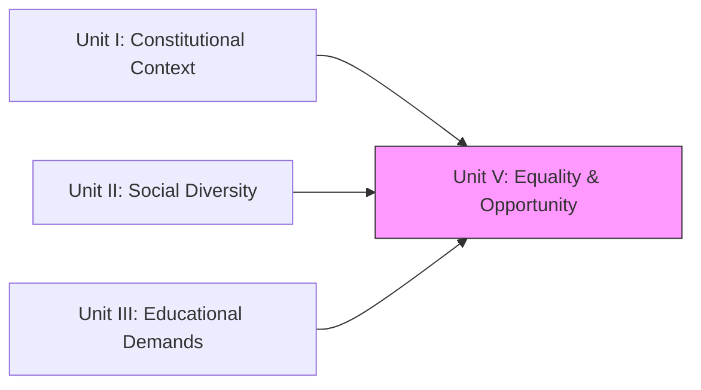
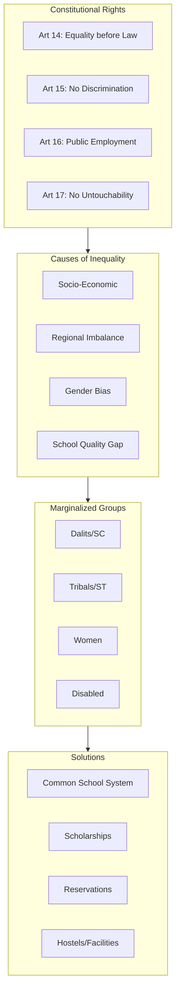

!!! abstract "Unit Overview"
    This unit delves into the concept of **Equality of Educational Opportunities**. It analyzes the constitutional provisions (Articles 14-18) ensuring equality and the harsh realities of inequality in India based on caste, class, gender, and region. The unit explores the concepts of **Social Discrimination** and **Marginalization**, specifically focusing on the educational challenges and solutions for **Dalits, Tribals, Women, and the Differently Abled**.

!!! info "Information"
    **Unit V - Implications of Equality of Educational Opportunities**
    **Content:** Constitutional Equality, Causes of Inequality, Marginalization (Dalits, Tribals, Women), Social Inequality types.
    **Pages:** 133 - 166 (Source Text: 254 - 314)

## 🎯 Introduction
While the Constitution guarantees equality, social reality often contradicts it. "Education is a great social leveller," as Gandhiji believed. This unit investigates why inequalities persist and what educational measures can bridge these gaps.

**Key Learnings:**
*   **Constitutional Articles:** 14 (Equality before law), 15 (No discrimination), 16 (Opportunity), 17 (Untouchability), 18 (Titles).
*   **Inequality Types:** Caste, Gender, Class, and Regional.
*   **Marginalization:** Understanding the exclusion of Dalits, Tribals, and Women.
*   **Solutions:** Common School System, Reservations, Scholarships, and Inclusive Education.

## 🔗 Connection to Other Units

| Unit | Connection |
| :--- | :--- |
| **Unit I** | Fundamental Rights (Arts 14-18) are the basis of Unit V. |
| **Unit II** | "Social Diversity" often leads to "Inequality" if not managed well. |
| **Unit III** | Schemes like SSA/RMSA (Unit III) are tools to achieve the Equality discussed here. |

## 📚 Unit Overview

| Lesson | Focus Area | Key Concepts |
| :--- | :--- | :--- |
| **Lesson 7** | **Inequality & Constitution** | Articles 14-18, Causes of Inequality, Regional Imbalances. |
| **Lesson 7 (Cont.)** | **Marginalization** | Dalits, Tribals, Women, Minorities. |

### Learning Outcomes
By the end of this unit, you will be able to:
1.  **Interpret** Articles 14-18 concerning equality.
2.  **Analyze** the causes of educational inequality (Socio-economic, Regional, Gender).
3.  **Define** Marginalization and identify marginalized groups.
4.  **Propose** educational measures to uplift Dalits, Tribals, and Women.

## 🗺️ Topic Connection Map

---

# LESSON - 7: IMPLICATIONS OF EQUALITY OF EDUCATIONAL OPPORTUNITIES

## 7:00 Introduction
Inequalities exist in all societies but are stark in developing nations like India. Discrimination is based on **Caste, Religion, Economy, Gender, and Place**.
**NPE 1986** defines Equality in Education as "providing equal access to quality education to all students irrespective of caste, creed, location, or sex."

## 7:02 Constitutional Provisions (Articles 14-18)

| Article | Provisions | Meaning |
| :--- | :--- | :--- |
| **Article 14** | Equality before Law | No one is above law. |
| **Article 15** | Prohibition of Discrimination | No discrimination on religion, race, caste, sex, place of birth. |
| **Article 16** | Equality of Opportunity | Equal chance in **Public Employment**. |
| **Article 17** | Abolition of Untouchability | Practice of untouchability is a punishable offence. |
| **Article 18** | Abolition of Titles | No titles (except military/academic) to ensure no artificial hierarchy. |

## 7:03 Causes for Inequality in Education
1.  **Socio-Economic Disparities:** Rich afford private schools; poor depend on ill-equipped govt schools.
2.  **Regional Imbalances:** Advanced states (Kerala/TN) vs. Backward states (Bihar/UP). Urban vs. Rural gap.
3.  **Quality Differences:** Elite Public Schools vs. Government Schools.
4.  **Gender Bias:** Preference for boys' education.
5.  **Home Environment:** First-generation learners lack guidance at home.
6.  **Social Class:** Caste-based exclusion.

## 7:04 Ways to Provide Equal Opportunity
1.  **Common School System:** Admission based on talent/neighborhood, not wealth. Rich and poor study together.
2.  **Uniform Pattern:** 10+2+3 system across India.
3.  **Removal of Imbalances:** Special funds for backward states/districts.
4.  **Free Education:** Abolition of tuition fees; free textbooks/uniforms.
5.  **Scholarships:** Merit and Means-based financial aid.
6.  **Reservation:** For SC/ST/OBC and Women.

### 7:04:1 Tamil Nadu Model
*   **Free Education:** Up to Class XII.
*   **Supplies:** Free texts, uniforms, bus passes, cycles, laptops.
*   **Incentives:** Marriage assistance for educated girls.
*   **Reservation:** 69% reservation policy (highest in India).

## 7:08 Marginalization & Social Discrimination

### 7:08:1 Social Discrimination
Differentiation of people into groups where one group dominates and others are deprived of privileges.
*   **Ascribed Status:** Status by birth (Caste).
*   **Achieved Status:** Status by effort (Education/Job).

### 7:08:2 Marginalization
**Definition:** Pushing people to the "margins" or edges of society, treating them as insignificant or powerless. They are excluded from mainstream social, economic, and political life.
**Marginalized Children:** Lack learning opportunities, suffer malnutrition, lack medical care, often forced into child labor.

### 7:09 Types of Social Inequality
1.  **Caste-based:** Hereditary hierarchy. Dalits/Scheduled Castes face historical oppression.
2.  **Gender-based (Sexism):** Discrimination against women in family, education, and work.
3.  **Class-based:** Based on economic status (Rich/Middle/Poor).
4.  **Region-based:** Disparities between North/South India or Urban/Rural areas.

## 7:11 Education for Marginalized Groups

### 7:11:4 Dalits (Scheduled Castes)
*   **Population:** ~16.6% (2011 Census).
*   **Measures:**
    *   Free education & hostels.
    *   Reservation in higher education/jobs.
    *   Scholarships.

### 7:11:5 Tribals (Scheduled Tribes / Adivasis)
*   **Population:** ~8.6%. High concentration in North East.
*   **Problems:**
    *   Language barrier (Tribal dialects vs. School language).
    *   Remote locations (Forests/Hills).
    *   Curriculum disconnect (Irrelevant to their life).
*   **Solutions:**
    *   **Residential Schools:** Ashram Schools in tribal areas.
    *   **Vocational Training:** Collecting forest produce, honey, etc.
    *   **Tribal Teachers:** Train local youth to teach.

### 7:11:6 Women
*   **Literacy:** Gap exists (Male: 81.3%, Female: 65.4% - National).
*   **Measures:**
    *   Girls' hostels and separate schools.
    *   Free cycles/laptops to ensure retention.
    *   Appointment of women teachers.
    *   Prevention of sexual harassment.

## 📝 Quick Revision Table

| Group | Key Problem | Key Solution |
| :--- | :--- | :--- |
| **Dalits** | Untouchability / Social Exclusion | Art 17, Reservation, Free Hostels. |
| **Tribals** | Isolation / Language Barrier | Ashram Schools, Vocational Training. |
| **Women** | Gender Bias / Safety | Free Transport, Women Teachers, Scholarships. |
| **Poor** | Cost of Education | Free Textbooks, Mid-day Meals, No fees. |
| **Disabled** | Access | Integrated/Inclusive Education (Unit 3). |

## 🧠 Memory Mnemonics
*   **Articles 14-18 (Right to Equality):**
    *   **14:** **E**quality law (4 looks like L for Law).
    *   **15:** **D**iscrimination (5 fingers -> Stop discrimination).
    *   **16:** **J**ob opportunity (16 is age for some jobs).
    *   **17:** **U**ntouchability (7 looks like a stick -> Don't beat/exclude).
    *   **18:** **T**itles (18 -> Adult -> No Titles).

## ❓ Review Questions
1.  Explain **Article 17** and its significance. [7:02]
2.  What is **Marginalization**? List the characteristics of marginalized children. [7:08:2]
3.  Discuss the problems faced by **Tribal children** in education. [7:11:5:01]
4.  How does **Tamil Nadu** ensure equality of educational opportunity? [7:04:1]
5.  Differentiate between **Ascribed Status** and **Achieved Status**. [7:08:1]

!!! success "Unit Complete"
    You have completed **Unit V**. You now understand the deep-rooted inequalities in Indian society and the constitutional and educational mechanisms designed to create a more just and equal society.
