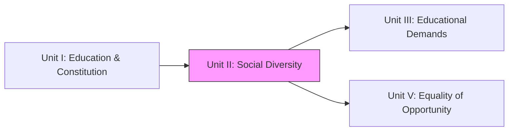
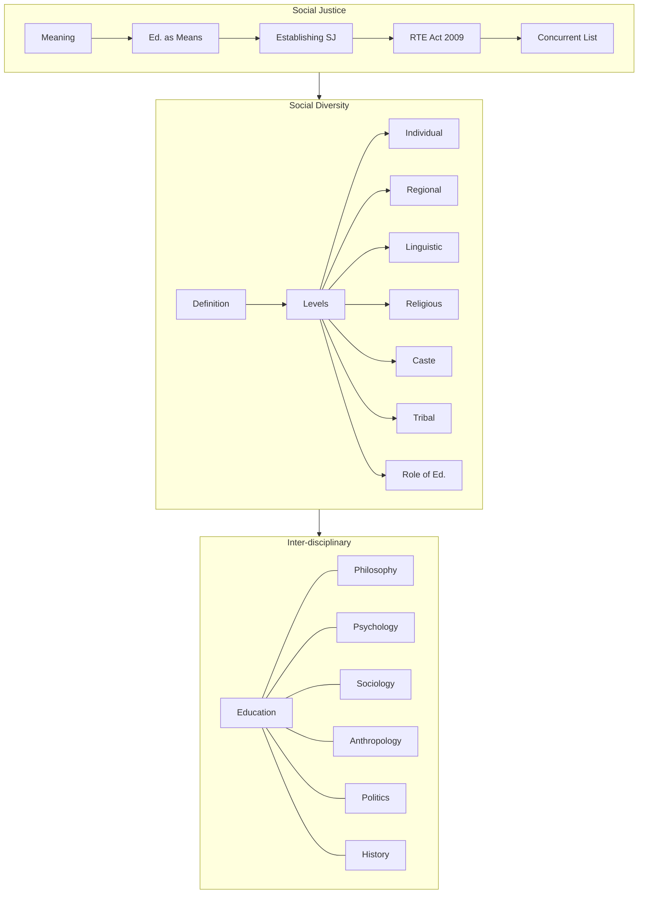

!!! abstract "Unit Overview"
    This unit explains the concept of Social Justice and Social Diversity in the Indian context. It covers the Indian Constitution's role in promoting social justice through education, including the Right to Education (RTE) Act 2009. The unit also analyzes various levels of social diversity—individual, regional, linguistic, religious, caste, and tribal—and the role of education in fostering understanding and positive attitudes towards this diversity. Finally, it explores the inter-disciplinary nature of education with Philosophy, Psychology, Sociology, Anthropology, Politics, and History.

!!! info "Information"
    **Unit II - Understanding Social Diversity**
    **Content:** Understanding Social Diversity and its Educational Implications
    **Pages:** 53 - 87 (Source Text: 94 - 163) (Note: Source text page numbering is continuous from previous unit)

## 🎯 Introduction
India is a land of vast diversity and deep-rooted social stratification. This unit focuses on how education serves as a bridge to understanding this diversity and as a tool for ensuring social justice. It transitions from the legal frameworks (Unit I) to the sociological realities of the Indian classroom and society.

**Key Learnings:**
*   **Social Justice:** Meaning and how education acts as a means to achieve it.
*   **RTE Act 2009:** Salient features and its role in Universalisation of Elementary Education.
*   **Education in Concurrent List:** Implications of shifting education from State to Concurrent list (1976).
*   **Social Diversity:** Understanding diversity at various levels (Language, Religion, Caste, Tribe, Region).
*   **Inter-disciplinary Approach:** How education relates to other disciplines like Psychology, Sociology, etc.

## 🔗 Connection to Other Units

| Unit | Connection |
| :--- | :--- |
| **Unit I** | Provides the Constitutional values (Justice, Equality) applied here. |
| **Unit II** | **Focus on Diversity & Social Justcie** |
| **Unit III** | Understanding diverse demands of individuals/communities (based on Unit II's diversity). |
| **Unit V** | Addressing inequality (Unit II) through opportunities (Unit V). |

## 📚 Unit Overview

| Lesson | Focus Area | Key Concepts |
| :--- | :--- | :--- |
| **Lesson 3 (Cont.)** | **Social Justice & Education** | Social Justice, RTE Act 2009, Concurrent List Implications. |
| **Lesson 4** | **Social Diversity** | Meaning, Levels (Individual, Regional, Linguistic, Religious, Caste, Tribal). |
| **Lesson 4 (Cont.)** | **Ed. Implications & Inter-disciplinary** | Role of Ed in diversity, Relation with Philosophy, Psychology, etc. |

### Learning Outcomes
By the end of this unit, you will be able to:
1.  **Explain** the concept of Social Justice and the role of education in achieving it.
2.  **Analyze** the salient features of the Right to Education (RTE) Act, 2009.
3.  **Discuss** the implications of education being in the Concurrent List.
4.  **Describe** various forms of social diversity in India (Linguistic, Caste, Tribal, etc.).
5.  **Evaluate** the inter-disciplinary nature of education with other social sciences.

## 🗺️ Topic Connection Map

---

# LESSON - 3 (Continued): Social Justice and Education

## 3:06 Social Justice and Education

### 3:06:1 Meaning of ‘Social Justice’
The core concept is **fair distribution of opportunities and privileges** within a society. Originally focused on wealth/property, it now includes environment, race, gender, and education.

### 3:06:2 Education as a Means of Social Justice
*   **Silent Revolution:** Gandhiji believed education brings silent revolution.
*   **Eliminating Injustice:** Literacy is low among marginalized groups. Education eliminates social injustice.
*   **Status Improvement:** Education improves providing 'Achieved Social Status' over 'Ascribed Social Status' (birth-based).
*   **Social Displacement:** Accelerates both "Vertical" and "Horizontal" mobility.

### 3:06:3 Establishing Social Justice in Education
**Definition:** Equal opportunity for all students, equitable distribution of resources, facilities, and privileges regardless of cultural/social/economic inequalities.
**Ways to Establish:**
1.  Free and compulsory quality education.
2.  Reservations in higher/professional education.
3.  Common School System.
4.  Free uniforms/textbooks/hostels.
5.  Opening schools in rural areas.
6.  Encouraging women's education.
7.  25% reservation in private schools (RTE).

## 3:07 Right to Education Act (RTE) 2009

### 3:07:1 Background
*   **Original:** Article 45 (Directive Principle - not enforceable).
*   **Amendment:** 86th Amendment (2002) inserted **Article 21-A** making education a Fundamental Right.
*   **Act Passed:** 4th August 2009.
*   **Effect:** 1st April 2010.

### 3:07:2 Salient Features of RTE
1.  **Compulsory & Free Education:** For every child (6-14 years) in a neighborhood school (1km radius).
2.  **Benchmark Mandate:** Norms for PTR (Pupil-Teacher Ratio), classrooms, toilets, drinking water.
3.  **Special Provisions:** Age-appropriate admission for out-of-school children + special training.
4.  **Quantity and Quality of Teachers:**
    *   PTR: 1:30 (Primary), 1:35 (Upper Primary).
    *   No non-academic work (except Census, Election, Disaster).
    *   Duties: Punctuality, completion of syllabus, meeting parents.
5.  **Zero Tolerance Against Discrimination:**
    *   No screening tests/capitation fees.
    *   No corporal punishment/mental harassment.
    *   No discrimination based on caste/gender/religion.
6.  **All-round Development:** Child-friendly/Child-centered learning.
7.  **Minimise Detention:** No detention policy (until elementary completion) + CCE (Continuous and Comprehensive Evaluation).
8.  **Monitoring:** **School Management Committees (SMC)** (75% parents, 50% women).
9.  **Implementation:** Grievance Redressal Mechanism.
10. **Social Inclusion:** **25% mandated reservation** in private schools for deeper weaker sections (reimbursed by Govt).

## 3:08 Education in the Concurrent List and its Implications

### 3:08:1 Constitutional Provisions (7th Schedule)
*   **Union List (List I):** Central Govt responsibility. Entries 63, 64, 65, 66 (Central Universities, Technical Institutions, Professional training, Coordination of standards).
*   **State List (List II):** Originally, Education was here. State responsibility.
*   **Concurrent List (List III):** **Entry 25**. Joint responsibility throughout the country.

### 3:09 Impact of 42nd Amendment (1976)
Education was shifted from **State List** to **Concurrent List**.
*   **Implication:** Both Centre and State can legislate. In case of conflict, **Central law prevails**.

### 3:09:1 Implications (Arguments For)
1.  **Uniformity:** Uniform pattern (e.g., 10+2+3) across India.
2.  **Better Implementation:** Centre ensures States implement policies.
3.  **Better Funds Utilisation:** Centre monitors fund usage.
4.  **Quality Leadership:** Centre provides national direction.
5.  **Improvement in Standards:** Utilizing national research/expertise.
6.  **Discipline:** Centre can overrule States.
7.  **Emotional Integration:** Promotes national integration over regionalism.

### 3:09:2 Arguments Against (Retaining as State Subject)
1.  **Democratic Values:** Decentralization is key; States lose power.
2.  **Local Needs:** States understand local needs/language better than Centre.
3.  **Red Tapism:** Increased bureaucracy/delays seeking clearance.
4.  **Security to Minorities:** Minorities often feel safer with State govts.
5.  **Unity in Diversity:** Allows States to preserve own identity/culture.

---

# LESSON — 4: UNDERSTANDING THE SOCIAL DIVERSITY

## 4:00 Introduction
Globalization/Migration increases diversity. India is multi-lingual, multi-ethnic, multi-religious. Harmony is essential for development.

## 4:01 Meaning and Definition

### 4:01:1 Meaning
Differences based on caste, religion, race, language, region, class, occupation.

### 4:01:2 Definition
!!! quote "Definition"
    **Barker (2003):** "Diversity means variety... refers to the range of personnel who more accurately represent minority populations and people from varied backgrounds."

## 4:02 Bases and Factors
**Three Bases:**
1.  Each individual is unique.
2.  Inter-dependence of individuals/society.
3.  Dynamic nature of culture.

**Factors:** Race, Language, Life style, Religion, Gender, Age, Region, Profession, Political ideology.

## 4:03 Social Diversity in Indian Society
*   **Languages:** 18+ recognized, 3000+ dialects.
*   **Religions:** Hinduism, Islam, Christianity, Sikhism, Buddhist, Jainism.
*   **Tribes:** Irulas, Todas, Gonds.
*   **Races:** Aryan, Dravidian, Mongol.
*   **Trend:** Acceptance of **multi-culturalism** (e.g., Holidays for minority festivals).

## 4:04 Levels of Social Diversity

### 4:04:1 Individual Level
*   **Biological:** Height, skin color.
*   **Psychological:** Self-concept & Social relationships.
*   **Manifestation:** Competition for proficiency, economic status, political power.

### 4:04:2 Regional Social Diversity
*   **Basis:** Region, language, life style.
*   **Issue:** "Sons of the soil" theory vs National interest. Unequal development within states (e.g., Telangana movement).
*   **Implication:** Can lead to isolation/parochialism (Undesirable) OR unity within region (Desirable).

### 4:04:3 Social Diversity at Linguistic Level
*   **Languages:** **22 Official Languages** (8th Schedule).
*   **Families:** Indo-Aryan (North), Dravidian (South).
*   **Link Languages:** English, Hindi.
*   **Impact:** A "Museum of Languages" (A.R. Desai). Promotes tolerance/multi-culturalism if managed well.

### 4:04:4 Social Diversity Based on Religion
*   **Demography (2011):** Hindus (79.8%), Muslims (14.2%), Christians (2.3%), Sikhs (1.7%), Buddhists (0.7%), Jains (0.4%).
*   **Secular State:**
    *   Equal before law.
    *   Freedom of worship.
    *   Right to establish educational institutions (Minorities).
    *   No religious instruction in Govt-aided schools.

### 4:04:5 Social Diversity at Caste Level
*   **Uniqueness:** Hierarchical stratification (Vertical layers).
*   **Presence:** Investigated even in non-Hindu religions (Christians, Muslims, Sikhs).
*   **Change:** Urbanization/Constitution loosening rigidity. Reservation promotes Upward Social Mobility.

### 4:04:6 Social Diversity at Tribal Level
*   **Adivasis:** Indigenous people, isolated in hilly/forest areas.
*   **Population:** High in Lakshadweep, Mizoram, Nagaland, MP. None in Punjab/Haryana/Delhi.
*   **Examples:** Bhils, Gonds, Santhals, Todas, Nagas.
*   **Policy:** 7.5% reservation (Note: Text says 1%, but current norms vary; text context implies reservation exists). Integration into mainstream while preserving culture.

## 4:05 Education for Understanding Social Diversity
*   **Curriculum:** Include freedom struggle, constitutional values (equality/secularism).
*   **Geography:** teaching about different states/resources.
*   **Language Policy:** Three Language Formula (Mother tongue + Hindi + English) to bridge gaps.
*   **Co-curricular:** Festivals, NCC/NSS, Educational tours to other states.
*   **Measures:** Common School System, Inclusive Education, Reservations.

## 4:06 Role of Education in Creating Positive Attitude
*   **Key Agent:** The **Teacher**.
*   **Method:** **Inclusive Education**.
*   **Teaching Techniques:**
    1.  **Group Interactive Sessions:** Promoting interaction among diverse students.
    2.  **Co-operative Learning:** Small heterogeneous teams working together.
    3.  **Collaborative Learning:** Shared responsibility for learning outcomes.

## 4:07 Inter-disciplinary Nature of Education

### 4:07:1 Meaning
Solving complex educational problems by integrating knowledge/methods from other disciplines.

### Relationships:
1.  **Philosophy & Education:**
    *   **Philosophy:** Sets the Goal/Ends (Theory).
    *   **Education:** The Means to achieve it (Practice).
    *   *Propagates* philosophy. All great philosophers were educators (Gandhi, Dewey).
2.  **Psychology & Education:**
    *   **Psychology:** Deals with "How to teach" (Methods/Learner behavior).
    *   Input: Motivation, Development stages, Memory, Personality.
3.  **Sociology & Education:**
    *   Study of man in society.
    *   **Educational Sociology:** Interprets educational problems via sociology. School as a "miniature society". Socialization of child.
4.  **Anthropology & Education:**
    *   Study of human culture/evolution.
    *   **Role:** Education functions for (i) Transmission of culture (Acculturation), (ii) Conservation, (iii) Enrichment.
5.  **Politics & Education:**
    *   Politics determines use of power/resources.
    *   **Regime Type:**
        *   *Individualism:* Competition/Talent.
        *   *Democracy:* Equality/Citizenship.
        *   *Socialism:* Equality/Productivity.
        *   *Communism:* State control/Patriotism.
6.  **History & Education:**
    *   **History of Education:** Understanding past systems to shape present/future. Learning from mistakes.

---

## 📝 Quick Revision Table

| Discipline | Contribution to Education |
| :--- | :--- |
| **Philosophy** | Aims, Values, Curriculum (The *Why*) |
| **Psychology** | Teaching Methods, Learning Process (The *How*) |
| **Sociology** | Social Change, School-Society Link (The *Where*) |
| **Anthropology** | Culture Transmission (The *What*) |
| **Politics** | Policy, Funding, Control (The *Who governs*) |
| **History** | Evolution, Past Lessons (The *When*) |

## 🧠 Memory Mnemonics
*   **RTE 2009:** **F**ree & **C**ompulsory (FC), **N**eighborhood School, **S**MC, **25%** Reservation.
*   **Concurrent List:** **1976** (42nd Amendment) -> Education went from **State** to **Concurrent**.
*   **Diversity Levels:** **I**ndividual, **R**egional, **L**inguistic, **R**eligious, **C**aste, **T**ribal (**I** **R**eally **L**ike **R**ed **C**at **T**oys).

## ❓ Review Questions
1.  What is 'Social Justice'? [3:06:1]
2.  List 5 salient features of RTE Act 2009. [3:07:2]
3.  Why was Education shifted to Concurrent List? [3:09:1]
4.  Define Social Diversity. [4:01:2]
5.  What are the 3 teaching techniques for positive attitude? [4:06]
6.  How are Philosophy and Education related? [4:07:1:02]

!!! success "Unit Complete"
    You have completed **Unit II**. You now understand the sociological foundations of Indian education, the legal push for social justice via RTE, and the complex web of social diversity that education must navigate and integrate.
